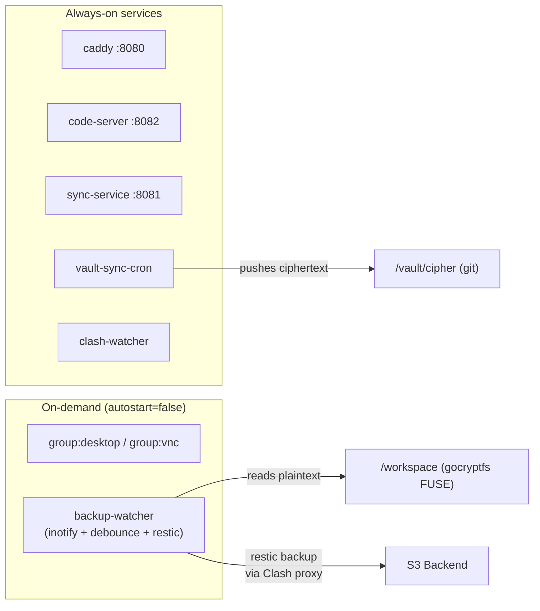
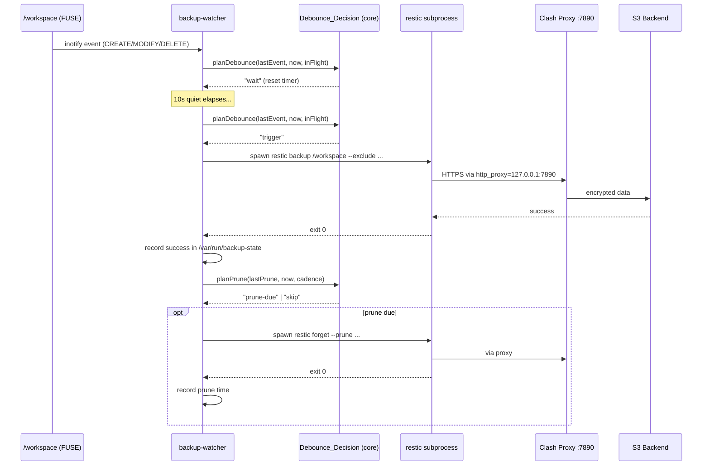
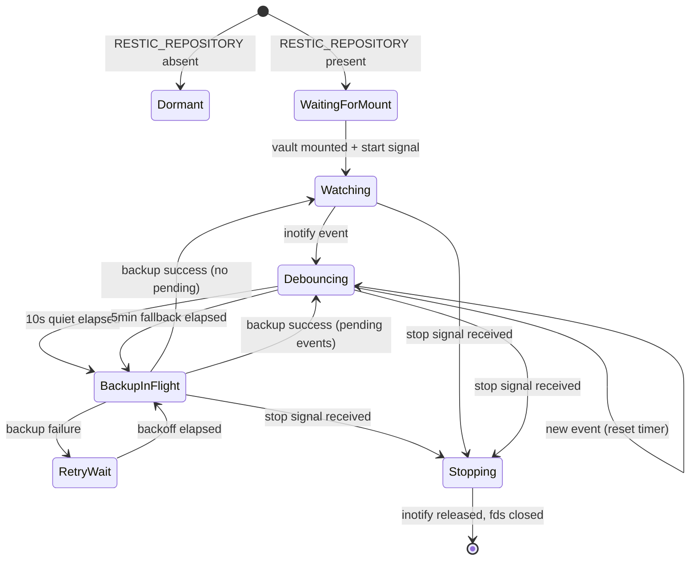

# Design Document: Realtime Backup to S3

## Overview

This feature adds **near-real-time, event-driven backup** of the user's plaintext working files (`/workspace`) to an S3-compatible object store using **restic**. The backup chain is entirely additive and opt-in: when `RESTIC_REPOSITORY` is absent, the container behaves identically to today. When configured, a long-running inotify watcher debounces filesystem activity and triggers `restic backup` once 10 seconds of quiet elapse, achieving seconds-to-minutes freshness without polling.

The design coexists with the existing `vault-sync` chain (cron → `git push` of gocryptfs ciphertext to GitHub). restic is the fast/primary backup; git-sync remains the slower secondary off-site copy. The two chains share no locks and operate on different data sources (plaintext vs ciphertext).

Key architectural decisions locked before design:
1. **Configuration**: restic's native env vars (`RESTIC_REPOSITORY`, `RESTIC_PASSWORD`, `AWS_ACCESS_KEY_ID`, `AWS_SECRET_ACCESS_KEY`) in `.env`. `RESTIC_REPOSITORY` presence is the opt-in gate.
2. **State directory**: `/var/run/backup-state` (container-local, non-FUSE). Loss on restart is non-fatal.
3. **Periodic fallback**: 5-minute safety-net scan (inotify unreliability on FUSE).
4. **Stop semantics**: SIGTERM → grace → SIGKILL the restic subprocess, then release inotify watches.
5. **Exclusion**: `.notifications/` excluded (prevents write-trigger loop).
6. **Repo init**: one-time entrypoint/CLI action, NOT runtime watcher behavior.
7. **`desktop-stop` does NOT stop the watcher** (only `lock-vault`/`destroy` do).
8. **Serialized operations**: backup and prune never concurrent (restic repo lock).
9. **Snapshot consistency**: restic does not guarantee cross-file transactional consistency (documented, not a code fix).
10. **inotify limit**: depends on existing `max_user_watches=524288` sysctl in entrypoint.

---

## Architecture

### Process Topology



The `backup-watcher` is a new supervised program (`autostart=false`) that starts when the vault is mounted AND `RESTIC_REPOSITORY` is configured. It holds inotify watches and read fds on `/workspace`, making it a FUSE-unmount blocker that must be stopped before `fusermount -u`.

### Data Flow



### Lifecycle State Machine



### Architectural Invariants Respected

| Invariant | How this design respects it |
|-----------|------------------------------|
| `core/` stays pure (no IO) | Debounce_Decision, Retention_Plan, Exclusion_Set, config validation — all pure functions in `packages/core`. |
| No upward deps | `packages/core` gains backup constants/logic; `packages/cli` imports from core only. |
| Pure decision vs IO execution separated | Core returns plans (`trigger`/`wait`/`coalesce`/`prune-due`); CLI executes them (spawn restic, write state files). Mirrors `vault-lifecycle.ts`. |
| Single config surface for env | restic's native env vars in `.env`; no custom prefix wrapper. |
| FUSE-unmount safety | backup-watcher added to the stop-before-unmount set in `lock-vault` and `destroy`. `desktop-stop` does NOT stop it. |
| Fail-closed egress | restic subprocess inherits `http_proxy`/`HTTPS_PROXY` → Clash. No direct S3 path. |
| Secrets never logged | restic env vars passed to subprocess env, never written to logs/notifications. |

---

## Components and Interfaces

### Core Package Additions (`packages/core/src/backup.ts`)

Pure decision logic — no IO, no imports from cli/server.

```typescript
// --- Constants ---
export const BACKUP_DEBOUNCE_MS = 10_000;          // 10s quiet window
export const BACKUP_FALLBACK_INTERVAL_MS = 300_000; // 5min safety-net scan
export const BACKUP_STATE_DIR = "/var/run/backup-state";
export const BACKUP_FAILURE_THRESHOLD = 3;
export const BACKUP_STALENESS_MS = 600_000;         // 10min → doctor warns
export const BACKUP_MAX_RETRIES = 5;
export const BACKUP_BASE_BACKOFF_MS = 5_000;        // 5s base for exponential backoff

// Retention policy (restic forget flags)
export const BACKUP_KEEP_HOURLY = 24;
export const BACKUP_KEEP_DAILY = 7;
export const BACKUP_KEEP_WEEKLY = 4;
export const BACKUP_PRUNE_CADENCE_MS = 6 * 60 * 60 * 1000; // every 6h

// Exclusion set — single source of truth for watcher ignore + restic --exclude
export const BACKUP_EXCLUSION_SET: readonly string[] = [
  "node_modules",
  ".git",
  ".cache",
  ".desktop",
  ".desktop-vnc",
  ".notifications",
  ".code-server",
  ".uploads",
  "dist",
  "build",
  ".vscode",
  ".idea",
  "__pycache__",
  ".mypy_cache",
  ".pytest_cache",
  "target",        // Rust/Java build output
  ".next",
  ".nuxt",
] as const;

// --- Debounce Decision ---
export type DebounceDecision = "trigger" | "wait" | "coalesce";

export interface DebounceState {
  lastEventMs: number | null;   // timestamp of most recent fs event (null = none)
  nowMs: number;                // current time
  backupInFlight: boolean;      // is a restic process currently running?
  lastTriggerMs: number | null; // timestamp of last backup START (success or failure); null = never triggered
  consecutiveFailures: number;  // current failure streak (0 = last backup succeeded or never ran)
  lastFailureMs: number | null; // timestamp of last backup failure (null = never failed)
}

export function planDebounce(state: DebounceState): DebounceDecision {
  if (state.backupInFlight) return "coalesce";
  // First tick after startup: immediately trigger a baseline backup.
  if (state.lastTriggerMs === null) return "trigger";
  // Backoff: if last backup failed, wait until backoff period elapses before retrying.
  if (state.consecutiveFailures > 0 && state.lastFailureMs !== null) {
    const backoff = backoffDelayMs(state.consecutiveFailures);
    if (state.nowMs - state.lastFailureMs < backoff) return "wait";
  }
  // Fallback: if no trigger in 5 minutes, force one (safety net for inotify misses)
  if (state.nowMs - state.lastTriggerMs >= BACKUP_FALLBACK_INTERVAL_MS) {
    return "trigger";
  }
  if (state.lastEventMs === null) return "wait";
  const quiet = state.nowMs - state.lastEventMs;
  return quiet >= BACKUP_DEBOUNCE_MS ? "trigger" : "wait";
}

// --- Retention Plan ---
export type PruneDecision = "prune-due" | "skip";

export interface PruneState {
  lastPruneMs: number | null;  // null = never pruned
  nowMs: number;
}

export function planPrune(state: PruneState): PruneDecision {
  if (state.lastPruneMs === null) return "prune-due";
  return state.nowMs - state.lastPruneMs >= BACKUP_PRUNE_CADENCE_MS
    ? "prune-due"
    : "skip";
}

// --- Backoff ---
export function backoffDelayMs(consecutiveFailures: number): number {
  // Exponential: 5s, 10s, 20s, 40s, 80s (capped at ~80s)
  const delay = BACKUP_BASE_BACKOFF_MS * Math.pow(2, Math.min(consecutiveFailures, 4));
  return delay;
}

// --- Opt-in Gate ---
export interface BackupGateEnv {
  RESTIC_REPOSITORY?: string;
  RESTIC_PASSWORD?: string;
  AWS_ACCESS_KEY_ID?: string;
  AWS_SECRET_ACCESS_KEY?: string;
}

export type GateResult =
  | { status: "dormant" }
  | { status: "enabled" }
  | { status: "misconfigured"; missing: string[] };

export function evaluateBackupGate(env: BackupGateEnv): GateResult {
  if (!env.RESTIC_REPOSITORY) return { status: "dormant" };
  const missing: string[] = [];
  if (!env.RESTIC_PASSWORD) missing.push("RESTIC_PASSWORD");
  if (!env.AWS_ACCESS_KEY_ID) missing.push("AWS_ACCESS_KEY_ID");
  if (!env.AWS_SECRET_ACCESS_KEY) missing.push("AWS_SECRET_ACCESS_KEY");
  return missing.length > 0
    ? { status: "misconfigured", missing }
    : { status: "enabled" };
}

// --- Notification Threshold ---
export function shouldNotify(consecutiveFailures: number): boolean {
  return consecutiveFailures >= BACKUP_FAILURE_THRESHOLD;
}

// --- Doctor Status ---
export type DoctorBackupStatus = "ok" | "warn" | "fail" | "not-configured";

export interface DoctorBackupState {
  gateResult: GateResult;
  lastSuccessMs: number | null;
  consecutiveFailures: number;
  nowMs: number;
}

export function planDoctorBackupStatus(state: DoctorBackupState): DoctorBackupStatus {
  if (state.gateResult.status === "dormant") return "not-configured";
  if (state.gateResult.status === "misconfigured") return "fail";
  if (state.consecutiveFailures >= BACKUP_FAILURE_THRESHOLD) return "fail";
  if (state.lastSuccessMs === null) return "warn";
  if (state.nowMs - state.lastSuccessMs >= BACKUP_STALENESS_MS) return "warn";
  return "ok";
}

// --- Exclusion Matching ---
/** Check if a relative path (from /workspace) should be excluded from watcher events.
 *  Checks ALL path segments, not just the first — so nested node_modules, .git, etc. are excluded. */
export function isExcludedPath(relativePath: string): boolean {
  const segments = relativePath.split("/");
  return segments.some(seg => BACKUP_EXCLUSION_SET.includes(seg));
}
```

### CLI Package: Backup Watcher (`packages/cli/src/backup-watcher.ts`)

The long-running supervised process. IO execution layer.

```typescript
#!/usr/bin/env bun
/**
 * backup-watcher — inotify-driven restic backup with debounce.
 * Supervised program (autostart=false). Started on vault mount when
 * RESTIC_REPOSITORY is configured.
 */
import { watch } from "node:fs";
import { existsSync, mkdirSync, readFileSync, writeFileSync } from "node:fs";
import {
  BACKUP_DEBOUNCE_MS,
  BACKUP_EXCLUSION_SET,
  BACKUP_FALLBACK_INTERVAL_MS,
  BACKUP_FAILURE_THRESHOLD,
  BACKUP_KEEP_DAILY,
  BACKUP_KEEP_HOURLY,
  BACKUP_KEEP_WEEKLY,
  BACKUP_STATE_DIR,
  CLASH_HTTP_PORT,
  WORKSPACE_MOUNT,
  backoffDelayMs,
  evaluateBackupGate,
  isExcludedPath,
  planDebounce,
  planPrune,
  shouldNotify,
} from "@sdw/core";
import { $ } from "bun";

// --- Pre-flight checks ---
const gate = evaluateBackupGate(process.env);
if (gate.status === "dormant") { process.exit(0); }
if (gate.status === "misconfigured") {
  console.error(`Backup misconfigured: missing ${gate.missing.join(", ")}`);
  process.exit(1);
}

const mountCheck = await $`mountpoint -q ${WORKSPACE_MOUNT}`.quiet().nothrow();
if (mountCheck.exitCode !== 0) {
  console.error("Workspace not mounted. Exiting.");
  process.exit(1);
}

mkdirSync(BACKUP_STATE_DIR, { recursive: true });

// --- State ---
let lastEventMs: number | null = null;
let lastTriggerMs: number | null = null;
let backupInFlight = false;
let pendingDuringFlight = false;
let consecutiveFailures = loadFailureCount();
let stopping = false;
let resticProc: ReturnType<typeof Bun.spawn> | null = null;

// --- inotify watcher (recursive) ---
const watcher = watch(WORKSPACE_MOUNT, { recursive: true }, (event, filename) => {
  if (stopping) return;
  if (filename && isExcludedPath(filename)) return;
  lastEventMs = Date.now();
  if (backupInFlight) pendingDuringFlight = true;
});

// --- Main loop ---
const TICK_MS = 1000;
const loop = setInterval(async () => {
  if (stopping) return;
  const decision = planDebounce({
    lastEventMs,
    nowMs: Date.now(),
    backupInFlight,
    lastTriggerMs,
  });
  if (decision === "trigger") {
    await runBackup();
  }
}, TICK_MS);

// --- Graceful shutdown ---
process.on("SIGTERM", gracefulStop);
process.on("SIGINT", gracefulStop);

async function gracefulStop() {
  stopping = true;
  clearInterval(loop);
  if (resticProc) {
    resticProc.kill("SIGTERM");
    const timeout = setTimeout(() => resticProc?.kill("SIGKILL"), 5000);
    await resticProc.exited;
    clearTimeout(timeout);
  }
  watcher.close();
  process.exit(0);
}

// --- Backup execution ---
async function runBackup() { /* ... spawn restic, handle success/failure ... */ }
```

### CLI Package: Backup Init (`packages/cli/src/backup-init.ts`)

One-time repo initialization command (NOT called by the watcher).

```typescript
#!/usr/bin/env bun
/**
 * backup-init — Initialize the restic repository on S3.
 * Run once before the watcher can operate. Safe to re-run (restic init is idempotent-ish:
 * exits 0 if repo exists with matching password).
 */
```

### Supervisor Configuration (`image/etc/supervisor/backup-watcher.conf`)

```ini
[program:backup-watcher]
command=/root/.bun/bin/bun run /opt/workspace/packages/cli/src/backup-watcher.ts
autostart=false
autorestart=false
startsecs=5
stopwaitsecs=10
stopsignal=TERM
stdout_logfile=/dev/fd/1
stdout_logfile_maxbytes=0
stderr_logfile=/dev/fd/2
stderr_logfile_maxbytes=0
```

Key settings:
- `autostart=false` — on-demand, started by entrypoint/unlock-vault when gate is enabled.
- `autorestart=false` — watcher does NOT auto-restart on crash. If it exits (config error, runtime crash), doctor surfaces the problem; user fixes and manually restarts. This avoids infinite restart loops on misconfiguration and matches the "explicit start" model.
- `stopwaitsecs=10` — grace period before SIGKILL (matches the 5s SIGTERM→SIGKILL in the watcher + margin).
- `stopsignal=TERM` — triggers the graceful shutdown handler.

---

## Data Models

### Backup State Files (`/var/run/backup-state/`)

```
/var/run/backup-state/
├── last-success       # ISO 8601 timestamp of last successful backup
├── consecutive-failures  # integer string ("0", "1", "2", ...)
└── last-prune         # ISO 8601 timestamp of last successful prune
```

All files are plain text, one value each. Loss on container restart is non-fatal:
- Missing `last-success` → doctor reports "warn" (no backup recorded).
- Missing `consecutive-failures` → treated as 0.
- Missing `last-prune` → next prune cycle runs immediately (safe; prune is idempotent).

### Configuration Surface (`.env` additions)

```dotenv
# --- REALTIME BACKUP (optional — S3-compatible store via restic) ---
# Presence of RESTIC_REPOSITORY enables the feature (opt-in gate).
# Example: s3:https://s3.us-east-1.amazonaws.com/my-bucket/workspace-backup
RESTIC_REPOSITORY=
RESTIC_PASSWORD=

# S3 credentials (restic native env vars). NOTE: these are standard AWS env vars.
# If you use other AWS services with different credentials, use restic's
# --option s3.access-key-id=... or AWS_PROFILE to isolate.
AWS_ACCESS_KEY_ID=
AWS_SECRET_ACCESS_KEY=

# Optional: custom S3 endpoint for R2/MinIO (restic reads this natively)
# AWS_DEFAULT_REGION=us-east-1
```

### Restic Command Construction

```typescript
interface ResticBackupCommand {
  binary: "restic";
  args: ["backup", "/workspace", ...excludeArgs];
  env: {
    RESTIC_REPOSITORY: string;
    RESTIC_PASSWORD: string;
    AWS_ACCESS_KEY_ID: string;
    AWS_SECRET_ACCESS_KEY: string;
    http_proxy: "http://127.0.0.1:7890";
    https_proxy: "http://127.0.0.1:7890";
    HTTPS_PROXY: "http://127.0.0.1:7890";
    // ... other restic env vars pass-through
  };
}

interface ResticPruneCommand {
  binary: "restic";
  args: [
    "forget", "--prune",
    "--keep-hourly", "24",
    "--keep-daily", "7",
    "--keep-weekly", "4",
  ];
  env: /* same as backup */;
}
```

---

## Correctness Properties

*A property is a characteristic or behavior that should hold true across all valid executions of a system — essentially, a formal statement about what the system should do. Properties serve as the bridge between human-readable specifications and machine-verifiable correctness guarantees.*

### Property 1: Debounce trigger correctness

*For any* debounce state where `backupInFlight` is false, the `planDebounce` function SHALL return `"trigger"` if and only if (a) `lastTriggerMs === null` (first run — immediate baseline), OR (b) the time since the last event is ≥ 10 seconds AND not within a backoff window, OR (c) the time since the last trigger is ≥ 5 minutes (fallback) AND not within a backoff window. It SHALL return `"wait"` in all other non-in-flight cases (including when within a backoff window after failure).

**Validates: Requirements 1.1, 1.2, 1.7, 7.1**

### Property 2: In-flight coalesce invariant

*For any* debounce state where `backupInFlight` is true, the `planDebounce` function SHALL always return `"coalesce"`, regardless of event timestamps or elapsed time. No second concurrent backup is ever triggered.

**Validates: Requirements 1.4, 1.5**

### Property 3: Exclusion path filtering

*For any* relative path where ANY segment matches an entry in `BACKUP_EXCLUSION_SET`, `isExcludedPath` SHALL return `true`. *For any* relative path where NO segment matches any entry, it SHALL return `false`. This covers nested exclusions (e.g. `project/node_modules/pkg/index.js` is excluded because `node_modules` appears as a segment).

**Validates: Requirements 3.1, 3.3**

### Property 4: Retention plan schedule

*For any* `lastPruneMs` and `nowMs`, `planPrune` SHALL return `"prune-due"` if and only if `lastPruneMs` is null OR `nowMs - lastPruneMs >= BACKUP_PRUNE_CADENCE_MS`. Otherwise it SHALL return `"skip"`.

**Validates: Requirements 6.2**

### Property 5: Exponential backoff computation

*For any* non-negative integer `consecutiveFailures`, `backoffDelayMs` SHALL return `BACKUP_BASE_BACKOFF_MS * 2^min(consecutiveFailures, 4)`. The result is always positive and capped at `BACKUP_BASE_BACKOFF_MS * 16`.

**Validates: Requirements 7.1**

### Property 6: Failure notification threshold

*For any* non-negative integer `consecutiveFailures`, `shouldNotify` SHALL return `true` if and only if `consecutiveFailures >= BACKUP_FAILURE_THRESHOLD`.

**Validates: Requirements 7.5**

### Property 7: Opt-in gate evaluation

*For any* environment object, `evaluateBackupGate` SHALL return `"dormant"` when `RESTIC_REPOSITORY` is absent/empty, `"misconfigured"` (with the list of missing keys) when `RESTIC_REPOSITORY` is present but any of `RESTIC_PASSWORD`, `AWS_ACCESS_KEY_ID`, `AWS_SECRET_ACCESS_KEY` is missing, and `"enabled"` when all four are present and non-empty.

**Validates: Requirements 10.2, 10.3, 13.1, 13.3, 13.4**

### Property 8: Doctor backup status

*For any* combination of gate result, last-success time, consecutive failures, and current time, `planDoctorBackupStatus` SHALL return: `"not-configured"` when gate is dormant, `"fail"` when gate is misconfigured OR failures ≥ threshold, `"warn"` when no success recorded OR success is stale (≥ `BACKUP_STALENESS_MS`), and `"ok"` otherwise.

**Validates: Requirements 14.1, 14.2, 14.3, 14.4**

### Property 9: Backoff is monotonically non-decreasing (up to cap)

*For any* two failure counts `a < b` where both are ≤ 4, `backoffDelayMs(a) <= backoffDelayMs(b)`. This ensures retry spacing grows with consecutive failures.

**Validates: Requirements 7.1**

---

## Error Handling

| Scenario | Condition | Response | Recovery |
|----------|-----------|----------|----------|
| Workspace not mounted at start | `mountpoint -q /workspace` fails | backup-watcher exits with code 1 | supervisord does NOT restart (autorestart=unexpected, exit 1 is expected for this guard) |
| RESTIC_REPOSITORY absent | gate evaluates to "dormant" | backup-watcher exits with code 0 (clean) | No restart; feature dormant by design |
| Missing credentials | gate evaluates to "misconfigured" | backup-watcher exits with code 1; doctor reports "fail" | User fixes `.env`, restarts watcher |
| restic backup fails (network) | restic exits non-zero | Increment failure counter; schedule retry with exponential backoff | Pending events preserved; next attempt after backoff |
| restic backup fails (repo locked) | restic exits with lock error | Same as network failure (backoff + retry) | restic's stale-lock detection handles abandoned locks |
| Clash proxy down | restic cannot connect via proxy | Backup fails (fail-closed); retry with backoff | Events preserved; resumes when Clash recovers |
| S3 backend unreachable | restic timeout/connection refused | Backup fails; retry with backoff | Same as above |
| Failure threshold reached | `consecutiveFailures >= 3` | Write `/workspace/.notifications/backup-failure.md`; doctor reports "fail" | User runs `doctor` to diagnose |
| inotify watch limit hit | `ENOSPC` from inotify_add_watch | Watcher logs error; relies on 5-min fallback scan | Existing sysctl sets 524288 watches; should not occur in practice |
| FUSE unmount requested | SIGTERM from supervisorctl (lock-vault/destroy) | Graceful stop: SIGTERM restic (5s grace → SIGKILL), close watcher, release fds, exit 0 | Clean shutdown; no EBUSY |
| restic in-flight at stop time | SIGTERM arrives during backup | SIGTERM → restic subprocess; 5s timeout → SIGKILL; close watcher | restic handles interrupted backups gracefully (incomplete snapshot is discarded) |
| Stale state files | Container restarted, `/var/run/backup-state` empty | Treated as fresh start: no last-success (doctor warns), failures=0, prune runs immediately | Non-fatal; first successful backup rebuilds state |
| Notification write fails | `/workspace/.notifications/` write error (unlikely) | Log warning; do not crash the watcher | Non-critical; doctor still reports the failure |
| restic forget --prune fails | Prune exits non-zero | Log warning; do NOT increment backup failure counter (prune failure ≠ backup failure) | Next prune attempt after cadence elapses again |

---

## Testing Strategy

### Unit Tests (Pure Logic — `packages/core/tests/backup.test.ts`)

Test the pure decision functions with specific examples and edge cases:

- `planDebounce`: trigger after 10s quiet, wait during quiet, coalesce when in-flight, fallback after 5min.
- `planPrune`: prune-due when never pruned, prune-due after cadence, skip before cadence.
- `backoffDelayMs`: correct exponential values, cap at failure count 4.
- `evaluateBackupGate`: dormant/enabled/misconfigured for various env combinations.
- `planDoctorBackupStatus`: all status paths (ok/warn/fail/not-configured).
- `isExcludedPath`: matches first segment, rejects non-matching paths, handles nested paths.
- `shouldNotify`: threshold boundary (2 → false, 3 → true).

### Property-Based Tests (`packages/core/tests/backup.property.test.ts`)

Using `fast-check` (already available in the project's test stack via Bun test runner).

Each property test runs **minimum 100 iterations** with randomly generated inputs.

- **Property 1** (Debounce trigger): Generate random `DebounceState` objects; assert the decision matches the specification rules.
  - Tag: `Feature: realtime-backup-s3, Property 1: Debounce trigger correctness`
- **Property 2** (In-flight coalesce): Generate random states with `backupInFlight=true`; assert result is always `"coalesce"`.
  - Tag: `Feature: realtime-backup-s3, Property 2: In-flight coalesce invariant`
- **Property 3** (Exclusion filtering): Generate random paths with/without exclusion prefixes; assert correct classification.
  - Tag: `Feature: realtime-backup-s3, Property 3: Exclusion path filtering`
- **Property 4** (Retention plan): Generate random prune states; assert decision matches cadence rule.
  - Tag: `Feature: realtime-backup-s3, Property 4: Retention plan schedule`
- **Property 5** (Backoff): Generate random failure counts; assert exponential formula.
  - Tag: `Feature: realtime-backup-s3, Property 5: Exponential backoff computation`
- **Property 6** (Notification threshold): Generate random failure counts; assert threshold comparison.
  - Tag: `Feature: realtime-backup-s3, Property 6: Failure notification threshold`
- **Property 7** (Opt-in gate): Generate random env objects (with/without keys); assert gate result.
  - Tag: `Feature: realtime-backup-s3, Property 7: Opt-in gate evaluation`
- **Property 8** (Doctor status): Generate random doctor state objects; assert status matches rules.
  - Tag: `Feature: realtime-backup-s3, Property 8: Doctor backup status`
- **Property 9** (Backoff monotonicity): Generate pairs of failure counts; assert non-decreasing.
  - Tag: `Feature: realtime-backup-s3, Property 9: Backoff is monotonically non-decreasing`

### Integration Tests (Container-Level)

- **Opt-in gate**: Start container without `RESTIC_REPOSITORY` → backup-watcher not running.
- **Start on mount**: Unlock vault with `RESTIC_REPOSITORY` set → backup-watcher starts.
- **FUSE safety**: Start backup-watcher, then `lock-vault` → watcher stopped, unmount succeeds (no EBUSY).
- **Proxy enforcement**: Set invalid S3 endpoint, verify backup fails (not bypasses proxy).
- **Coexistence**: Both backup-watcher and vault-sync-cron running simultaneously without interference.
- **Doctor reporting**: Verify doctor output includes backup component in all states.

---

## Security Considerations

- **Encrypted-only backend**: restic encrypts all data client-side with `RESTIC_PASSWORD` before transmission. S3 backend stores only ciphertext.
- **Fail-closed egress**: restic subprocess inherits `http_proxy`/`HTTPS_PROXY` pointing to Clash. No fallback to direct connection. If Clash is down, backup fails (by design).
- **Secrets confinement**: `RESTIC_PASSWORD`, `AWS_ACCESS_KEY_ID`, `AWS_SECRET_ACCESS_KEY` are passed via process environment only. Never written to logs, notifications, or state files.
- **No repo init at runtime**: The watcher never calls `restic init`. A transient network error cannot be misinterpreted as "repo missing" and accidentally create a new empty repo that shadows the real one.
- **inotify-only reads**: The watcher opens read-only fds for inotify; it never writes to `/workspace` (except the notification file on failure threshold, which is in the exclusion set to prevent loops).
- **Subprocess isolation**: restic runs as a child process with controlled env. The watcher does not expose any network port.

---

## Performance Considerations

- **Debounce prevents thrash**: 10s quiet window means a burst of saves (e.g., `git checkout`, IDE refactor) produces exactly one backup, not hundreds.
- **restic incremental scan**: After the first full backup, restic's content-defined chunking means only changed chunks are uploaded. The 5-minute fallback scan is near-zero-cost when nothing changed (restic compares metadata only).
- **Exclusion reduces scan scope**: `node_modules`, `.git`, build artifacts excluded from both inotify watches and restic scan.
- **Serialized backup+prune**: No concurrent restic operations. Prune runs only every 6 hours (not every backup), keeping the common path fast.
- **inotify overhead**: Recursive inotify on `/workspace` (minus exclusions) is lightweight. The existing `max_user_watches=524288` sysctl provides ample headroom. **Trade-off note**: `fs.watch` with `{ recursive: true }` registers inotify watches on ALL subdirectories including excluded ones (exclusion is applied at the callback level, not the registration level). This means `node_modules` directories still consume watch slots. With 524288 available, this is acceptable for typical workspaces. If watch exhaustion becomes an issue, the implementation can switch to `inotifywait --exclude` (external tool, filters at registration time).
- **Memory**: The watcher is a single Bun process with minimal state (timestamps + a boolean). No large buffers.

---

## Dependencies

| Dependency | Source | Pin | Notes |
|-----------|--------|-----|-------|
| `restic` | apt / GitHub release binary | latest stable (≥0.16) | Client-side encrypted backup tool. Single static binary, no runtime deps. |
| `fast-check` | npm (dev) | existing in project | Property-based testing library for the core logic tests. |
| Bun runtime | existing | existing | Watcher process runs under Bun (same as all CLI scripts). |
| Node.js `fs.watch` | built-in | — | Recursive inotify watcher (Bun implements Node's `fs.watch` API). |

### Dockerfile Addition

```dockerfile
# --- restic (realtime backup to S3) ---
# Single static binary; no runtime dependencies.
ARG RESTIC_VERSION=0.17.3
RUN curl -fsSL "https://github.com/restic/restic/releases/download/v${RESTIC_VERSION}/restic_${RESTIC_VERSION}_linux_$(dpkg --print-architecture).bz2" \
    | bunzip2 > /usr/local/bin/restic \
    && chmod +x /usr/local/bin/restic
```

---

## Change Points

### Change Point 1 — `packages/core/src/backup.ts` (NEW)

Pure decision logic module as specified in Components and Interfaces above. Exports:
- Constants: `BACKUP_DEBOUNCE_MS`, `BACKUP_FALLBACK_INTERVAL_MS`, `BACKUP_STATE_DIR`, `BACKUP_FAILURE_THRESHOLD`, `BACKUP_STALENESS_MS`, `BACKUP_MAX_RETRIES`, `BACKUP_BASE_BACKOFF_MS`, `BACKUP_KEEP_*`, `BACKUP_PRUNE_CADENCE_MS`, `BACKUP_EXCLUSION_SET`
- Functions: `planDebounce`, `planPrune`, `backoffDelayMs`, `evaluateBackupGate`, `shouldNotify`, `planDoctorBackupStatus`, `isExcludedPath`

### Change Point 2 — `packages/core/src/index.ts`

Add `export * from "./backup.ts"` to the barrel export.

### Change Point 3 — `packages/cli/src/backup-watcher.ts` (NEW)

Long-running supervised process. IO execution layer that:
1. Evaluates the gate (exit if dormant/misconfigured).
2. Verifies mount (exit if not mounted).
3. Sets up recursive inotify watcher with exclusion filtering.
4. Runs a 1-second tick loop calling `planDebounce`.
5. On `"trigger"`: spawns `restic backup` with proxy env, handles success/failure/state.
6. After successful backup: calls `planPrune`, optionally spawns `restic forget --prune`.
7. On SIGTERM: graceful stop (kill restic subprocess, close watcher, exit 0).

### Change Point 4 — `packages/cli/src/backup-init.ts` (NEW)

CLI command for one-time repo initialization:
```
backup-init — Initialize the restic repository on S3.
Usage: bun run packages/cli/src/backup-init.ts
```
Calls `restic init` with the configured env. Idempotent (restic reports "already initialized" and exits 0 if repo exists).

### Change Point 5 — `image/etc/supervisor/backup-watcher.conf` (NEW)

Supervisor program definition as specified in Components and Interfaces.

### Change Point 6 — `image/supervisord.conf`

Add the new conf file to the `[include]` path (already uses `files = /etc/supervisor/conf.d/*.conf` glob — the new file just needs to be in that directory). No change to `supervisord.conf` itself if the file is placed in `/etc/supervisor/conf.d/`.

Actually, looking at the existing structure: the main `supervisord.conf` uses `[include] files = /etc/supervisor/conf.d/*.conf`. The new `backup-watcher.conf` goes into `image/etc/supervisor/` and is COPYed to `/etc/supervisor/conf.d/` by the Dockerfile. **No change to `supervisord.conf` needed.**

### Change Point 7 — `packages/cli/src/lock-vault.ts`

Add backup-watcher to the stop-before-unmount sequence:

```typescript
// 2. Stop all desktops if running (before unmount to avoid FUSE EBUSY)
if (await isAnyDesktopRunning()) {
  console.log("Stopping desktop session(s)...");
  await stopAllDesktops();
}

// 2b. Stop backup-watcher if running (holds inotify watches + read fds on /workspace)
await $`supervisorctl stop backup-watcher`.quiet().nothrow();
```

### Change Point 8 — `packages/cli/src/lib/destroy.ts`

Same addition: stop backup-watcher before unmount in the destroy sequence.

### Change Point 9 — `packages/cli/src/entrypoint-main.ts`

After vault auto-unlock succeeds, conditionally auto-init the repo and start the backup-watcher:

```typescript
// 8d. Auto-start backup watcher (if configured)
if (process.env.RESTIC_REPOSITORY) {
  // Auto-init repo if not yet initialized (idempotent; restic init on existing repo = exit 0).
  // This eliminates the manual `backup-init` step for first-time setup.
  const initCheck = await $`restic snapshots --no-lock 2>&1`.quiet().nothrow();
  if (initCheck.exitCode !== 0) {
    const stderr = initCheck.stderr?.toString() || initCheck.stdout?.toString() || "";
    if (stderr.includes("wrong password") || stderr.includes("unable to open config")) {
      console.warn("WARNING: Backup repo exists but RESTIC_PASSWORD does not match. Check .env.");
    } else {
      // Likely "repository does not exist" — attempt init
      const initResult = await $`restic init`.quiet().nothrow();
      if (initResult.exitCode === 0) {
        console.log("Backup repo initialized.");
      } else {
        console.warn("WARNING: Backup repo init failed (will retry on next start).");
      }
    }
  }
  // Flip autostart so supervisord starts it
  await $`sed -i 's/autostart=false/autostart=true/' /etc/supervisor/conf.d/backup-watcher.conf`
    .quiet().nothrow();
}
```

### Change Point 10 — `packages/cli/src/unlock-vault.ts`

After successful mount, start backup-watcher if gate is enabled:

```typescript
// After mount success:
if (process.env.RESTIC_REPOSITORY) {
  await $`supervisorctl start backup-watcher`.quiet().nothrow();
}
```

### Change Point 11 — `packages/cli/src/doctor.ts`

Add backup health check section (after vault sync check):

```typescript
// 5b. Backup (S3/restic)
import { evaluateBackupGate, planDoctorBackupStatus, BACKUP_STATE_DIR, BACKUP_FAILURE_THRESHOLD } from "@sdw/core";

const backupGate = evaluateBackupGate(process.env);
const backupLastSuccess = existsSync(`${BACKUP_STATE_DIR}/last-success`)
  ? readFileSync(`${BACKUP_STATE_DIR}/last-success`, "utf-8").trim()
  : null;
const backupFailures = existsSync(`${BACKUP_STATE_DIR}/consecutive-failures`)
  ? parseInt(readFileSync(`${BACKUP_STATE_DIR}/consecutive-failures`, "utf-8").trim(), 10)
  : 0;

const backupStatus = planDoctorBackupStatus({
  gateResult: backupGate,
  lastSuccessMs: backupLastSuccess ? new Date(backupLastSuccess).getTime() : null,
  consecutiveFailures: backupFailures,
  nowMs: Date.now(),
});

const backupDetail = backupStatus === "not-configured"
  ? "not configured (optional)"
  : backupStatus === "ok"
  ? `last: ${backupLastSuccess}`
  : backupStatus === "warn"
  ? backupLastSuccess ? `last: ${backupLastSuccess} (stale)` : "no backup recorded"
  : `${backupFailures} consecutive failures`;

results.push({ component: "Backup (S3/restic)", status: backupStatus === "not-configured" ? "ok" : backupStatus, detail: backupDetail });
```

### Change Point 12 — `image/Dockerfile`

Add restic binary installation layer (see Dependencies section above).

### Change Point 13 — `.env.example`

Add the backup configuration section (see Data Models → Configuration Surface).

### Change Point 14 — `packages/cli/package.json`

Add `backup-watcher` and `backup-init` to the `bin` field (if applicable) or document as runnable scripts.

---

## Snapshot Consistency Note

restic does NOT guarantee cross-file transactional consistency. If file A and file B are being written simultaneously during a backup, the snapshot may contain A at time T1 and B at time T2. This is inherent to restic's design (it reads files sequentially) and is acceptable for this use case:

- The 10-second debounce window means most saves complete before the backup starts.
- For atomic multi-file operations (e.g., database files), users should use application-level snapshots or exclude those directories.
- This is documented, not a code fix.

---

## Restore Path (Documented Procedure)

### List Snapshots

```bash
# Inside the container (uses Clash proxy automatically via env):
export http_proxy=http://127.0.0.1:7890
export HTTPS_PROXY=http://127.0.0.1:7890
restic snapshots
```

### Restore a Snapshot

```bash
# Restore latest snapshot to a temporary directory:
restic restore latest --target /tmp/restore

# Restore a specific snapshot:
restic snapshots  # find the snapshot ID
restic restore <snapshot-id> --target /tmp/restore

# Restore specific files:
restic restore latest --target /tmp/restore --include "path/to/file"
```

All commands inherit `RESTIC_REPOSITORY`, `RESTIC_PASSWORD`, and AWS credentials from the process environment (already set in `.env`).
