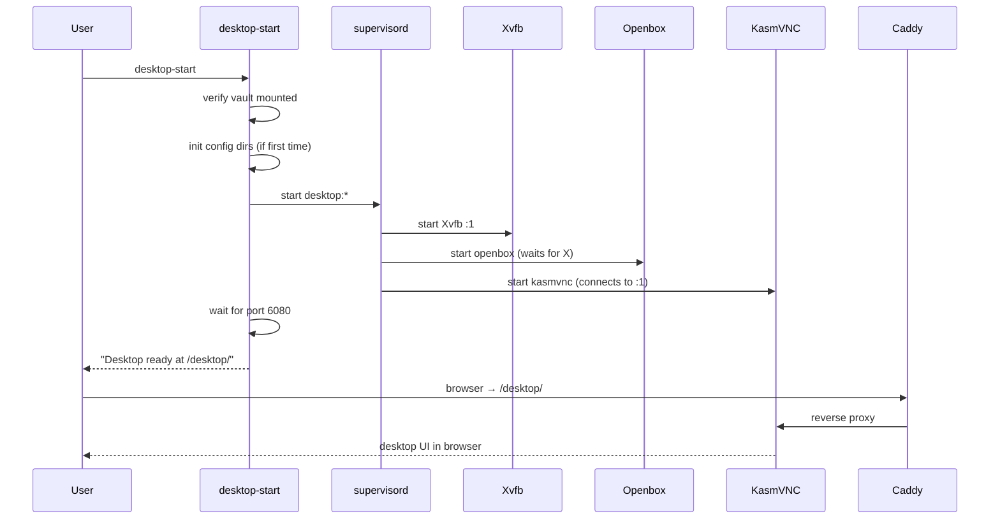
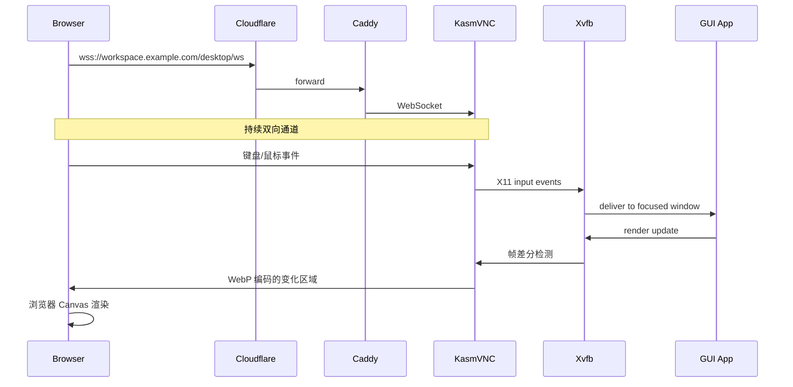
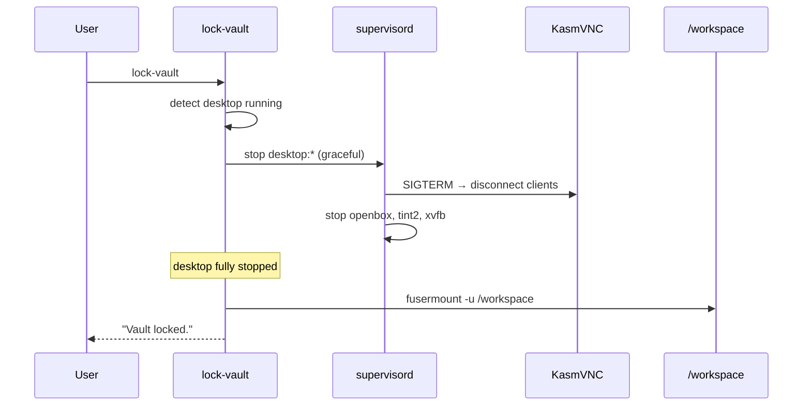

# Design Document

## Overview

为 dev-workspace 添加浏览器可访问的完整 Linux 桌面环境。使用 KasmVNC 作为传输层，Xvfb 作为虚拟显示，Openbox 作为窗口管理器。桌面环境按需启动，所有应用配置存储在 gocryptfs 加密层内。

设计原则：
- **按需启动**：桌面不是必须的，不用时零资源消耗
- **加密一致**：GUI 应用配置享受与代码相同的加密保护
- **无缝集成**：共享 workspace、proxy、tunnel，不引入新的访问入口
- **轻量优先**：基础设施 < 250MB，不预装重型应用

## Architecture

### 系统拓扑（新增部分）

```
浏览器
├── /              → Caddy → code-server (:8082)     ← IDE
├── /sync/*        → Caddy → sync-service (:8081)    ← 文件同步
└── /desktop/*     → Caddy → KasmVNC (:6080)         ← 远程桌面 (NEW)
                                │
                                ▼ WebSocket
                         KasmVNC Server
                                │
                                ▼ X11 protocol
                         Xvfb (:1, 1920x1080x24)
                                │
                         Openbox (窗口管理)
                         tint2 (任务栏)
                         GUI 应用 (用户安装)
```

### 进程树（桌面运行时）

```
supervisord
├── caddy
├── code-server
├── sync-service
├── vault-sync-cron
├── clash-watcher
└── desktop (NEW — supervisord program, autostart=false)
    ├── Xvfb :1 -screen 0 ${RESOLUTION}x24
    ├── openbox --config-file /workspace/.desktop/.config/openbox/rc.xml
    ├── tint2 -c /workspace/.desktop/.config/tint2/tint2rc
    └── kasmvnc_server -websocketPort 6080 -display :1 ...
```

### 文件系统布局

```
/opt/desktop-apps/                 ← 应用二进制 (不加密, 容器层/volume)
├── firefox/
├── idea/
└── burpsuite/

/workspace/.desktop/               ← 应用配置 (加密, vault 内)
├── .config/
│   ├── openbox/rc.xml            ← 窗口管理器配置
│   ├── tint2/tint2rc             ← 面板配置
│   ├── kasmvnc/                  ← VNC 会话设置
│   ├── JetBrains/                ← IDEA 配置
│   └── BurpSuite/                ← Burp 项目
├── .local/share/
│   ├── applications/             ← .desktop 文件 (应用菜单)
│   └── recently-used.xbel        ← 最近文件
├── .mozilla/                      ← Firefox profile
└── Desktop/                       ← 桌面文件夹 (用户可放快捷方式)

/tmp/.desktop-cache/               ← 缓存 (tmpfs, 不加密, 容器停止消失)
├── thumbnails/
├── fontconfig/
└── mesa_shader_cache/
```

## Components and Interfaces

### 1. Desktop Service (supervisord program)

**配置:** supervisord 中注册为 `autostart=false` 的 program group，由 `desktop-start` 命令手动启动。

```ini
[program:xvfb]
command=/usr/bin/Xvfb :1 -screen 0 %(ENV_DESKTOP_RESOLUTION)sx24 -ac +extension GLX +render -noreset
autostart=false
autorestart=true
environment=HOME="/workspace/.desktop"

[program:openbox]
command=/usr/bin/openbox --config-file /workspace/.desktop/.config/openbox/rc.xml
autostart=false
autorestart=true
depends_on=xvfb
environment=DISPLAY=":1",HOME="/workspace/.desktop",XDG_CONFIG_HOME="/workspace/.desktop/.config",XDG_DATA_HOME="/workspace/.desktop/.local/share",XDG_CACHE_HOME="/tmp/.desktop-cache"

[program:tint2]
command=/usr/bin/tint2 -c /workspace/.desktop/.config/tint2/tint2rc
autostart=false
autorestart=true
depends_on=openbox
environment=DISPLAY=":1",HOME="/workspace/.desktop"

[program:kasmvnc]
command=/usr/bin/kasmvncserver -display :1 -websocketPort 6080 -interface 127.0.0.1 -SecurityTypes None -FrameRate 30 -DynamicQualityMin 4 -DynamicQualityMax 9 -WebpCompression 8 -IdleTimeout 0
autostart=false
autorestart=true
depends_on=xvfb
environment=HOME="/workspace/.desktop"

[group:desktop]
programs=xvfb,openbox,tint2,kasmvnc
```

**为什么 autostart=false：**
- 桌面按需启动，不用时零开销
- 需要 vault 先 unlock（配置在加密层内）
- 并非所有用户都需要 GUI

### 2. desktop-start / desktop-stop CLI

**位置:** `packages/cli/src/desktop-start.ts`, `packages/cli/src/desktop-stop.ts`

**desktop-start 逻辑:**
```typescript
// 1. 验证 vault 已挂载
if (!await isMounted(WORKSPACE_MOUNT)) {
  console.error("Vault not unlocked. Run: unlock-vault");
  process.exit(1);
}

// 2. 初始化桌面配置目录 (首次使用)
await initDesktopConfig();

// 3. 启动 desktop group
await $`supervisorctl start desktop:*`;

// 4. 等待 KasmVNC 端口就绪
await waitForPort(6080);

console.log("Desktop ready at: /desktop/");
```

**desktop-stop 逻辑:**
```typescript
// 1. 停止 desktop group
await $`supervisorctl stop desktop:*`;
console.log("Desktop stopped.");
```

### 3. Caddy Route 变更

```
:8080 {
    handle /desktop/* {
        uri strip_prefix /desktop
        reverse_proxy 127.0.0.1:6080
    }
    handle /sync/* {
        reverse_proxy 127.0.0.1:8081
    }
    handle {
        reverse_proxy 127.0.0.1:8082
    }
}
```

KasmVNC 的 web UI 需要 WebSocket 升级，Caddy 默认透传 WebSocket。

### 4. desktop-install 脚本

**位置:** `packages/cli/src/desktop-install.ts`

**支持的应用:**

```typescript
const APPS: Record<string, AppDef> = {
  firefox: {
    install: "apt-get install -y firefox-esr",
    desktop: "firefox-esr.desktop",
    category: "browser",
  },
  chromium: {
    install: "apt-get install -y chromium",
    desktop: "chromium.desktop",
    category: "browser",
  },
  idea: {
    install: async () => {
      // Download from JetBrains site, extract to /opt/desktop-apps/idea/
      // Create .desktop file
    },
    desktop: "jetbrains-idea.desktop",
    category: "ide",
  },
  burpsuite: {
    install: async () => {
      // Download installer, run with --mode unattended
      // Install to /opt/desktop-apps/burpsuite/
    },
    desktop: "burpsuite.desktop",
    category: "pentest",
  },
  wireshark: {
    install: "apt-get install -y wireshark",
    desktop: "wireshark.desktop",
    category: "network",
  },
};
```

安装后自动在 `/workspace/.desktop/.local/share/applications/` 创建 `.desktop` 文件，使应用出现在菜单中。

### 5. lock-vault 集成

修改现有 `lock-vault.ts`：在 unmount 之前先停止桌面：

```typescript
// 新增：在 fusermount 之前
if (isDesktopRunning()) {
  console.log("Stopping desktop session...");
  await $`supervisorctl stop desktop:*`.quiet().nothrow();
}
// 原有：fusermount -u /workspace
```

### 6. self-destruct 集成

修改 `destroyCore()` Phase 1：在 unmount 之前先停桌面：

```typescript
// Phase 1: 切断明文
await $`supervisorctl stop desktop:*`.quiet().nothrow(); // NEW
await unmountVault(WORKSPACE_MOUNT);
await unmountVault(PENTEST_MOUNT);
```

### 7. Pentest 环境 GUI 支持

修改 `pentest-enter.ts`：将 X11 socket 挂入 chroot：

```bash
mount --bind /tmp/.X11-unix ${PENTEST_MOUNT}/tmp/.X11-unix
# 然后 chroot 内的应用可以用 DISPLAY=:1 显示到宿主桌面
```

## Data Models

### 环境变量（桌面会话内）

```bash
DISPLAY=:1
HOME=/workspace/.desktop
XDG_CONFIG_HOME=/workspace/.desktop/.config
XDG_DATA_HOME=/workspace/.desktop/.local/share
XDG_STATE_HOME=/workspace/.desktop/.local/state
XDG_CACHE_HOME=/tmp/.desktop-cache
XDG_RUNTIME_DIR=/run/user/0
http_proxy=http://127.0.0.1:7890
https_proxy=http://127.0.0.1:7890
all_proxy=socks5://127.0.0.1:7890
```

### 桌面状态检测

```typescript
async function isDesktopRunning(): Promise<boolean> {
  const result = await $`supervisorctl status desktop:xvfb`.quiet().nothrow();
  return result.stdout.toString().includes("RUNNING");
}
```

### desktop-install 注册表

```
/opt/desktop-apps/.registry.json
{
  "installed": {
    "firefox": { "version": "128.0", "installedAt": "2025-01-01T00:00:00Z" },
    "idea": { "version": "2024.3", "installedAt": "..." }
  }
}
```

## Data Flows

### Flow 1: 桌面启动



### Flow 2: 浏览器 GUI 操作



### Flow 3: lock-vault 与桌面的交互



## Error Handling

| 错误场景 | 处理方式 |
|----------|----------|
| desktop-start 但 vault 未挂载 | 拒绝启动，提示 unlock-vault |
| KasmVNC 端口被占用 | 检查并报错，提示已有会话运行 |
| GUI 应用在 lock-vault 时未响应 SIGTERM | desktop-stop 使用 timeout + SIGKILL |
| Xvfb crash | supervisord autorestart，KasmVNC 自动重连 |
| 浏览器窗口关闭 | 桌面会话持续运行，重新打开 /desktop/ 即可恢复 |
| 分辨率不匹配 | KasmVNC dynamic resolution 自动调整 |
| OpenGL 应用 crash (llvmpipe 不兼容) | 应用级问题，不影响桌面环境本身 |
| desktop-install 网络不通 | 依赖 Clash proxy，提示检查代理状态 |

## Correctness Properties

### Property 1: Zero Leakage on Lock
**Validates: Requirements 3.4, 3.1**
当 vault 锁定时，desktop 进程组已完全终止，没有进程持有 `/workspace/.desktop/` 下文件的 fd。FUSE unmount 不会因 EBUSY 而失败。

### Property 2: Desktop Optional
**Validates: Requirements 4.1, 4.2**
supervisord 配置 `autostart=false`，不执行 `desktop-start` 时，Xvfb/KasmVNC/Openbox 进程不存在，资源占用为零。

### Property 3: Config Encryption
**Validates: Requirements 3.1, 3.2, 3.7**
所有 XDG 路径指向 `/workspace/.desktop/`（vault 内），应用配置文件在磁盘上只以 gocryptfs 密文形式存在。

### Property 4: Proxy Inheritance
**Validates: Requirements 5.6, 6.2**
桌面会话环境变量包含 http_proxy/https_proxy，所有 GUI 应用（Firefox、IDEA 等）自动走 Clash 代理，无需单独配置。

### Property 5: Shared Workspace
**Validates: Requirements 6.1**
desktop 和 code-server 共享同一个 `/workspace` FUSE mount。文件修改实时互通。

## Testing Strategy

1. **PoC 验证（首先执行）:**
   - 独立 Dockerfile 安装 Xvfb + KasmVNC + Openbox
   - 验证 Mac Mini Docker Desktop 下的实际帧率（target: 25+ fps）
   - 验证 llvmpipe OpenGL 可用性（glxinfo）
   - 测量内存基线

2. **集成测试:**
   - desktop-start → 验证 6080 端口响应
   - lock-vault → 验证 desktop 被正确停止后再 unmount
   - unlock-vault + desktop-start → 验证配置从加密层正确恢复

3. **性能基线:**
   - 空闲桌面内存 < 250MB
   - Caddy → KasmVNC 路由延迟 < 5ms (本地)
   - 通过 CF Tunnel 总延迟 < 120ms (目标)
