# Design Document

## Overview

The secure-dev-workspace is a single-host development system that turns a Mac Mini in a company server room into a remote, browser-accessible IDE whose contents are encrypted at rest, encrypted in transit (above TLS), and reachable through an authenticated Cloudflare Tunnel rather than any inbound network port.

**Implementation stack (post-refactor):**
- Runtime: Bun (replaces Node.js)
- HTTP framework: Hono + Bun.serve() (replaces Fastify)
- Container scripts: Bun TypeScript (replaces shell scripts)
- Lint/Format: Biome (replaces eslint+prettier)
- JDK: Azul Zulu 17 via mise
- Monorepo: packages/core, packages/server, packages/cli, packages/spa
- Auth: code-server built-in password (replaces Cloudflare Access OAuth)

The design is shaped by three hard constraints from the operating environment:

1. **Hostile host context.** The Mac Mini runs under company management with EDR/DLP and likely TLS interception via a corporate root CA. The host filesystem, processes, and network traffic are observable.
2. **Restrictive network.** Direct egress to GitHub and other developer services is unreliable; all outbound traffic must transit the user's own proxy.
3. **Single passphrase, zero secrets on disk.** The user remembers one vault password. Everything else (sync key, GitHub credentials, SSH keys) must derive from it or live inside the vault.

The system answers these constraints with one consistent mental model:

> **Plaintext exists only inside FUSE-mounted memory pages of a Docker container. Everything that crosses the container boundary (disk write, network send) is encrypted with a key the company cannot derive.**

The container houses Clash (egress), gocryptfs (storage), code-server (IDE), a sync service (file transfer), and a vault-sync daemon (Git push to GitHub), supervised by a single process tree. A Cloudflare Tunnel provides ingress without opening any host port. The browser carries a second encryption layer above TLS so a corporate MITM proxy sees only opaque AEAD-encrypted blobs disguised as benign media.

The result is a system where the failure modes are explicit and the security boundary is a single, easily audited surface: **the FUSE mount is the only place plaintext data lives, and it disappears when the container stops.**

## Architecture

### High-Level Topology

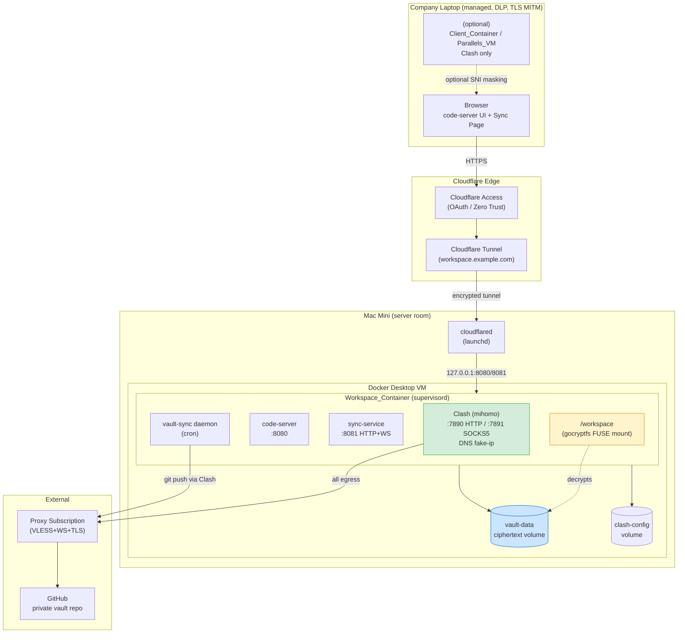

### Security Boundary Layers

The system stacks five independent encryption / access boundaries. Compromise of any single layer does not leak plaintext.

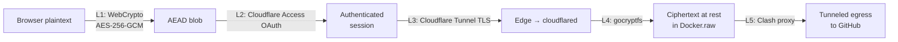

| Layer | Defends Against | Key Material |
|-------|-----------------|--------------|
| L1 WebCrypto AEAD | Corporate TLS MITM, Cloudflare itself, sync-service log leakage | HKDF(vault_passphrase, "sync-key-v1") |
| L2 Cloudflare Access | Unauthenticated reach to tunnel | OAuth IdP (Google/GitHub/etc.) |
| L3 Cloudflare Tunnel TLS | Network sniffing, port scanning of Mac Mini | Cloudflare-managed |
| L4 gocryptfs | Disk forensics, Docker volume export, host file access | Vault passphrase → master key |
| L5 Clash proxy | Network-level identification of GitHub traffic, DNS leakage | User's proxy subscription |

### Process & Volume Topology Inside the Container

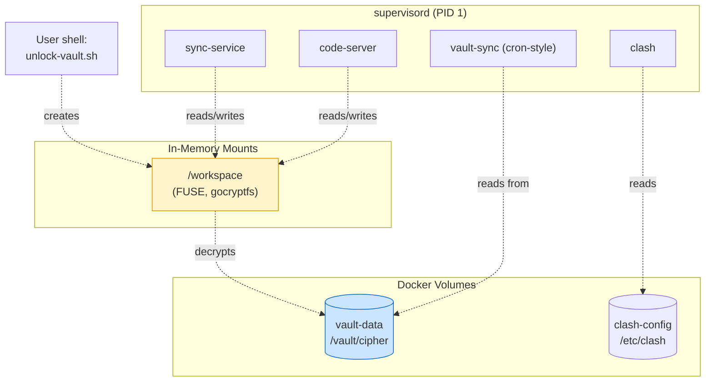

## Components and Interfaces

The system is composed of seven cooperating components. Each is described with its single responsibility, dependencies, and interfaces.

### 1. Workspace_Container (Image)

**Responsibility:** Self-contained runtime environment. One image, all services.

**Build strategy:**
- Base image: `debian:bookworm-slim` (small, FUSE-friendly, broadly mirrored)
- Core layer (rarely changes): supervisord, gocryptfs, FUSE utils, clash (mihomo), cloudflared (optional), git, git-lfs, openssh-client, ca-certificates, tini, cron
- Tooling layer (mise-managed): python, java17, node, pnpm, jf CLI, code-server. Pinned via `.mise.toml` baked into the image; users may override at runtime via `/workspace/.mise.toml`.
- Filesystem prep: `/workspace` (mountpoint), `/vault/cipher` (volume target), `/etc/clash`, `/etc/supervisor/conf.d/`
- Capabilities: requires `--cap-add SYS_ADMIN --device /dev/fuse`. Documented; not negotiable.
- Build resilience (R24): `Dockerfile.aliyun` sibling that swaps base registry; `make image-export` produces a `.tar` for `docker save | docker load` migration.

**Runtime contract:**
- Runs as root inside container (R1.7); escape would yield no privileges on host (Docker Desktop VM isolation).
- Logs default to `driver: "local"` with 10MB cap to avoid DLP-readable plaintext leakage.

### 2. Clash_Proxy (mihomo)

**Responsibility:** Single egress chokepoint. Every byte leaving the container traverses Clash.

**Configuration model:**
- Static base config at `/etc/clash/config.yaml` (user-supplied or fetched from `CLASH_SUBSCRIPTION_URL`).
- Custom rules at `/etc/clash/rules.yaml` (user-editable, mounted via clash-config volume).
- DNS interception: `enhanced-mode: fake-ip`, listening on `:53` inside container, with `dns.listen: 0.0.0.0:53` and `nameserver: [https://1.1.1.1/dns-query]` (DoH through proxy nodes).
- Bypass list: `localhost`, `127.0.0.0/8`, `172.16.0.0/12`, `10.0.0.0/8`, `169.254.0.0/16`, `*.local`.
- Default routing strategy:
  - Direct: package mirrors (npm, pypi, maven central) — configurable.
  - Proxy: GitHub, Cloudflare API, the user's vault Git host.
  - Reject: telemetry/known tracker domains.

**Interfaces:**
- `:7890` HTTP proxy
- `:7891` SOCKS5 proxy
- `:9090` Clash external controller (loopback only inside container, used by `doctor.sh`)

**Startup contract (R2, R8):** Clash is started by `entrypoint.sh` directly (not by supervisord) so the entrypoint can explicitly wait for `:7890` to listen and a HEAD probe via the proxy to succeed before `exec`-ing supervisord. Supervisord then manages caddy, code-server, sync-service, and the vault-sync cron in parallel. Each of those services tolerates clash being briefly unavailable (caddy retries upstream; sync-service polls vault state; vault-sync skips on push failure). This split avoids the supervisord-doesn't-wait-for-readiness problem.

### 3. Vault (gocryptfs)

**Responsibility:** Encrypted filesystem. The only persistent home for plaintext data — and even there, plaintext is never on disk.

**Layout:**

```
/vault/cipher/                  ← Docker volume (ciphertext, persists)
├── gocryptfs.conf              ← master key (encrypted with passphrase)
├── gocryptfs.diriv
├── .git/                       ← vault is itself a Git repo (R9)
├── .gitignore                  ← excludes node_modules/, build/, etc.
├── .gitattributes              ← LFS rules for large binary blobs
└── <encrypted file blocks>

/workspace/                     ← FUSE mount (plaintext, in-memory)
├── README-UNLOCK.md            ← shown when locked (baked at build time)
├── .code-server/               ← extensions, settings (persists in vault)
├── .credentials/
│   ├── ssh/                    ← symlinked to ~/.ssh on unlock
│   └── github-token
├── .mise.toml                  ← user tool overrides
├── shared/                     ← sync-service drop folder (R19)
└── projects/                   ← user code
```

**Key derivation chain (R20.2):**

```
                    user passphrase
                          │
              ┌───────────┴───────────┐
              ▼                       ▼
       gocryptfs scrypt        HKDF-SHA256
       (master key wrap)       salt = "sync-key-v1"
              │                       │
              ▼                       ▼
        vault master key      sync AEAD key (32 bytes)
        (file encryption)     (browser ↔ sync-service)
```

The two keys are cryptographically independent; compromise of one does not enable derivation of the other.

**Lifecycle scripts:**
- `init-vault.sh` — one-time, prompts for passphrase, runs `gocryptfs -init`, writes `.gitignore`/`.gitattributes`, `git init`, and seeds `/workspace/.credentials/sync-passphrase` (mode 0600) with the passphrase so the sync-service can recover the sync key after future unlocks/restarts without user re-entry. The vault itself is the only place this file ever exists in plaintext (FUSE-mounted memory only).
- `unlock-vault.sh` — reads passphrase via TTY, mounts `/vault/cipher` at `/workspace`, runs post-unlock hooks (symlink SSH, configure git creds, broadcast `{"state":"unlocked"}` via UNIX socket `/var/run/vault-state.sock` to sync-service). The sync-service then reads `/workspace/.credentials/sync-passphrase` and derives the AEAD key via HKDF in its own process memory.
- `lock-vault.sh` — `fusermount -u /workspace`, broadcasts `{"state":"locked"}`. The sync-service drops its in-memory key.
- On sync-service crash/restart while vault is mounted, sync-service detects mount on startup and re-derives the key from the same path (file is still readable through FUSE).
- `change-vault-password.sh` — refuses if mounted; calls `gocryptfs -passwd`. Note: changing vault passphrase must also rewrite `/workspace/.credentials/sync-passphrase` after the next unlock.
- `vault-prune.sh` — wraps `git filter-repo` for large-file removal.

### 4. Code_Server

**Responsibility:** The IDE surface. Stateless from a security perspective; all state lives in `/workspace`.

**Config:**
- Bind: `0.0.0.0:8080` (inside container) — but Docker maps to `127.0.0.1:<host-port>` (R5.4, R6.5).
- `--auth none` — authentication is delegated entirely to Cloudflare Access.
- `--user-data-dir /workspace/.code-server` — extensions and settings persist with vault.
- Auto-save enabled (R5.5).
- Inherits `http_proxy`/`https_proxy` from container env so marketplace traffic transits Clash.

**When vault is locked:** `/workspace/README-UNLOCK.md` (created at image build time, present in unmounted state) is what the user sees, with terminal instructions.

### 5. Sync_Service

**Responsibility:** Browser-native bidirectional file sync (R19) and end-to-end encrypted transport (R20).

**Architecture:**

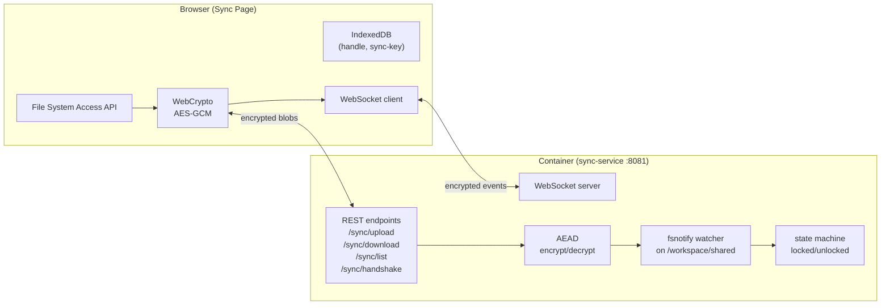

**Wire protocol (one operation = one envelope; large files use multiple envelopes):**

```
ClientEnvelope {
  op:       "put-chunk" | "put-finalize" | "delete" | "rename" | "list" | "handshake"
  nonce:    12 bytes (random, unique per envelope per key)
  ciphertext: AEAD(key, nonce, plaintext_payload, aad=AAD_per_op)
  tag:      AEAD authentication tag (last 16 bytes of GCM output)
}

AAD per op (binds the envelope to its semantic position so chunks cannot be swapped):
  put-chunk    → "put-chunk|<timestamp_ms>|<file_id>|<chunk_idx>"
  put-finalize → "put-finalize|<timestamp_ms>|<file_id>|<total_chunks>"
  delete       → "delete|<timestamp_ms>|<path_hash>"     (path_hash = SHA-256(path))
  rename       → "rename|<timestamp_ms>|<from_hash>|<to_hash>"
  list         → "list|<timestamp_ms>"
  handshake    → "handshake|<timestamp_ms>"

plaintext_payload (per op):
  put-chunk    → { file_id, chunk_idx, total_chunks, chunk_bytes }     (1 chunk ≤ 4 MiB)
  put-finalize → { file_id, path, mtime, size, content_sha256 }
  delete       → { path, mtime }
  rename       → { from, to, mtime }
  handshake    → { magic: "secure-dev-workspace-handshake-v1", echo: <client_random> }
```

**Chunked upload protocol:**
- Browser reads file via `File.slice(start, end)` to keep memory bounded; each 4 MiB chunk is an independent AEAD envelope with its own nonce.
- Server accumulates chunks under `.uploading-<file_id>` keyed by `file_id` (UUID generated by the SPA before the first chunk).
- Server validates `chunk_idx` is monotonic and contiguous; out-of-order or duplicate chunks are rejected.
- On `put-finalize`, server verifies the assembled file's SHA-256 matches `content_sha256`, then atomically renames `.uploading-<file_id>` to `path`. Mismatch → delete temp, return error.
- A finalize that arrives without all chunks present (or with stale chunks > 1 hour old) → reject; SPA retries from chunk 0.
- 500 MB file ≈ 125 chunks; replay window must be sized accordingly (≥ 1000 envelopes per minute headroom).

**Replay protection:**
- Server keeps a sliding window of `(nonce_hash, timestamp_ms)` pairs scoped to the current key. Any nonce already seen within the window is rejected.
- Timestamp tolerance: ±300 seconds (5 min) between client and server clocks. Envelopes outside this window are rejected.
- Clock-skew handling: at handshake, server returns its own current `unix_ms`. If skew > 60 s, SPA logs a warning and applies an offset to subsequent envelope timestamps so they fall within tolerance.
- Window size: at least 10000 entries; eviction by oldest timestamp.
- The window is per-key, not per-connection, so multiple browser tabs sharing the same key still share replay protection.

**Handshake:**
- On first key derivation in the browser, the SPA sends a `handshake` envelope. The server decrypts; if the magic string matches, it stores the (key fingerprint = first 16 bytes of `SHA-256(key)`) and responds with a fresh AEAD-encrypted "ok" envelope plus its current `unix_ms`. The SPA decrypts and confirms key correctness end-to-end.
- A wrong passphrase yields decryption failure on either side, and the SPA shows "wrong passphrase" rather than "sync working".
- A stale-key handshake (server sees a different key fingerprint than last time, e.g., after vault password rotation) responds with `key-rotated`; SPA clears its IndexedDB key cache and prompts re-entry.

**Camouflage (R20.5, R20.6):**
- HTTPS multipart upload with `Content-Type: image/png` and a 33-byte PNG header prefix prepended to ciphertext: 8-byte signature `89 50 4E 47 0D 0A 1A 0A` + 25-byte IHDR chunk (4-byte length `00 00 00 0D`, 4-byte type `IHDR`, 13-byte payload encoding 1×1 dimensions and color type, 4-byte CRC). Receiver strips this fixed prefix before AEAD decryption.
- Filename pattern: `asset-{uuid}.png`.
- Path/filename are inside the encrypted payload (R20.9), never in URL or headers.

**State machine:**

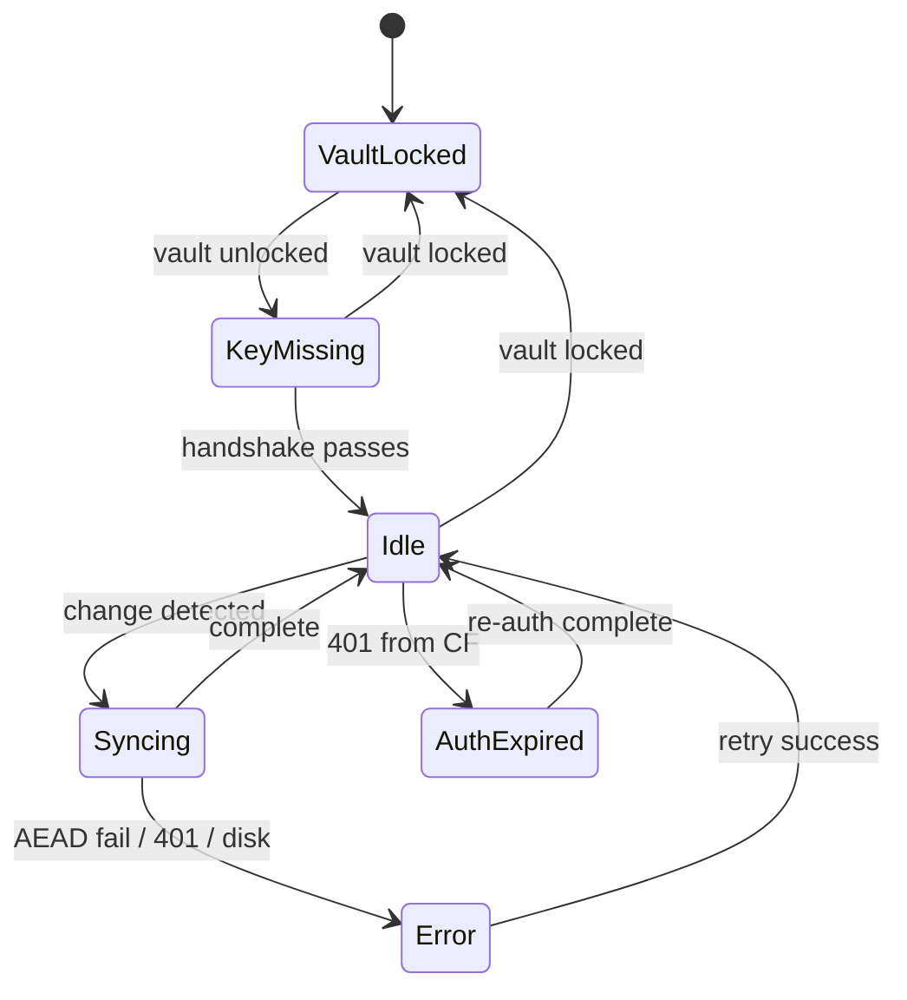

**Conflict resolution (R19.9):** content-hash compare on reconciliation; if both sides changed, rename loser to `<name>.conflict-<ts>` and surface in UI.

**Single-session lock (R19.18):** `BroadcastChannel("sync-lock-<folder-hash>")` + IndexedDB lease record with TTL.

### 6. Cloudflare_Tunnel + Cloudflare_Access

**Responsibility:** Ingress without opening a port on the Mac Mini; identity-aware proxy.

**Layout decisions:**
- `cloudflared` runs on the **host** (launchd), not inside the container. Reason: tunnel credentials are scoped to the host's Cloudflare account; running outside Docker keeps them separate from the workspace image and survives container rebuilds.
- A small reverse proxy (Caddy, baked into the workspace image) fronts both code-server (`/`) and sync-service (`/sync/*`) on a single container port `:8080`. This is necessary because Cloudflare Tunnel ingress rules route by **hostname only**, not by path.
- Tunnel ingress: single rule `workspace.example.com` → `http://localhost:<host-port>` → container Caddy → demuxes to code-server or sync-service by path prefix.
- Cloudflare Access policy: require OAuth (Google/GitHub) AND require user email match.
- Setup script (`setup-cloudflared.sh`) automates `cloudflared tunnel login → create → service install → route dns`.

### 7. Vault_Sync_Daemon

**Responsibility:** Periodically push vault ciphertext to a private GitHub repo (R9).

**Algorithm (every `VAULT_SYNC_INTERVAL`, default 30 min):**

```
1. if /workspace not mounted: log "skipped (locked)", exit 0
2. cd /vault/cipher
3. git add -A                       # ciphertext blocks only
4. if no changes: exit 0
5. git commit -m "auto-sync $(date -Iseconds)"
6. git push                         # via Clash
7. on success: write /var/run/vault-sync/last-success
   on failure: increment counter; if ≥ threshold,
               write banner to /workspace/.notifications/sync-failure.md
```

Runs under cron inside the container, supervised by supervisord. Exclusions are enforced via the in-vault `.gitignore` (R9.9, R25.1).

### Component Interface Summary

| From → To | Channel | Format | Auth |
|-----------|---------|--------|------|
| Browser → cloudflared | HTTPS (TLS, possibly MITM'd) | HTTP/WS | Cloudflare Access OAuth |
| cloudflared → code-server | localhost TCP | HTTP | none (loopback only) |
| cloudflared → sync-service | localhost TCP | HTTP/WS | none (loopback only) |
| Browser ↔ sync-service | (over above) | AEAD envelopes in PNG-camouflaged multipart | sync key from HKDF |
| code-server ↔ /workspace | direct fs syscalls | files | FUSE-mediated |
| sync-service ↔ /workspace/shared | direct fs syscalls + fsnotify | files | FUSE-mediated |
| vault-sync → GitHub | git over HTTPS via Clash:7890 | git pack | SSH key/PAT in vault |
| All container egress → Internet | SOCKS5/HTTP via Clash | proxied TCP | proxy subscription |
| unlock-vault → sync-service | UNIX socket `/var/run/vault-state.sock` | line-delimited JSON | filesystem perms |

## Data Models

The system has very few persistent data shapes; most state is filesystem-derived. The four that matter:

### `.env` (host, gitignored)

```
# Egress
CLASH_SUBSCRIPTION_URL=https://...
# Ingress
CLOUDFLARE_TUNNEL_TOKEN=...
TUNNEL_HOST_PORT=18080           # 127.0.0.1:18080 → container Caddy :8080
                                 # Caddy demuxes / and /sync/* internally
# Persistence
VAULT_GIT_REPO=git@github.com:user/dev-vault.git
VAULT_SYNC_INTERVAL=1800
# Identity
GIT_USER_NAME=...
GIT_USER_EMAIL=...
TZ=Asia/Shanghai
# Resources
MEMORY_RESERVATION=8g
```

### `.mise.toml` (in vault, plaintext only when mounted)

```toml
[tools]
python = "3.12"
java   = "17"
node   = "20"
pnpm   = "latest"
# user-overridable; baked defaults provide offline usability
```

### Sync envelope (wire format)

```typescript
type Envelope = {
  v: 1;                      // protocol version
  op: "put" | "delete" | "rename" | "list" | "handshake";
  nonce: Uint8Array;         // 12 bytes
  ciphertext: Uint8Array;    // AEAD output incl. tag
};
// AEAD additional data (AAD): "${op}|${unix_ms}"
// Inner plaintext: JSON, then for "put" appended with raw chunk bytes
```

### Vault sync state (host-readable, contains no plaintext)

```
/var/run/vault-sync/
├── last-success          # ISO timestamp
├── consecutive-failures  # integer
└── last-error            # short string, no path/content
```

### State Diagrams

**Vault lifecycle:**

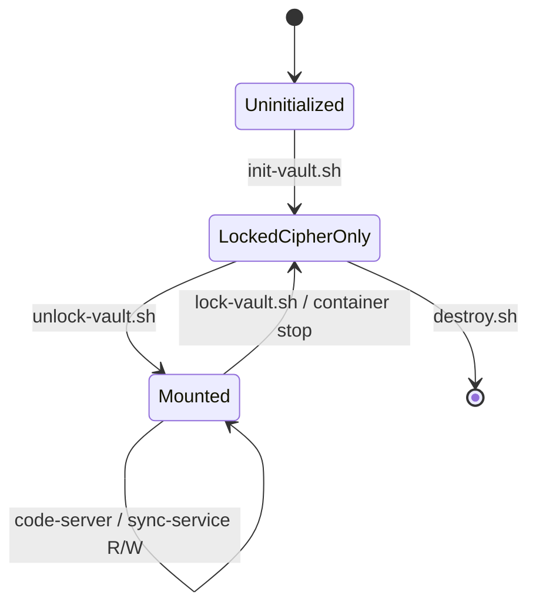

**Container startup:**

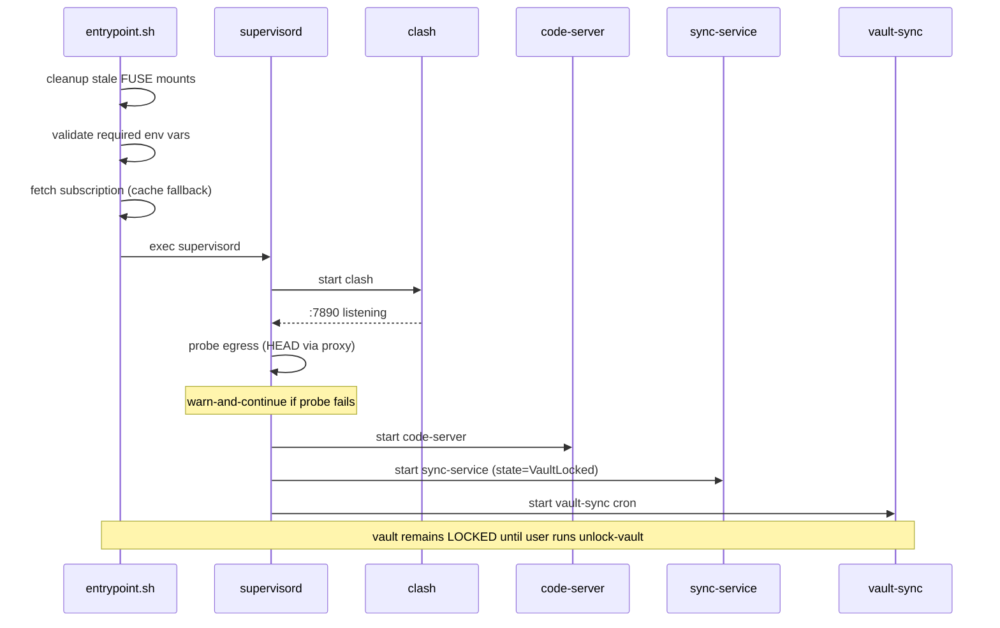

## Data Flows

### Flow 1: Normal IDE Usage (Browser → code-server)

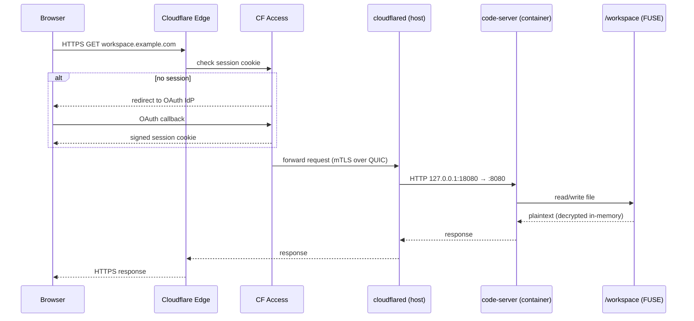

### Flow 2: File Sync — Local change uploaded to container

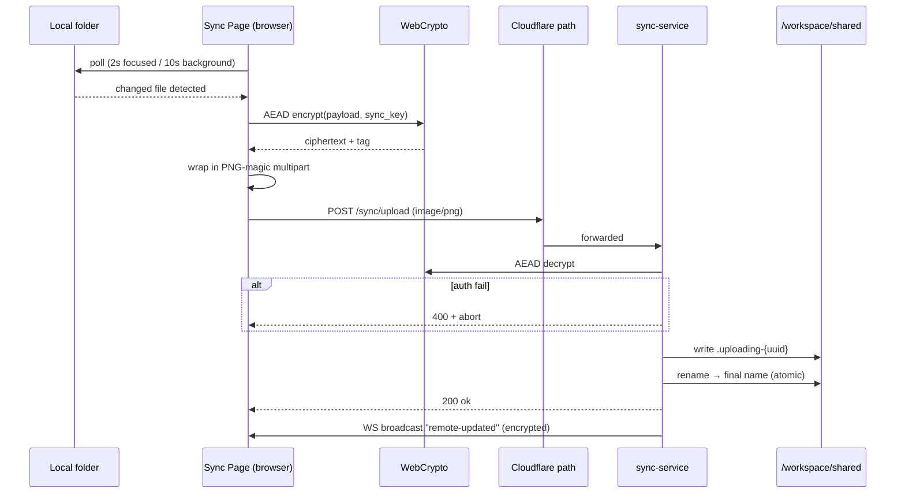

### Flow 3: File Sync — Remote change pushed to laptop

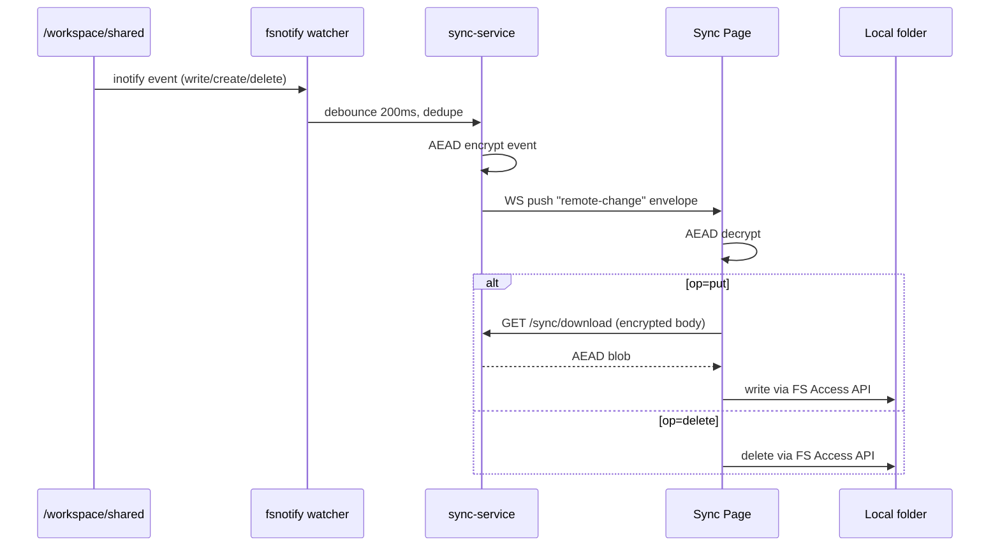

### Flow 4: Vault Sync (container → GitHub)

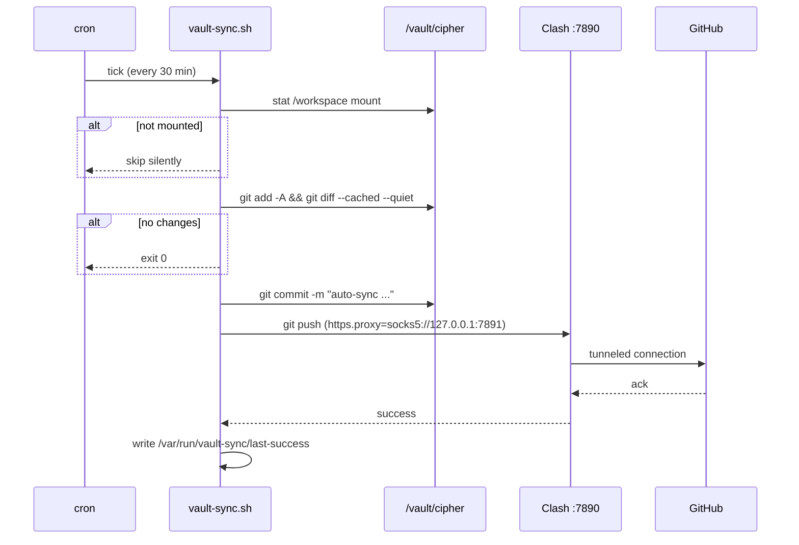

### Flow 5: Bootstrap on a fresh Mac Mini

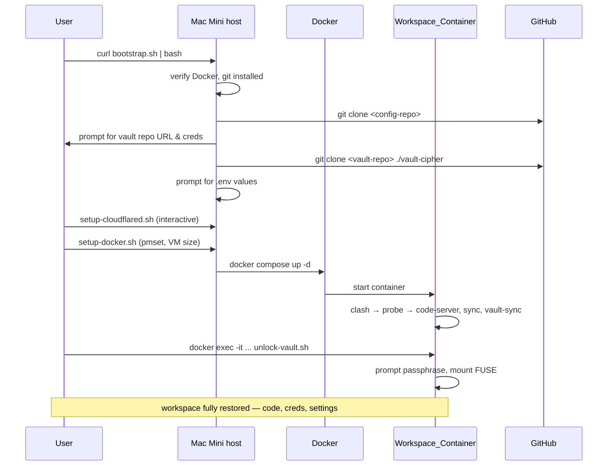

### Flow 6: Destroy

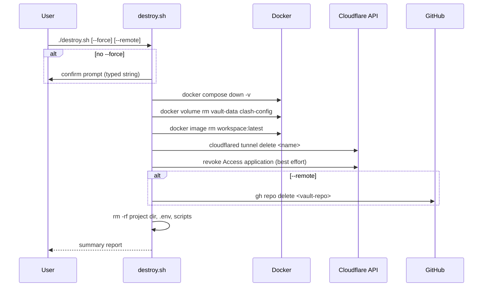

## Security Model

### Adversaries

| ID | Adversary | Capability |
|----|-----------|------------|
| A1 | Company DLP/EDR on Mac Mini | Read host filesystem, list processes, read Docker logs, inspect network traffic from host |
| A2 | Company DLP/EDR on laptop | Same as A1, plus install corporate root CA → TLS MITM |
| A3 | Network operator | Block domains, throttle, DNS poison, observe SNI/IP patterns |
| A4 | Cloudflare | Sees TLS-decrypted traffic at edge (since they terminate the tunnel) |
| A5 | Casual host user / shared session | Local console access to Mac Mini |
| A6 | GitHub / vault repo host | Sees ciphertext blobs |
| A7 | Lost device | Possession of laptop or Mac Mini |

### Threats and Defenses

```mermaid
graph TB
    T1["T1: Plaintext on host disk<br/>(forensics, EDR scan)"] --> D1["FUSE mount in container memory only<br/>+ Docker.raw indirection<br/>+ no plaintext volumes"]
    T2["T2: Process / FS observation<br/>by EDR"] --> D2["Container isolates fs; host sees<br/>'com.docker.hyperkit' only"]
    T3["T3: TLS MITM with corporate CA"] --> D3["L1: WebCrypto AEAD above TLS<br/>+ traffic camouflaged as PNG"]
    T4["T4: DNS leakage to company DNS"] --> D4["Clash fake-ip + DoH;<br/>container uses :53→Clash only"]
    T5["T5: Direct GitHub block / monitoring"] --> D5["All git ops via Clash:7891<br/>(SOCKS5); failure is fail-closed"]
    T6["T6: Inbound port scan<br/>or IP exposure"] --> D6["No host port open to network;<br/>cloudflared outbound only"]
    T7["T7: Unauthenticated access"] --> D7["Cloudflare Access OAuth required;<br/>code-server itself --auth none"]
    T8["T8: Vault repo theft"] --> D8["gocryptfs ciphertext useless<br/>without passphrase"]
    T9["T9: Sync key derivation leak"] --> D9["HKDF context separation;<br/>sync key ≠ vault key"]
    T10["T10: Partial-file race / corruption"] --> D10["Atomic temp+rename;<br/>AEAD detects tampering"]
    T11["T11: Forgotten plaintext after crash"] --> D11["Stale FUSE cleanup on entrypoint;<br/>FUSE disappears with container"]
    T12["T12: Browser tab compromise"] --> D12["Sync key non-extractable<br/>CryptoKey in IndexedDB"]
```

### Defense-in-Depth Per Layer

**Host (Mac Mini):**
- All workspace state lives inside Docker volumes, which sit inside `Docker.raw` (an opaque Linux VM disk image to the host EDR).
- No bind-mounts of plaintext directories. Host filesystem only sees the project dir (compose, scripts, `.env`) and `Docker.raw`.
- `pmset` keeps machine awake; auto-restart on power. No host login auto-launch beyond Docker Desktop and cloudflared.
- Container `--log-driver local --log-opt max-size=10m`. No DEBUG logging of user paths or content.

**Container:**
- Runs as root *inside* container; the container is a low-trust sandbox to the host. Capabilities limited to `SYS_ADMIN` (FUSE) and `/dev/fuse`.
- Plaintext is reachable only through `/workspace` (FUSE-mediated kernel pages inside the Docker VM). No process outside the container can `ptrace` it.
- Stale-mount cleanup at entrypoint protects against unclean shutdowns.

**Egress:**
- Single chokepoint: Clash. If Clash is down, network is down — fail-closed (R15.4).
- DNS interception ensures even hostname lookups don't escape the proxy's view.
- Bypass list scoped to localhost + RFC1918, never allows the corporate DNS/HTTP path to "win".

**Ingress:**
- No inbound listener on the Mac Mini to the network. cloudflared makes only outbound TCP/UDP.
- Cloudflare Access enforces identity *before* any byte reaches cloudflared on the host.

**Browser ↔ container path:**
- Even with corporate root CA installed → TLS decryption gives an MITM only AEAD-encrypted blobs that fail to authenticate without the sync key.
- AEAD = AES-256-GCM with a 12-byte random nonce per envelope. AAD includes timestamp to detect replay (server keeps a small sliding window).
- Camouflage: PNG magic + `image/png` content type → DLP heuristic scanners classify as media; behavioral analysis sees a familiar request shape.
- Filenames and paths inside encrypted payload, never on the wire in cleartext.

**At rest:**
- gocryptfs in standard mode (per-file IV, AES-256-GCM, master key wrapped with scrypt-derived KEK).
- Vault Git repo on GitHub holds only ciphertext; even GitHub cannot read it.
- `.gitignore` keeps ephemeral plaintext-pattern files (logs, caches) out of the sync stream.

**Identity & credentials:**
- Single passphrase, derived to two independent keys.
- SSH keys / GitHub PATs live inside vault. Symlinked from `/workspace/.credentials/ssh` to `~/.ssh` only after unlock.
- code-server has no auth of its own (delegated to Cloudflare Access) — eliminates a stored secret.

### Residual Risks (Acknowledged)

1. **Cloudflare can see decrypted L3 traffic.** The L1 WebCrypto layer specifically defends against this. Code-server WebSocket traffic, however, *is* visible to Cloudflare in plaintext (the IDE itself uses no E2E above TLS). Users should treat IDE WebSocket content as visible to Cloudflare. The high-value asset (file content during sync) is protected.
2. **Browser-side passphrase entry.** The sync key passphrase is typed into a web page. Compromise of the browser/extensions defeats L1. Mitigation: code-server itself is the trusted environment; the Sync Page runs in the same origin.
3. **Process metadata.** EDR can see `com.docker.hyperkit` consuming CPU/RAM. Cannot read inside the VM. Acceptable for stated threat model.
4. **Shoulder-surfing.** Out of scope.
5. **Subscription-side exit node observability.** The user's proxy provider sees destination domains (post-Clash). Equivalent to trusting any VPN.

## File Structure

The repository is the single source of truth, cloned from GitHub during bootstrap. The vault repo is separate.

```
secure-dev-workspace/
├── README.md
├── bootstrap.sh                    # one-command host setup (R17)
├── destroy.sh                      # one-command teardown (R18)
├── docker-compose.yml              # server stack (R7)
├── docker-compose.client.yml       # optional client container (R10)
├── .env.example                    # documented vars (R12.1)
├── .gitignore                      # excludes .env, vault-cipher/
├── Makefile                        # build, image-export, image-import, lint
│
├── image/
│   ├── Dockerfile                  # primary build (R1, R24)
│   ├── Dockerfile.aliyun           # alt registry for restricted networks
│   ├── .mise.toml                  # baked default tool versions
│   ├── supervisord.conf
│   └── etc/
│       ├── clash/
│       │   ├── config.yaml         # base, may be overridden by sub
│       │   └── rules.yaml          # user-customisable routing
│       └── README-UNLOCK.md        # baked into /workspace
│
├── scripts/
│   ├── entrypoint.sh               # container PID1 prep (R8)
│   ├── init-vault.sh               # R3
│   ├── unlock-vault.sh             # R4
│   ├── lock-vault.sh               # R4
│   ├── change-vault-password.sh    # R22
│   ├── vault-prune.sh              # R25
│   ├── vault-sync.sh               # cron target (R9)
│   ├── doctor.sh                   # R21
│   ├── setup-docker.sh             # host (R14, R23)
│   └── setup-cloudflared.sh        # host (R6)
│
├── sync-service/
│   ├── package.json                # node-based; or go alternative
│   ├── src/
│   │   ├── server.ts               # HTTP+WS endpoints
│   │   ├── crypto.ts               # AEAD, HKDF
│   │   ├── camouflage.ts           # PNG magic wrap/unwrap
│   │   ├── reconcile.ts            # hash-based diff
│   │   ├── watcher.ts              # fsnotify
│   │   ├── state.ts                # vault state machine
│   │   └── lock.ts                 # cross-tab session lock
│   └── public/                     # Sync Page SPA
│       ├── index.html
│       └── app/
│           ├── main.ts             # FS Access API driver
│           ├── crypto.ts           # WebCrypto AEAD + HKDF
│           ├── ws.ts               # WebSocket client w/ resume
│           ├── ui.tsx              # status, conflicts, fallback
│           └── idb.ts              # handle/key persistence
│
├── client/                         # optional R10
│   ├── Dockerfile
│   └── clash-config-template.yaml
│
├── parallels/                      # optional R11
│   ├── README.md                   # tradeoffs vs client container
│   └── provision.sh                # cloud-init for Ubuntu guest
│
├── docs/
│   ├── architecture.md             # mirrors this design
│   ├── runbook.md                  # daily ops, recovery
│   ├── threat-model.md             # expanded security
│   └── migration.md                # bootstrap walkthrough
│
└── tests/
    ├── unit/                       # sync-service crypto, state
    ├── property/                   # round-trip, idempotence
    └── integration/                # docker compose smoke tests
```

The **vault repo** is separate (`git@github.com:user/dev-vault.git`) and contains only `gocryptfs` ciphertext directories plus `.gitignore`/`.gitattributes`. It is never mixed with the config repo.

## Key Decisions and Trade-offs

| Decision | Alternative considered | Why this choice |
|---|---|---|
| Single container with supervisord | Multi-container compose (clash, code-server, sync separate) | FUSE mount must be visible to all consumers in the same mount namespace; multi-container would force sharing FUSE which is fragile. Single container also reduces attack surface and simplifies the security boundary. |
| gocryptfs over EncFS / cryfs | EncFS has known security issues; cryfs hides metadata but is heavier and less battle-tested with Git | gocryptfs is mature, fast, has stable on-disk format suitable for Git, and supports password rotation without re-encrypting blocks (R22). |
| Clash (mihomo) as egress | sing-box, v3ray, system-level VPN | Clash supports a wide range of subscription formats users already have, has DNS interception built-in, and exposes an HTTP+SOCKS5 surface that all CLI tools handle natively. |
| code-server `--auth none` | Built-in code-server password | Eliminates a stored credential. Cloudflare Access already provides identity; layering code-server's own password adds friction without security since Access is required to reach it. |
| FUSE mount NOT auto-unlocked at startup | Auto-unlock with key from env / file | An auto-unlock key on disk defeats the whole encryption-at-rest goal. Manual unlock is the deliberate trust boundary. |
| Sync key derived from vault passphrase via HKDF | Separate sync passphrase | One thing to remember. HKDF with distinct context (`"sync-key-v1"`) ensures cryptographic independence, so the trade-off is purely UX, not security. |
| WebCrypto layer above TLS | Trust corporate TLS | The whole point: corporate TLS *is* the threat. WebCrypto AEAD with a key the corporation cannot derive is the only meaningful defense. |
| Camouflage as PNG | Plain `application/octet-stream` | DLP/IDS systems often flag opaque binary uploads. PNG framing is cheap and reduces behavioral-analysis friction without claiming to defeat targeted forensic inspection. |
| Vault as Git repo on GitHub | rclone to S3, Backblaze B2, restic | Git gives content-addressed deduplication, history, easy migration (clone), and runs entirely over the existing Clash path. No new dependency. LFS handles large blobs (R9.7). **POC-4 measured push pack sizes for typical edits: 1-byte mod in 1 MB file → ~4.5 KB pushed (gocryptfs encrypts per 4 KB block, so a single mod only invalidates one block); 50 small edits → ~108 KB total. A 1 GB GitHub free repo accommodates roughly a year of typical daily edits.** |
| cloudflared on host (not in container) | Run cloudflared inside the workspace container | Tunnel credentials are host-scoped. Running outside Docker survives container rebuilds, decouples ingress from workspace state, and runs as a launchd daemon naturally. |
| Single passphrase model | Multiple keys in a key manager | The user is the only trust root. A second secret manager would itself need a master credential — turtles all the way down. |
| `--auth none` + Access OAuth | code-server password + Access | Two layers of authn that share no fate provide little extra security but add real friction. Access is the single auth event. |
| Bootstrap clones vault repo before unlock | Bootstrap initializes a fresh vault | The 30-second migration story (R17) is only possible if the vault repo *is* the home directory. New machines are restored, not re-initialized. |
| `restart: unless-stopped` not `always` | `always` would survive `docker stop` | `unless-stopped` respects user intent. After `lock-vault.sh && docker stop`, container stays down. |
| Sync envelope per operation, not streaming | Long-lived bidirectional stream | Per-op envelopes give per-op authentication and clean retry semantics. Streaming would require per-chunk auth anyway. |
| Optional client container OR Parallels VM | Mandate one | Different users have different host capabilities and risk tolerances. Both are documented; neither is required. |
| Vault sync = git push | Continuous file-by-file backup | Git's atomicity (commit) ensures a backup is always a consistent snapshot; partial backups are impossible. Skipping when unmounted (R9.6) avoids racing FUSE state. |

## Local POC Verification Results

The following design assertions were validated locally before commitment to implementation. Full POCs are in `poc/secure-dev-workspace/` with reproducible scripts.

| POC | Assertion validated | Result |
|---|---|---|
| 1-crypto-compat | WebCrypto (browser) and Node `crypto` produce byte-identical HKDF/AES-GCM output; both sides decrypt each other's ciphertext; tampered ciphertext and AAD are rejected | ✓ Confirmed; spec R20 buildable |
| 2-chunked-aead | Per-chunk AEAD envelopes with AAD `op|ts|file_id|chunk_idx` resist reorder/file-confusion attacks; 12 MiB encrypt+decrypt round-trip in 12 ms | ✓ Confirmed; chunk protocol safe and fast |
| 3-gocryptfs-docker | gocryptfs init/mount/unmount works inside `debian:bookworm-slim` with `--cap-add SYS_ADMIN --device /dev/fuse` on Docker Desktop for Mac; plaintext never leaks to ciphertext volume; filenames are encrypted; stale mounts can be cleaned with `fusermount -uz` | ✓ Confirmed |
| 4-vault-git-diff | gocryptfs ciphertext as a git repo: 1-byte modification in 1 MB file pushes ~4.5 KB (4 KB block + git overhead); 50 small text edits push ~108 KB total; a 1 GB GitHub repo supports roughly a year of daily edits | ✓ Confirmed; R9 git-based vault sync is economically viable |

**Out-of-scope for local POC** (require deployment environment):
- DLP heuristic response to PNG-camouflaged uploads
- Cloudflare Tunnel single-hostname Caddy routing with Access OAuth
- Clash subscription DNS fake-ip behavior under real network
- Browser File System Access API end-to-end interactive flow

These are validated during deployment via the integration smokes in tasks 15.x.


*A property is a characteristic or behavior that should hold true across all valid executions of a system — essentially, a formal statement about what the system should do. Properties serve as the bridge between human-readable specifications and machine-verifiable correctness guarantees.*

The system exposes two layers of code that benefit from property-based testing:

1. **Pure logic layer**: cryptography (HKDF, AEAD), reconciliation algorithm, exclusion-pattern matching, state classification (doctor, sync state machine), env validation.
2. **Stateful invariants** verifiable with shell + filesystem fixtures: vault lifecycle, no-plaintext-on-disk, fail-closed egress, idempotence of init/cleanup.

Configuration-only requirements (compose structure, env var names), one-shot infrastructure assertions (Cloudflare tunnel reachability, pmset values), and host-level setup are validated via example/smoke/integration tests and are intentionally absent from this section.

### Property 1: No Plaintext on Disk

*For any* sequence of writes performed inside the vault-mounted `/workspace`, the produced plaintext byte sequences SHALL not appear in any file under `/vault/cipher`, in any Docker volume mounted to the container, or in container logs.

**Validates: Requirements 13.1, 13.3, 13.5**

### Property 2: All Egress Traverses Clash (fail-closed)

*For any* outbound TCP connection initiated by any process in the container to a non-loopback, non-RFC1918 address, the connection SHALL be either established through Clash_Proxy or fail. When Clash_Proxy is not running, *for any* such connection attempt — including `git push`, `curl`, `npm install` — the operation SHALL fail without falling back to a direct route.

**Validates: Requirements 2.5, 2.6, 13.2, 15.4**

### Property 3: Vault Lifecycle Round-Trip and Idempotence

*For any* vault state (locked or unlocked) and any valid passphrase, the sequence `unlock-vault → lock-vault` SHALL return the system to the original locked state, and *for any* number of repeated `unlock-vault` invocations on an already-unlocked vault, only the first SHALL perform a mount; subsequent invocations SHALL be no-ops.

**Validates: Requirements 4.1, 4.3, 4.4, 4.6**

### Property 4: Wrong-Password Rejection

*For any* passphrase that does not match the vault's master-key wrap, `unlock-vault` SHALL exit with a non-zero status, SHALL NOT create a mount at `/workspace`, and SHALL NOT leak any decryption material into process state visible to other processes.

**Validates: Requirements 4.2**

### Property 5: Vault State Invariants on Locked Boundary

*For any* container startup and *for any* vault-sync invocation, when `/workspace` is not currently FUSE-mounted: (a) the entrypoint SHALL NOT auto-mount the vault, (b) `/workspace` SHALL contain only `README-UNLOCK.md` (the build-time placeholder), (c) vault-sync SHALL skip the cycle without producing a Git commit. Equivalently: the system never holds plaintext when the vault is locked.

**Validates: Requirements 5.8, 8.6, 9.6, 13.5**

### Property 6: Init-Vault Idempotence

*For any* pre-existing vault directory containing a valid `gocryptfs.conf`, executing `init-vault.sh` SHALL be a no-op: it SHALL NOT modify any file in the vault, SHALL NOT prompt for a new password, and SHALL exit with success and an informational message.

**Validates: Requirements 3.4**

### Property 7: Stale-Mount Cleanup Idempotence

*For any* state of `/workspace` at container startup (clean, stale FUSE leftover, partially-mounted, or missing), the entrypoint cleanup phase SHALL produce a clean unmounted state, and running cleanup repeatedly SHALL be safe (idempotent).

**Validates: Requirements 8.1**

### Property 8: HKDF Key Derivation — Determinism and Cryptographic Independence

*For any* passphrase P, HKDF-SHA256(P, salt="sync-key-v1") SHALL produce the same 32-byte key on every invocation (determinism). The sync key derived via HKDF and the gocryptfs master key derived via scrypt from the same passphrase SHALL be different byte-strings, AND knowledge of either key SHALL not enable efficient derivation of the other (the two KDF chains are computationally independent because they use distinct algorithms and salts). The PBT verifies (a) determinism and (b) byte-string difference; the cryptographic independence claim rests on standard assumptions about the underlying primitives (HKDF and scrypt) and is documented as a design assertion rather than a runtime test.

**Validates: Requirements 20.2, 20.3**

### Property 9: AEAD Round-Trip and Tamper Detection

*For any* sync key K, nonce N, additional data A, and plaintext payload M, `decrypt(K, N, A, encrypt(K, N, A, M)) == M`, AND *for any* single-bit modification of the resulting ciphertext, AAD, or tag, decryption SHALL fail and the receiving end (browser or sync-service) SHALL reject the envelope without performing any filesystem side effect.

**Validates: Requirements 20.1, 20.7, 20.8**

### Property 10: On-Wire Confidentiality of Paths and Content

*For any* sync envelope traversing the network (carrying file path, filename, or content), the bytes observable on the wire (HTTP body, query string, headers) SHALL NOT contain the plaintext path, filename, or content as a substring; the only plaintext-shaped bytes SHALL be the camouflage prefix (PNG magic) and HTTP framing.

**Validates: Requirements 20.1, 20.5, 20.9**

### Property 11: Sync Atomic Visibility

*For any* upload of a file F via the Sync Page, no observer reading `/workspace/shared` SHALL ever see a file at the final path with partial content; either F is absent, or F is fully present with the complete final content (achieved via `.uploading-{uuid}` temp file plus rename).

**Validates: Requirements 19.4**

### Property 12: Sync Reconciliation Convergence

*For any* pair of (local folder state, container shared folder state) and a known last-synced baseline, the reconciliation algorithm SHALL produce an action set that, when applied to both sides, yields equal states; *for any* file modified on both sides since baseline, both versions SHALL be preserved (one renamed with `.conflict-{ts}` suffix). Repeated reconciliation on already-converged states SHALL be a no-op.

**Validates: Requirements 19.6, 19.9, 19.12**

### Property 13: Sync Size-Limit Enforcement

*For any* candidate file with size > configured limit, the Sync Page SHALL reject it client-side with a clear error before any network upload begins; *for any* file with size ≤ limit, the upload SHALL be accepted and chunked.

**Validates: Requirements 19.8**

### Property 14: Sync Locked-State Refusal

*For any* sync operation request (upload, download, reconcile) received while the sync-service state is `VaultLocked`, the service SHALL reject the request with a clear `vault-locked` error and SHALL NOT decrypt or persist any payload.

**Validates: Requirements 20.10, 19.21**

### Property 15: Vault-Sync Exclusion Correctness

*For any* file written under `/workspace` whose path matches a pattern in the in-vault `.gitignore` (including `node_modules/`, `*.log`, `.DS_Store`, `/workspace/shared/*`), `vault-sync.sh` SHALL NOT include that file in any commit. Conversely, files outside the exclusion set SHALL be committed when changed.

**Validates: Requirements 9.9, 25.1**

### Property 16: Vault-Sync No-Op on Quiet Cycle

*For any* invocation of `vault-sync.sh` where (a) the vault is mounted and (b) no ciphertext block in `/vault/cipher` has changed since the last sync, the script SHALL exit successfully without producing a new Git commit or push.

**Validates: Requirements 9.3, 9.4**

### Property 17: Password Rotation Preserves Data

*For any* vault containing plaintext file F accessible with passphrase P_old, after `change-vault-password.sh` rotates to P_new (with vault first locked), unlock with P_new SHALL recover F unchanged, AND unlock with P_old SHALL fail. The rotation SHALL refuse to proceed if the vault is currently mounted.

**Validates: Requirements 22.1, 22.4**

### Property 18: Env Validation Completeness

*For any* subset of required environment variables omitted at container startup, the entrypoint SHALL exit with a non-zero status and an error message that explicitly names at least one missing variable; *for any* complete required-variable set, the entrypoint SHALL proceed past validation.

**Validates: Requirements 12.4**

### Property 19: Doctor State Classification

*For any* vector of component states (clash up/down, vault mounted/unmounted, code-server up/down, tunnel reachable/unreachable, last sync timestamp, vault disk usage), `doctor.sh` SHALL produce per-component status indicators (✓/⚠/✗) consistent with a fixed classification function, AND the overall exit code SHALL be non-zero iff any component reports ✗.

**Validates: Requirements 21.1, 21.2**

### Property 20: Destroy Completeness

*For any* pre-destroy host state, after `destroy.sh --force` completes successfully, the host SHALL contain no Docker container, image, or volume bearing the workspace project label, no project directory, no `.env`, and no Cloudflare tunnel registration for the configured tunnel name (when cloudflared CLI is reachable).

**Validates: Requirements 18.1, 18.2, 18.3, 18.5**

## Error Handling

The system has three orthogonal error categories. Each is handled deliberately rather than swept up in generic try/catch.

### 1. Resource / Connectivity Errors (Recoverable)

| Failure | Detection | Response |
|---|---|---|
| Subscription URL unreachable on startup | `curl -fsSL` returns non-zero | Fall back to cached `/etc/clash/config.yaml`; log warning; continue (R2.3) |
| Egress probe fails after Clash starts | Probe URL HEAD returns error after N retries | Log warning; continue startup; surface in `doctor.sh` (R8.4) |
| Vault sync push fails | `git push` non-zero | Increment failure counter; on threshold, write banner to `/workspace/.notifications/sync-failure.md` (R9.5) |
| Cloudflare Access token expired | sync-service HTTP request returns 401 | Sync Page surfaces re-auth prompt; pauses sync queue; resumes on success (R19.14) |
| Subscription proxy nodes all down | Clash internal | Surface in `doctor.sh`; user replaces subscription |
| Browser tab closed mid-upload | Sync Page terminates | Server discards `.uploading-{uuid}` temp on next reconcile or fixed TTL sweep |

### 2. Integrity / Authentication Errors (Hard fail)

| Failure | Detection | Response |
|---|---|---|
| AEAD authentication failure | Decryption tag mismatch | Reject envelope; log redacted error; **no filesystem side effect** (Property 9) |
| Wrong vault passphrase | gocryptfs mount returns error | Exit non-zero; no mount; no key material in process memory (Property 4) |
| Sync key passphrase wrong (browser) | Server handshake rejects test vector | Sync Page shows error; clears IndexedDB key cache (R19.20) |
| Tampered envelope from MITM | Same as AEAD failure | Same as above |
| Vault corruption (gocryptfs) | Read returns IO error | Surface in `doctor.sh`; refuse to start sync; user must restore from vault repo |

### 3. Configuration / Programmer Errors (Fail-fast)

| Failure | Detection | Response |
|---|---|---|
| Required env var missing | Entrypoint pre-flight check | Exit non-zero with named variable (Property 18) |
| Init-vault on existing vault | `gocryptfs.conf` present | Print info, exit 0, no modification (Property 6) |
| Password rotation while mounted | Mount detection in `change-vault-password.sh` | Refuse, print "lock vault first" (Property 17) |
| Second concurrent Sync Page | BroadcastChannel + IDB lock | Refuse to start; show "another session active" |
| `--cap-add SYS_ADMIN` missing | gocryptfs mount fails with EPERM | Entrypoint detects, prints capability requirements, exits |

### 4. Cross-Component State Mismatch

The sync-service state machine is the most subtle. Authoritative source of truth: presence of `/workspace` mount. The state-watcher observes mount events via UNIX socket signals from `unlock-vault.sh` and `lock-vault.sh`, with a periodic re-check (5s) as a safety net. Any divergence is reconciled in favor of the actual filesystem state. The browser's view trails the server's by one WebSocket message and is similarly self-correcting on reconnect.

### 5. Logging Discipline

- No path, filename, or file content ever logged at any level.
- Errors logged at most include error class (`AEAD_FAIL`, `MOUNT_FAIL`, `PROXY_DOWN`) and a generic operation tag.
- Container log driver `local` with 10MB cap (R8.8).
- The `doctor.sh` output is sanitized for the same reason; it shows component status, never user content.

## Testing Strategy

### Test Pyramid

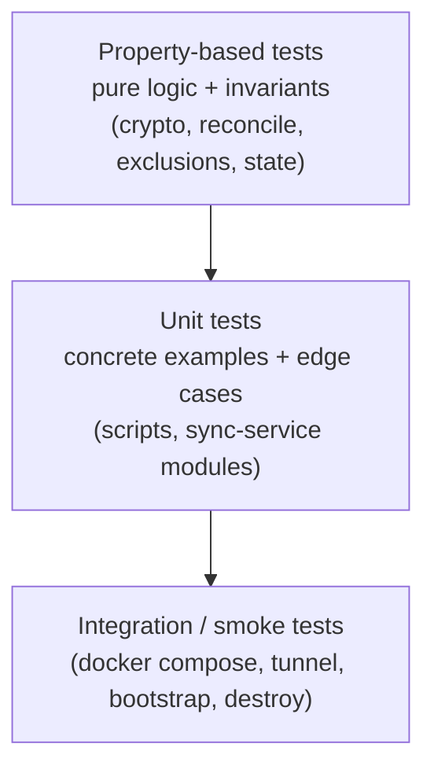

### Property-Based Tests

PBT applies cleanly to:

- **Cryptography (Properties 8, 9, 10):** AEAD round-trip, tamper detection, key derivation determinism, on-wire-no-plaintext. Library: `fast-check` (TypeScript) for the sync-service and Sync Page; same library covers both ends since both implementations target browser-compatible WebCrypto.
- **Reconciliation algorithm (Property 12):** Pure function `(local_state, remote_state, baseline) → action_set`. Generate arbitrary file-state pairs, assert convergence and conflict preservation.
- **Exclusion-pattern matching (Property 15):** Generate arbitrary paths, check inclusion under `.gitignore` patterns matches the canonical `git check-ignore` semantics.
- **Doctor classification (Property 19):** Generate arbitrary state vectors, check classifier output.
- **Sync-service state machine (Property 14):** Generate arbitrary event sequences, check invariants (locked-state never decrypts).

**Configuration:**
- Library: `fast-check` (sync-service & Sync Page TS) and `pytest-hypothesis` if any Python helper code is added.
- Minimum 100 iterations per property test.
- Each test header carries the tag: `// Feature: secure-dev-workspace, Property {n}: {short text}`.
- One property = one test (not split across multiple test functions).

**For shell-script-driven properties** (3, 4, 5, 6, 7, 16, 17, 18, 20), property tests are expressed as parameterised shell tests using `bats-core` with generated fixtures (random vault content, random env-var subsets, random state combinations), driven by a small Python harness (Hypothesis) that invokes the docker container and inspects results. Where docker invocation is too slow, the relevant pure logic (e.g., env-var validator, exclusion matcher) is extracted into a Node/Python module and tested directly with PBT.

### Unit Tests (example-based)

- Compose file parsing/validation (R7).
- `.env.example` documents every variable referenced in code.
- Camouflage prefix correctness (PNG magic bytes, IHDR shape).
- Single-file fallback UI rendering on non-Chromium UA strings (R19.13).
- Specific edge cases: empty file upload, zero-byte file, path with non-ASCII characters.
- Setup script idempotence (`setup-docker.sh`, `setup-cloudflared.sh`).

### Integration / Smoke Tests

- **Build smoke:** Dockerfile builds; binaries present and respond.
- **Bootstrap end-to-end:** `bootstrap.sh` against a clean Linux runner with a fixture vault repo; assert post-conditions (R17.3).
- **Destroy end-to-end:** matching `destroy.sh` test (Property 20).
- **Tunnel reach:** in CI with a sandbox Cloudflare account, GET via tunnel hits code-server.
- **Egress fail-closed:** stop Clash, attempt `git push`, confirm failure (Property 2 — runtime check, harder to PBT).
- **No-plaintext-on-disk audit:** write a known-magic plaintext via FUSE, scan `/vault/cipher` and host fs for the magic, fail on hit (Property 1 — runs as integration smoke per release).

### Test Tagging and Coverage

Each property test in code includes:

```typescript
// Feature: secure-dev-workspace, Property 9: AEAD round-trip and tamper detection
test("AEAD round-trip and tamper detection", () => {
  fc.assert(
    fc.property(/* generators */, (k, n, a, m) => { /* ... */ }),
    { numRuns: 100 }
  );
});
```

A coverage report cross-references each numbered property in this design with its implementing test(s); CI fails if any property has zero implementing tests.

### What We Explicitly Do Not Test With PBT

- **Cloudflare Tunnel availability** — external service; integration test with 1-2 examples (R6).
- **Docker Desktop VM behavior** — not our code.
- **`pmset` configuration** — one-shot host setup; smoke test (R23).
- **macOS `launchd` daemon installation** — smoke test.
- **GitHub repo deletion** — destructive integration; gated, single example (R18.7).
- **UI visual rendering of the Sync Page** — snapshot tests for component states; not PBT.

The discipline is: **test the algorithm, not the deployment.** Algorithms (crypto, reconcile, classify, validate) get property tests with 100+ iterations. Deployments get one well-chosen example each.
