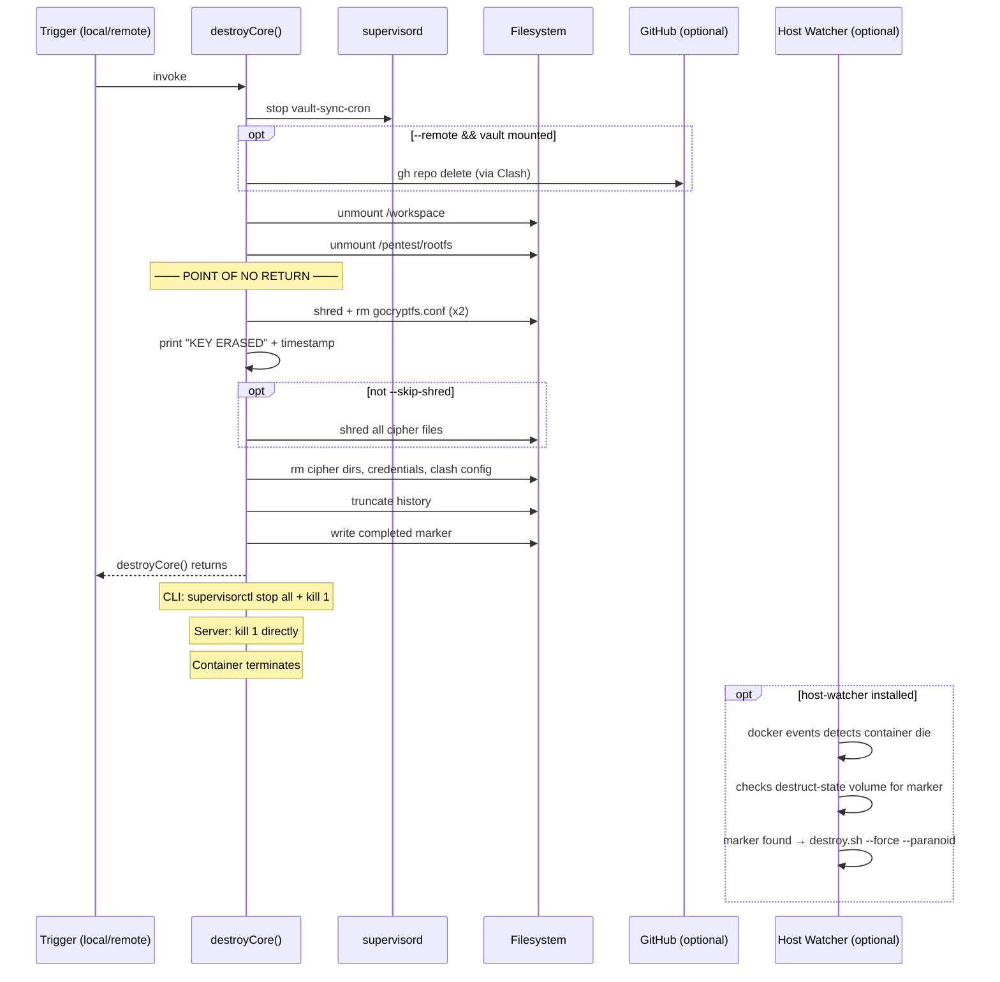

# Design Document

## Overview

Self-destruct 为 dev-workspace 提供三层紧急数据销毁能力：

1. **容器内 CLI** — 执行密钥擦除 + 数据清理
2. **远程 API** — 从任何设备触发（手机/另一台电脑）
3. **宿主机联动** — 容器退出后自动清理 Docker 资源

核心安全论断：**`gocryptfs.conf` 是将密码转化为解密能力的唯一桥梁**。AES-256 master key 存储在 `gocryptfs.conf` 中，用用户密码的 scrypt 派生密钥加密。擦除该文件后，即使知道密码，也无法重建 master key → 密文不可解密 → 数据不可恢复。

设计原则：
- **密钥擦除 > 数据覆写**：gocryptfs.conf 的删除是唯一必须成功的操作
- **速度优先**：`--skip-shred` 模式 < 3 秒完成（应对物理威胁）
- **无需额外 bind mount**：宿主机联动使用 Docker event API（exit code），不新增攻击面
- **幂等安全**：重复执行 self-destruct 不会出错（已删除的文件跳过）

## Architecture

### 系统拓扑变更

```
┌─────────────────── 变更概览 ──────────────────────────────────────────┐
│                                                                        │
│  新增 Docker volume:  destruct-state → /var/run/self-destruct          │
│    存储: key-hash (bcrypt), completed (inert mode marker)              │
│                                                                        │
│  新增 CLI 命令:  self-destruct                                         │
│  新增 Server route:  POST /sync/api/destruct                           │
│  新增宿主机脚本:  scripts/host-watcher.sh                              │
│  变更 entrypoint.sh:  顶部增加 inert mode 检查                         │
│                                                                        │
└────────────────────────────────────────────────────────────────────────┘
```

### 触发路径与执行模型

```
触发入口 (任选其一)
├── 1. 本地终端: self-destruct [--force] [--skip-shred] [--remote]
├── 2. code-server 终端: self-destruct --force
├── 3. 远程浏览器: Sync Page #emergency → POST /sync/api/destruct
└── 4. 任意 HTTP 客户端: POST /sync/api/destruct {passphrase}
         │
         ▼
┌── 执行核心 (destroyCore 函数) ─────────────────────────────────────┐
│                                                                     │
│  Phase 0: 前置                                                      │
│    ├── stop vault-sync-cron (防止 git push "已删除" 的 commit)       │
│    └── [--remote] 读取 GitHub token, gh repo delete (vault 未锁时)   │
│                                                                     │
│  Phase 1: 切断明文                                                   │
│    ├── unmountVault(/workspace)                                      │
│    └── unmountVault(/pentest/rootfs)                                 │
│                                                                     │
│  Phase 2: 密钥擦除 ← POINT OF NO RETURN                             │
│    ├── shred -n3 -z /vault/cipher/gocryptfs.conf && rm              │
│    └── shred -n3 -z /pentest/cipher/gocryptfs.conf && rm            │
│                                                                     │
│  Phase 3: 数据清理 (skipped if --skip-shred)                        │
│    ├── find /vault/cipher -type f -exec shred -n1 -z {} +           │
│    ├── find /pentest/cipher -type f -exec shred -n1 -z {} +         │
│    └── rm -rf /vault/cipher/* /pentest/cipher/*                     │
│                                                                     │
│  Phase 4: 凭证/配置清理                                             │
│    ├── shred -n1 /etc/clash/config.yaml && rm                       │
│    ├── rm -rf /root/.ssh /root/.gitconfig /root/.git-credentials    │
│    └── rm -f /var/run/self-destruct/key-hash                        │
│                                                                     │
│  Phase 5: 痕迹清除 + 进入惰性状态                                    │
│    ├── > ~/.bash_history (truncate)                                  │
│    └── touch /var/run/self-destruct/completed                        │
│         (destroyCore returns here — caller handles process exit)     │
│                                                                     │
└─────────────────────────────────────────────────────────────────────┘
         │
         ▼ (CLI: supervisorctl stop all + kill 1 / Server: kill 1)
┌── 宿主机 (可选) ───────────────────────────────────────────────────┐
│                                                                     │
│  host-watcher: docker events → container die → check volume marker  │
│              → confirmed → destroy.sh --force --paranoid            │
│                                                                     │
└─────────────────────────────────────────────────────────────────────┘
```

### 时序图



## Components and Interfaces

### 1. destroyCore() — 共享核心逻辑

**位置:** `packages/cli/src/lib/destroy.ts`

**设计决策:** 将销毁逻辑抽取为独立模块，CLI 和 server route 共用同一实现，避免代码重复和行为分歧。

```typescript
// packages/cli/src/lib/destroy.ts

export interface DestroyOptions {
  force: boolean;       // 跳过确认
  skipShred: boolean;   // 仅密钥擦除，不覆写密文
  remote: boolean;      // 同时删除 GitHub vault repo
  silent: boolean;      // 抑制 stdout 输出 (远程调用时)
}

export async function destroyCore(opts: DestroyOptions): Promise<void>;
```

**关键实现细节:**

- 使用 `packages/cli/src/lib/vault.ts` 中已有的 `unmountVault()` 函数（已实现渐进升级逻辑）
- `shred` 调用使用 `Bun.$` shell，`nothrow()` 处理文件不存在的情况（幂等）
- Phase 3 使用 `find ... -exec shred ... {} +` (batch 模式) 而非 `{} \;`，减少进程开销
- `--remote` 读取 token 发生在 Phase 0（vault 还挂载时），使用 `gh repo delete --yes`
- **destroyCore() 不调用 process.exit() 或 kill PID 1** — 它是纯逻辑函数，执行完毕后正常 return；进程终止由调用方负责

### 2. self-destruct CLI (packages/cli/src/self-destruct.ts)

**职责:** 命令行入口，解析参数，调用 destroyCore()，然后终止容器。

```typescript
// 伪代码结构
if (!opts.force) {
  const answer = prompt("Type 'destroy' to confirm: ");
  if (answer !== "destroy") process.exit(0);
}

await destroyCore(opts);
// destroyCore 返回后，CLI 负责终止容器
await $`kill -TERM 1`.quiet().nothrow(); // SIGTERM → tini → 容器退出
// CLI 进程随容器退出而终止
```

### 3. destruct route (packages/server/src/routes/destruct.ts)

**职责:** 远程触发入口，验证 destruct passphrase，延迟调用 destroyCore()。

**关键设计：响应优先于销毁**

```typescript
// 先发送 HTTP 200 响应给客户端
// 然后用 setTimeout 延迟执行销毁（确保响应完整发送）
setTimeout(async () => {
  await destroyCore({ force: true, skipShred: true, remote: false, silent: true });
  // 直接 kill PID 1 终止容器
  // 不能用 supervisorctl stop all（会杀死当前进程—— sync-service 自己）
  process.kill(1, "SIGTERM");
}, 200); // 200ms 延迟确保 TCP 响应完整发送
return c.json({ status: "destroyed" }, 200);
```

**为什么 Server 路径跳过 supervisorctl stop all:**
- sync-service 运行在 supervisord 管理下
- `supervisorctl stop all` 会给 sync-service 发 SIGTERM → 当前进程被杀 → destroyCore 中断
- 直接 kill PID 1（tini）→ tini 转发 SIGTERM 给所有子进程（包括 supervisord）→ 所有进程统一终止
- 效果等价但不会自杀

**为什么用 setTimeout:**
- await 会导致 destroyCore 执行期间 HTTP 连接保持打开，kill 1 后响应永远发不完
- setTimeout 让 event loop 先完成响应写入，再开始销毁
- 200ms 足够 TCP 完成一个小 JSON 响应的发送

**认证模型:**

```
vault passphrase (用户输入 unlock-vault 时)
       │
       ▼
HKDF-SHA256(passphrase, salt="destruct-key-v1", info="self-destruct")
       │
       ▼
destruct_key: Buffer (32 bytes)
       │
       ├── Base64(destruct_key) → 用户保存为 "destruct passphrase"
       │     (在首次 unlock 时打印一次，或通过 doctor 命令查看)
       │
       └── Bun.password.hash(base64_key, { algorithm: "bcrypt", cost: 12 })
             → 写入 /var/run/self-destruct/key-hash
```

**安全说明:** 
- destruct passphrase 是 vault passphrase 的确定性派生，用户可以随时通过 HKDF 从 vault passphrase 重新计算
- 用户不需要记忆额外密码：知道 vault passphrase 就能算出 destruct passphrase
- 但攻击者从 destruct key hash 无法反推 vault passphrase（bcrypt + HKDF 双重保护）

**速率限制实现:**

```typescript
const rateLimiter = new Map<string, { count: number; resetAt: number }>();
// Per source IP (from X-Forwarded-For or connection), 3 attempts/minute
```

**响应设计:**
- 成功: `200 { "status": "destroyed" }` 
- 失败(密码错误/hash不存在): `404` (无 body，不暴露端点存在)
- 速率限制: `429`

### 4. Host Watcher (scripts/host-watcher.sh)

**职责:** 监听 Docker 容器退出事件，验证自毁标记后触发宿主机清理。

**实现:**

```bash
#!/usr/bin/env bash
# host-watcher.sh — Monitor container for self-destruct signal
CONTAINER="dev-workspace"
VOLUME_PREFIX="dev-workspace"  # docker compose 项目名前缀
SCRIPT_DIR="$(cd "$(dirname "$0")/.." && pwd)"

docker events --filter "container=${CONTAINER}" --filter "event=die" --format '{{.ID}}' | while read -r id; do
  # Verify: check if destruct-state volume has completed marker
  if docker run --rm -v "${VOLUME_PREFIX}_destruct-state:/s" alpine test -f /s/completed 2>/dev/null; then
    echo "[$(date -Iseconds)] Self-destruct confirmed. Executing host cleanup..."
    "${SCRIPT_DIR}/destroy.sh" --force --paranoid
    break
  fi
done
```

**为什么不用 exit code:**
- 容器被 SIGTERM 终止时 exit code 由 tini 决定（通常 143），不可控
- docker exec 的独立进程 exit code 不等于容器 exit code
- volume 内的 marker 文件是**确定性标志**，无误触发可能

**LaunchAgent (~/Library/LaunchAgents/com.dev-workspace.host-watcher.plist):**
- KeepAlive: true
- WorkingDirectory: 项目目录
- 无 root 权限要求

### 5. Entrypoint Inert Mode Check

**变更:** `scripts/entrypoint.sh` 顶部新增：

```bash
# Inert mode: container was self-destructed, refuse to start services
if [ -f /var/run/self-destruct/completed ]; then
  echo "╔══════════════════════════════════════════════════════════════╗"
  echo "║  Environment destroyed. Container is inert.                  ║"
  echo "║  To clean up: docker compose down -v                         ║"
  echo "╚══════════════════════════════════════════════════════════════╝"
  exec sleep infinity
fi
```

### 6. SPA Emergency Panel

**位置:** `packages/spa/src/` (新增组件)

**入口:** URL hash `#emergency`

**UI 流程:**
1. 红色全屏警告面板
2. 输入 destruct passphrase（用户需要从 vault passphrase 计算或从密码管理器中获取）
3. 输入 "DESTROY" 确认
4. POST 请求 + 等待响应
5. 最终状态显示

**可用性设计:**
- URL fragment 方式确保手机/平板/任何浏览器都能触发
- 无键盘快捷键依赖（手机场景）
- 面板默认隐藏（非 `#emergency` URL 不显示任何 UI）

## Docker Compose 变更

```yaml
services:
  workspace:
    volumes:
      - vault-data:/vault/cipher
      - cache-data:/pentest/cipher
      - clash-config:/etc/clash
      - destruct-state:/var/run/self-destruct    # NEW

volumes:
  vault-data:
  cache-data:
  clash-config:
  destruct-state:                                 # NEW
```

**为什么用 named volume 而非 bind mount:**
- Named volume 在 Docker Desktop 中存于 Docker.raw 虚拟磁盘内部，宿主机取证工具不易直接读取
- 不暴露 `key-hash` 或 `completed` 文件到宿主机文件系统
- `docker compose down -v` 会自动删除（与其他 volume 统一生命周期）
- 不需要 host-watcher 读取文件（改用 Docker event API）

## Data Flow: Destruct Key 生命周期

```
┌─── 初始化 (首次 unlock-vault) ────────────────────────────────────┐
│                                                                     │
│  user enters vault passphrase                                       │
│       │                                                             │
│       ├── gocryptfs decrypts vault (existing logic)                 │
│       │                                                             │
│       └── HKDF(passphrase, "destruct-key-v1", "self-destruct")      │
│             │                                                       │
│             ├── base64(key) → print ONCE to stdout as               │
│             │   "Your destruction passphrase: xxxx"                  │
│             │   (user saves to password manager)                     │
│             │                                                       │
│             └── Bun.password.hash(base64_key) →                     │
│                   write /var/run/self-destruct/key-hash              │
│                   (destruct-state volume, persists across restarts)  │
│                                                                     │
└─────────────────────────────────────────────────────────────────────┘

┌─── 远程触发 ──────────────────────────────────────────────────────┐
│                                                                     │
│  user enters destruct passphrase in SPA or curl                     │
│       │                                                             │
│       ▼                                                             │
│  POST /sync/api/destruct { passphrase: "xxxx" }                     │
│       │                                                             │
│       ▼                                                             │
│  read /var/run/self-destruct/key-hash                               │
│       │                                                             │
│       ▼                                                             │
│  Bun.password.verify(passphrase, hash)                              │
│       │                                                             │
│       ├── false → 404                                               │
│       └── true → destroyCore({ force:true, skipShred:true, ... })   │
│                                                                     │
└─────────────────────────────────────────────────────────────────────┘
```

## Edge Cases & Failure Modes

| 场景 | 行为 |
|------|------|
| Vault 已锁定，执行 self-destruct | Phase 1 unmount 为 no-op (not mounted)，继续 Phase 2 删除 key |
| Pentest chroot 正在使用中 | `unmountVault()` 的渐进升级会 fuser -km kill 所有进程后 lazy unmount |
| vault-sync 正在 git push 中 | Phase 0 先 stop cron；活跃的 git 进程在 unmount 后会因 FUSE 消失而自动失败 |
| self-destruct 在 Phase 2 后断电 | 密钥已删，重启后数据不可恢复。Inert mode marker 可能未写入 → 容器 restart 尝试启动 → clash config 已删 → 部分服务 crash → 无害（数据已不可恢复） |
| self-destruct 在 Phase 2 前断电 | 数据完整，可正常使用 |
| 重复执行 self-destruct | 幂等：文件不存在时 shred/rm 静默跳过，最终效果相同 |
| 容器 restart 后进入 inert mode | destruct-state volume 中 completed 文件仍存在 → entrypoint sleep infinity |
| host-watcher 未安装 | 容器因 SIGTERM 退出 → Docker restart policy 重启容器 → inert mode → sleep → 无害 |
| 远程触发时 Clash 已关闭 | Cloudflare Tunnel 不经过 Clash（cloudflared 在宿主机），请求仍可达 sync-service |
| destruct-state volume 未创建 (旧部署) | /var/run/self-destruct/ 目录不存在时，远程销毁返回 404（hash 不存在），本地 self-destruct 正常工作（不依赖该 volume） |
| 远程触发后 HTTP 200 已返回但 setTimeout 未执行 | 200ms 延迟内网络断开 → destroyCore 仍正常执行（本地操作不依赖网络） |
| 密码轮换后远程触发 | unlock-vault 时 key-hash 自动更新 → 新 passphrase 立即生效，旧 passphrase 失效 |
| host-watcher 的 `docker run alpine` 失败（无 alpine image） | host-watcher 应先 `docker pull alpine` 或使用 `docker volume inspect` 替代方案；实际中 Docker Desktop 通常有 alpine 缓存 |

## Security Analysis

### 攻击面评估

| 新增攻击面 | 风险 | 缓解 |
|------------|------|------|
| `/sync/api/destruct` endpoint | DoS (触发他人销毁) | bcrypt 验证 + 速率限制 + 独立 passphrase |
| `destruct-state` volume 中的 hash | 暴露 "系统有自毁功能" | Volume 在 Docker.raw 内部，不直接可见于宿主机 |
| Container die + volume 检查机制 | 正常 crash 也触发 volume 检查 | 只有 marker 文件存在才触发销毁；正常 crash 不会产生 marker |
| SPA `#emergency` panel | 社会工程学诱导输入密码 | 需要知道 destruct passphrase，面板有二次确认 |

### 与现有安全层的关系

```
原有防御层:
  L5 E2E (WebCrypto) — self-destruct 不影响
  L4 code-server password — self-destruct 不影响
  L3 Cloudflare Tunnel — destruct API 通过此通道
  L2 gocryptfs — self-destruct 的主要目标 (删除 key)
  L1 Clash proxy — config 被清除

新增: L0 "Dead man's switch" — 数据擦除作为最后防线
```

## Constants 新增

```typescript
// packages/core/src/constants.ts 新增
export const DESTRUCT_STATE_DIR = "/var/run/self-destruct";
export const DESTRUCT_KEY_HASH_PATH = "/var/run/self-destruct/key-hash";
export const DESTRUCT_COMPLETED_PATH = "/var/run/self-destruct/completed";
export const DESTRUCT_HKDF_SALT = "destruct-key-v1";
export const DESTRUCT_HKDF_INFO = "self-destruct";
export const DESTRUCT_RATE_LIMIT_WINDOW_MS = 60_000;
export const DESTRUCT_RATE_LIMIT_MAX_ATTEMPTS = 3;
export const DESTRUCT_RESPONSE_DELAY_MS = 200;
```

## Data Models

### destruct-state volume 内容

```
/var/run/self-destruct/
├── key-hash       # bcrypt hash of Base64(HKDF(vault_passphrase))
│                  # 写入时机: 每次 unlock-vault
│                  # 删除时机: destroyCore Phase 4
└── completed      # ISO 时间戳字符串
                   # 写入时机: destroyCore Phase 5
                   # 用途: entrypoint inert mode 检测, host-watcher 验证
```

### DestroyOptions 接口

```typescript
interface DestroyOptions {
  force: boolean;       // 跳过确认 (由 CLI 在调用前处理)
  skipShred: boolean;   // true = 仅密钥擦除; false = 完整覆写
  remote: boolean;      // 尝试删除 GitHub vault repo
  silent: boolean;      // 抑制 console.log 输出
}
```

### API 请求/响应

```
POST /sync/api/destruct
Request:  { "passphrase": "<base64-encoded-destruct-key>" }
Response: 200 { "status": "destroyed" }
        | 404 (no body — wrong passphrase or unconfigured)
        | 429 (no body — rate limited)
```

## Error Handling

| 错误场景 | 处理方式 |
|----------|----------|
| shred 命令不存在 | 回退到 `dd if=/dev/urandom of=file bs=1k count=1` 然后 rm |
| gocryptfs.conf 已不存在 | nothrow() 静默跳过 (幂等) |
| unmountVault 超时 | 渐进升级至 fusermount -uz (lazy unmount, 总是成功) |
| gh 命令不存在 (--remote) | 打印 warning, 继续执行 |
| VAULT_GIT_REPO 未配置 (--remote) | 打印 warning, 继续执行 |
| key-hash 文件不可读 (远程触发) | 返回 404 |
| bcrypt 验证超时 | Bun.password.verify 内部有超时, 不会无限阻塞 |
| supervisor socket 不可达 | nothrow(), supervisorctl 失败不阻塞销毁流程 |
| PID 1 不响应 SIGTERM | kill -KILL 1 作为最后手段 (不在当前设计中, 因为 tini 总是响应 SIGTERM) |

## Testing Strategy

由于 self-destruct 的本质是**不可逆的破坏性操作**，测试需要在隔离环境中进行：

1. **单元测试 (destroyCore 的各子函数):**
   - `shredFile()` 对不存在文件的幂等性
   - 速率限制器的状态机正确性
   - `deriveDestructKey` 的确定性 (相同输入 → 相同输出)

2. **集成测试 (隔离容器中):**
   - 构建测试容器 → init-vault → unlock → self-destruct --force --skip-shred
   - 验证: gocryptfs.conf 不存在, completed 存在
   - 验证: 重启后进入 inert mode

3. **不可测试的部分 (需人工验证):**
   - kill PID 1 后容器实际退出行为
   - host-watcher 全链路 (需要实际 Docker 环境)
   - SPA → API → destroyCore 全链路时序

## Correctness Properties

### Property 1: Key Erasure Atomicity
**Validates: Requirements 2.1, 2.2, 2.4**
gocryptfs.conf 的 `shred -n3 -z file && rm -f file` 作为单个 shell 命令执行。断电窗口仅存在于 shred 完成和 rm 开始之间（微秒级）。即使在此窗口中断，文件已被覆写为全零，密钥不可恢复。

### Property 2: Inert Mode Reliability
**Validates: Requirements 1.7, 5.5, 5.6**
completed marker 是 destroyCore 的最终写入操作。如果 Phase 2 后中断但 marker 未写入，容器重启会因 clash config 缺失而 crash loop——但数据已不可恢复（密钥已删），安全目标仍然达成。

### Property 3: Remote Trigger Response Priority
**Validates: Requirements 4.7, 4.12**
setTimeout(200ms) 保证 TCP 响应先于 destroyCore 执行完成。即使 destroyCore 最终杀死进程，客户端已收到完整的 200 响应。

### Property 4: Idempotence
**Validates: Requirements 1.9, 5.1**
所有文件操作使用 `.nothrow()` 和条件检查，重复执行 destroyCore 不产生错误，最终状态等价。

### Property 5: No Race with vault-sync
**Validates: Requirements 1.3a, 5.1**
Phase 0 中 `supervisorctl stop vault-sync-cron` 在任何数据修改之前执行，消除了 git push（推送"已删除"状态）和文件删除之间的竞态。
