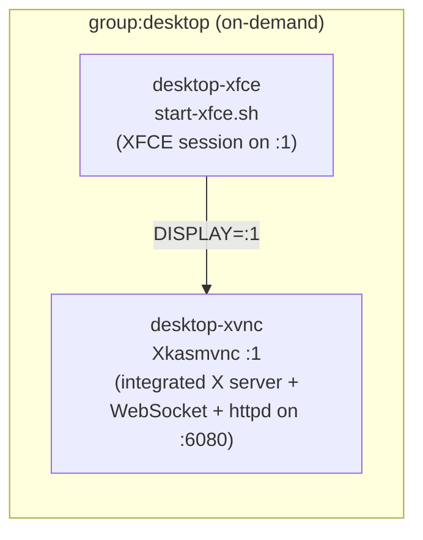
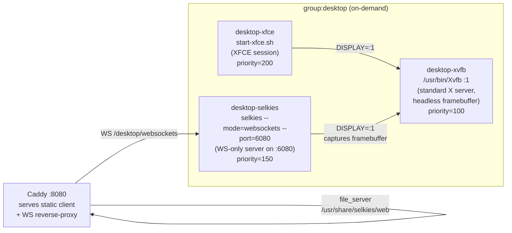
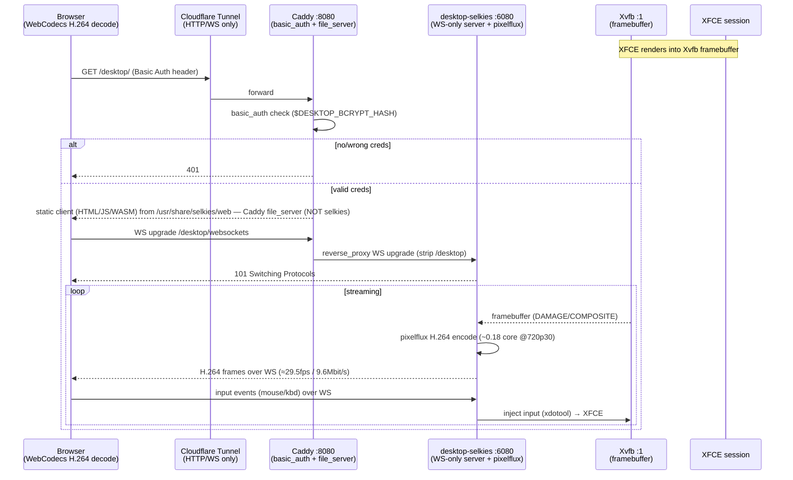
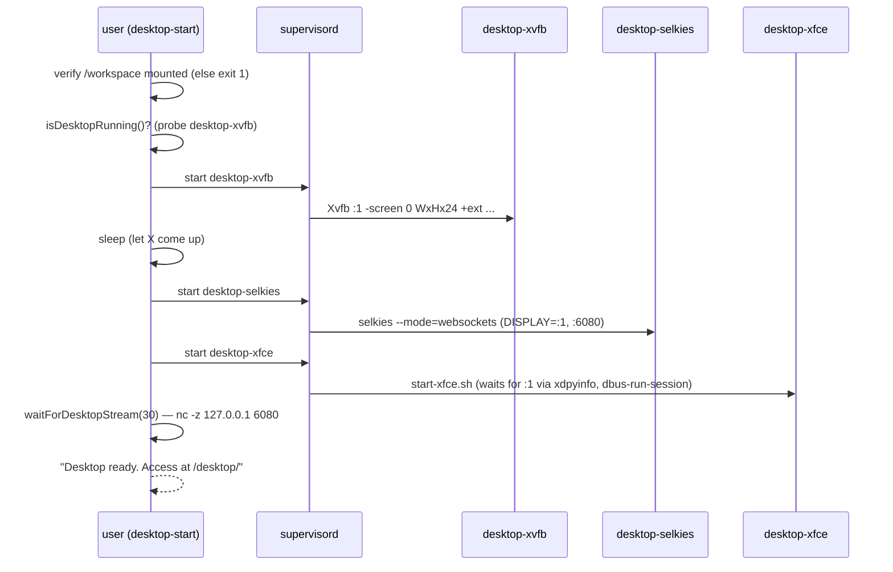
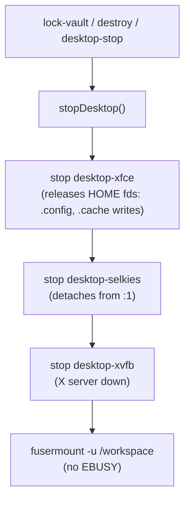

# Design Document: Selkies Desktop Migration

## Overview

This feature replaces the KasmVNC-based remote desktop in the single-container secure dev workspace with the 2026 **Selkies** streaming stack (pure WebSocket + browser-side WebCodecs H.264, **not** WebRTC). The goal is a major fluidity/UX improvement while preserving the existing security model end-to-end: zero inbound ports, all traffic over Cloudflare Tunnel as HTTP/WS only, one container, gocryptfs FUSE-backed home.

The migration is deliberately surgical. The new Selkies architecture attaches to an **external** Xvfb via the `DISPLAY` env var rather than spawning its own integrated X server (the way `Xkasmvnc` did). That single fact lets us preserve the entire existing XFCE session, the gocryptfs-backed `/workspace/.desktop` home, and `start-xfce.sh` unchanged. There is **no migration to Wayland** (Selkies runs in X11 mode on aarch64; Wayland's AVX2 requirement is x86-only and irrelevant here).

The change splits the desktop supervisord group from two integrated programs (`desktop-xvnc`, `desktop-xfce`) into three composable programs (`desktop-xvfb`, `desktop-selkies`, `desktop-xfce`), updates the single source-of-truth control module (`desktop.ts`), swaps the Docker install block (KasmVNC `.deb` → self-installed Selkies venv), and restructures the Caddy desktop route. All architectural invariants the project already locked with the user are respected; the `desktop.ts` single-source-of-truth pattern is the reason the riskiest-looking change (process topology) is actually low-risk.

> **Critical architecture correction (verified by a second PoC round).** The
> new-arch Selkies process is a **pure WebSocket server — it does NOT serve the
> HTML/JS/WASM client** (hitting its port with a browser returns `HTTP 426
> "You cannot access a WebSocket server directly with a browser"`). The static
> client is a separate ~5.9 MB asset tree (`selkies-dashboard`) that the
> upstream image serves via **NGINX**. Therefore a single
> `reverse_proxy → selkies` (as an earlier draft assumed) **cannot work** — the
> browser would only ever get a 426. This design instead has **Caddy serve the
> static client directly AND reverse-proxy only the WebSocket** to Selkies, with
> **no NGINX added** (see "Front Layer Decision: Caddy vs NGINX vs Hono"). This
> keeps the single-entry-point posture and is simpler than the upstream
> NGINX-based layout.

This document covers both the **High-Level Design** (architecture, topology old vs new, stream/data flow, start/stop and FUSE-safety sequencing) and the **Low-Level Design** (concrete file-level changes for all six change points). All empirical claims are PoC-verified during this session and are cited as design rationale, not assumptions. A dedicated section enumerates the open verification items that are explicitly **not** yet solved.

---

## Empirical PoC Findings (Design Rationale)

These were measured/verified during this session and are treated as established ground truth. They justify the design decisions that follow.

| # | Finding | Design consequence |
|---|---------|--------------------|
| P1 | Host/target: Apple M5 / aarch64 / no GPU / Docker Desktop (10 CPU, 8GB). Selkies runs in **X11 mode** on aarch64. | No Wayland. Keep Xvfb + XFCE. Wayland's AVX2 requirement is x86-only. |
| P2 | Selkies uses pure WebSocket + browser WebCodecs H.264 (`mode=websockets`), not WebRTC. Passes through Cloudflare Tunnel (HTTP/WS only), zero inbound ports. | **Security model preserved.** No STUN/TURN/UDP. Same reverse-proxy posture as KasmVNC. |
| P3 | Encoder CPU ≈ **0.18 of one core** for 1280×720@30fps under continuous motion (isolated to the selkies PID). Static screen → encoder spins to near-zero (8s static = 6 frames / 19KB). Idle container ~2-3% CPU, ~830-940MB RAM. | CPU budget is well within the 10-core box. Idle cost negligible; on-demand model still worthwhile but not strictly cost-driven. |
| P4 | Selkies attaches to an **external** `Xvfb` via `DISPLAY`; it does **not** spawn its own X server. Standard invocation: `/usr/bin/Xvfb :1 -screen 0 WxHx24 +extension COMPOSITE +extension DAMAGE +extension RANDR +extension GLX ...`. | Existing XFCE session, `/workspace/.desktop` home, and `start-xfce.sh` are **preserved**. Topology becomes 3 programs instead of 2. |
| P5 | `pip install selkies` (PyPI) installs the **OLD** WebRTC/GStreamer arch (`selkies_gstreamer` v1.6.1) — WRONG. The NEW arch (module `selkies`, version `0.0.0`, entry `from selkies.__main__ import main`) is **not on PyPI**; install from GitHub: `pip install "git+https://github.com/selkies-project/selkies.git@<pin>"`. | Dockerfile must install from a **pinned GitHub ref**, not PyPI. |
| P6 | Build deps (verified by iterative build-fail-then-succeed): `python3-dev gcc pkg-config libxkbcommon-dev git`. **Runtime deps (CORRECTED — these are HARD: missing any one crashes selkies at startup): `libpulse0` (selkies imports `pulsectl` → dlopen `libpulse.so.0` at import time), `xclip` (spawned on start), `xdotool` (input injection), `xrandr` via `x11-xserver-utils` (resolution), plus `libva2 libva-drm2 libgbm1 libdrm2 libjpeg62-turbo`.** Final confirmed: `selkies-0.0.0` starts the WS server cleanly with all of these present. | Exact apt list for the new Dockerfile layer. `libpulse0`/`xclip`/`xdotool`/`xrandr` are **required**, not optional. |
| P7 | End-to-end through Caddy `basic_auth` verified **twice**: (a) Caddy→LSIO-NGINX→selkies = 401/200/101, 29.5fps/9.6Mbit/s; (b) **Caddy→(static served by Caddy) + WS reverse-proxy→selkies, NO NGINX** = `/desktop/`→200 HTML, asset→200, no/wrong-creds→401, WS connection established and selkies pipeline started. | The `DESKTOP_BCRYPT_HASH` basic_auth pattern works unchanged; **the no-NGINX layout is verified at the transport/auth/static level**. |
| P8 | The Selkies client opens its WebSocket at `location.pathname + "websockets"` (**plural**) — verified in the built JS (`ot.pathname+="websockets"`). So under `/desktop/`, the client connects `/desktop/websockets`. (LSIO's NGINX has a `/websocket` singular `location`, which the current client does not use.) | Caddy must match **`/desktop/websockets`** for the WS reverse-proxy; static files for everything else under `/desktop/*`. |
| P9 | Confirmed CLI flags (from the pinned build's `--help`): `--mode`, `--port` (default **8082**, not 6080), `--addr`, `--control-port` (default 8083), `--encoder`, `--framerate`, `--h264-crf`, `--manual-width/height`, `--dri-node`. Confirmed env vars: `SELKIES_ENCODER`, `SELKIES_FRAMERATE`, `LC_ALL` (i18n), `PIXELFLUX_RECORDING_SOCKET`, `AUTO_GPU`/`DRINODE`/`DRI_NODE` (future GPU). LSIO launches it as `selkies --addr=localhost --mode=websockets` (no `--port` → default 8082). | `desktop-selkies` runs on **8082** (corrected from 6080). `--control-port` 8083 is a second loopback port to account for. |
| P10 | **Selkies does NOT serve the web client.** Hitting selkies' port at `/` returns `HTTP 426 "You cannot access a WebSocket server directly with a browser. You need a WebSocket client."` The static client lives separately (LSIO: `/usr/share/selkies/selkies-dashboard`, ~5.9 MB, `cp -a`'d to `/usr/share/selkies/web` at init) and is served by NGINX. | A static-asset provider is **mandatory and was missing from the earlier design**. Chosen: Caddy serves it directly (no NGINX). |
| P11 | The pip-installed `selkies` Python package (`.../site-packages/selkies/`) contains **only `.py` files + a `webrtc/` dir — no web assets**. The static client is shipped separately by LSIO, sourced from the selkies git repo's frontend, not the pip package. | Self-install gets the server but **not** the frontend. The 5.9 MB static client must be sourced/vendored separately (see new "Static Client Provisioning" change point). |
| P12 | **pip install ordering trap (verified):** installing `pixelflux`/`pcmflux` *explicitly alongside* `git+selkies` triggers `ERROR: THESE PACKAGES DO NOT MATCH THE HASHES FROM THE REQUIREMENTS FILE` (selkies ships a hash-pinned requirement set). Installing **only** `git+selkies` and letting it resolve its deps succeeds and still pins `pixelflux==1.6.3`/`pcmflux==1.0.8`. | Dockerfile installs **only** the git selkies; it pulls pixelflux/pcmflux transitively. Verify both import post-install. |
| P13 | aarch64 install pulls `nvidia-cuda-nvrtc` transitively (a selkies dep). Harmless on no-GPU (never loaded), but adds image size. | Note for image-size accounting; no action required on no-GPU target. |
| P14 | Caddy alone (no NGINX) can do all four jobs the front layer needs: serve static (`file_server`/`handle_path`), reverse-proxy the WS (`reverse_proxy` upgrades natively), `basic_auth`, and subpath mounting. Verified end-to-end in the no-NGINX PoC. | **No NGINX, no Hono.** Reuse the existing single Caddy entry point. |

---

## High-Level Design

### Process Topology: Old vs New

**Old (KasmVNC, integrated X + VNC):**



`Xkasmvnc` is a single binary that is *both* the X server for display `:1` *and* the WebSocket/static-asset server on `:6080`. XFCE attaches to its display.

**New (Selkies, decomposed; static client served by Caddy, no NGINX):**



The integrated server is decomposed into three single-responsibility programs. The X server (`Xvfb`) is now standalone; Selkies and XFCE both attach to display `:1`. **Selkies is a WS-only server on `:6080`** (P9/P10 — its default 8082 collides with code-server, so it runs on 6080) — it does NOT serve the web client. **Caddy serves the ~5.9 MB static client** (`/usr/share/selkies/web`) directly and reverse-proxies the WebSocket (`/desktop/websockets`) to Selkies. No NGINX (P14).

### Component Interaction & Stream Flow



Data path: `Browser ↔ Caddy ↔ {static files | WS→selkies} ↔ Xvfb ↔ XFCE`. No UDP, no separate signaling server, no inbound ports, **no NGINX**. The static client is served by Caddy's `file_server`; only the WebSocket is reverse-proxied to Selkies on `:8082`.

### On-Demand Start Sequence

The desktop group remains `autostart=false` and is started by `desktop-start`. The new sequence respects the dependency chain `Xvfb → selkies → XFCE`:



### Stop Sequence and FUSE-Unmount Safety (Critical Invariant)

The stop order is the **reverse** of start and is coupled to gocryptfs FUSE-unmount safety. `/workspace/.desktop` is the desktop HOME and lives on the gocryptfs mount. Any process holding an open fd there causes `fusermount -u` to fail with `EBUSY`. Three callers (`desktop-stop`, `lock-vault`, `destroy`) rely on `stopDesktop()` to guarantee no desktop process holds the mount before unmount.



Invariant preserved: **stop all desktop programs before unmount**. The three-program decomposition does not weaken this — `DESKTOP_STOP_ORDER` lists all three in reverse dependency order and `stopDesktop()` issues a single `supervisorctl stop` over the full list. The new `desktop-selkies` writes nothing to the gocryptfs home by default (its config is env-driven), so the EBUSY risk surface does not grow; `desktop-xfce` remains the primary HOME-fd holder and is still stopped first.

### Architectural Invariants Respected

| Invariant | How this design respects it |
|-----------|------------------------------|
| 1. `core/` stays pure (no IO) | Only constants added to `constants.ts`. No IO introduced into core. |
| 2. No upward deps (server/cli depend on core only) | `desktop.ts` (cli) imports constants from core; no new cross-deps. |
| 3. Untrusted input validated at boundaries | Basic auth at Caddy boundary unchanged; resolution env normalized in entrypoint. |
| 4. Pure decision vs IO execution separated | `vault-lifecycle.ts` plan logic untouched; `desktop.ts` remains the IO-executing control surface. |
| 5. Single config surface for env | `DESKTOP_RESOLUTION`/`DESKTOP_BCRYPT_HASH` injection in entrypoint stays the one surface; new constants centralized in `constants.ts`. |
| 6. Irreversible ops crash-safe | No change to destroy/shred ordering; `stopDesktop` still precedes unmount. |
| 7. Shared mutable resources serialized | gocryptfs unmount still gated behind full desktop stop. |
| 8. No dead code paths | `KASMVNC_PORT` kept only as a transition alias, slated for removal (tracked). |
| SSOT pattern | `desktop.ts` remains the one place defining the process group; 5 callers follow. This is why change point 4 is low-risk. |

---

## Low-Level Design

Six change points. Each below gives the concrete before/after at file level.

### Change Point 1 — `packages/core/src/constants.ts`

Introduce desktop-stream constants; keep `KASMVNC_PORT` as a transition alias.

```typescript
// Remote desktop (Selkies stream)
export const DESKTOP_HOME = "/workspace/.desktop";
export const DESKTOP_CONFIG_DIR = "/workspace/.desktop/.config";
export const DESKTOP_CACHE_DIR = "/tmp/.desktop-cache";
export const DESKTOP_APPS_DIR = "/opt/desktop-apps";
export const DESKTOP_APPS_REGISTRY = "/opt/desktop-apps/.registry.json";

/** Port the Selkies WebSocket server listens on. Selkies' OWN default is 8082,
 *  but code-server already occupies 8082 in this single container — so we run
 *  Selkies on 6080 via explicit `--port=6080`. 6080 is free on the selkies path
 *  (KasmVNC's integrated server that used it is gone). Selkies is a WS-ONLY
 *  server (no static client, P10); the static client is served by Caddy. */
export const DESKTOP_STREAM_PORT = 6080;
/** X display the desktop runs on. Xvfb, selkies, and XFCE all bind here. */
export const DESKTOP_DISPLAY = ":1";
/** Path inside the container where the static Selkies web client lives and from
 *  which Caddy serves it (provisioned in the Dockerfile — see Static Client
 *  Provisioning). */
export const DESKTOP_WEB_ROOT = "/usr/share/selkies/web";
export const DESKTOP_DEFAULT_RESOLUTION = "1920x1080";

/** @deprecated REMOVED — KasmVNC lives on a separate branch (feat/dual-vault-pentest-env).
 *  This constant no longer exists in this branch. */
// export const KASMVNC_PORT = 6080; // DELETED
```

Rationale: Selkies is a **WS-only server** (P10). Its own default port is `8082`,
**but code-server already binds `8082` in this single container** — a hard
collision. So Selkies runs on **`6080`** via explicit `--port=6080` (free on the
selkies path now that KasmVNC's integrated server is gone). `DESKTOP_STREAM_PORT`
is therefore `6080`, matching the Caddy WS upstream and the `doctor` probe.
`DESKTOP_DISPLAY` becomes a real shared constant now that the X server is a
distinct program. `DESKTOP_WEB_ROOT` is new: the static client path Caddy serves
from (P10/P11). `KASMVNC_PORT` (6080) remains only for the `DESKTOP_STACK=kasmvnc`
fallback variant; the value coincides with Selkies' port but the stacks are
mutually exclusive (only one is built/runs at a time). Invariant 8 (no dead code)
is honored by removing `KASMVNC_PORT` together with the fallback.

### Change Point 2 — `image/Dockerfile`

Replace the KasmVNC `.deb` install block with a self-installed Selkies virtualenv. The desktop apt layer also gains the verified runtime libs and `Xvfb`.

**Remove** the KasmVNC block:

```dockerfile
# (REMOVED) Install KasmVNC from GitHub releases
# ARG KASMVNC_VERSION=1.3.3
# RUN ... kasmvncserver_bookworm_..._${ARCH}.deb ... libdatetime-perl ...
```

**Amend** the desktop apt layer to ensure `Xvfb` + Selkies runtime libs (P6) are present (replace the KasmVNC-implied X server with a standalone one):

```dockerfile
# Desktop layer: Xvfb + XFCE + fonts + mesa + Selkies runtime deps
RUN apt-get update && apt-get install -y --no-install-recommends \
    xvfb \
    xfce4 \
    xfce4-terminal \
    xfce4-whiskermenu-plugin \
    thunar \
    dbus-x11 \
    libgl1-mesa-dri \
    mesa-utils \
    libglib2.0-0 \
    librsvg2-common \
    fonts-noto-cjk \
    fonts-dejavu-core \
    xdg-utils \
    x11-utils \
    x11-xserver-utils \
    at-spi2-core \
    # --- Selkies HARD runtime deps (verified P6 — missing any crashes selkies) ---
    libpulse0 xclip xdotool \
    libva2 libva-drm2 libgbm1 libdrm2 libjpeg62-turbo \
    && rm -rf /var/lib/apt/lists/*
```

> `x11-xserver-utils` provides `xrandr` (resolution control, P6). `libpulse0`,
> `xclip`, and `xdotool` are **hard** runtime deps — verified that omitting any
> one makes selkies abort at startup (libpulse via `pulsectl` import; xclip
> spawned on start; xdotool for input injection). They are NOT optional and NOT
> "audio is a later feature" — `libpulse0` is required even with audio disabled.

**Add** the Selkies self-install block (build deps + pinned-commit git install + PyPI encoder libs). Uses the mise-managed Python 3.12 already on PATH; isolates into a venv to keep system Python clean:

```dockerfile
# --- Selkies (NEW WebSocket + WebCodecs H.264 arch) ---
# IMPORTANT (P5): the NEW-arch `selkies` (module `selkies`, v0.0.0, entry
# `from selkies.__main__ import main`) is NOT on PyPI. `pip install selkies`
# installs the OLD WebRTC/GStreamer arch — wrong. Install from a PINNED GitHub
# ref. IMPORTANT (P12): do NOT also list pixelflux/pcmflux here — selkies ships
# a HASH-PINNED requirement set and mixing in un-pinned siblings triggers
# "PACKAGES DO NOT MATCH THE HASHES". Install ONLY git+selkies; it pulls
# pixelflux==1.6.3 / pcmflux==1.0.8 transitively. Verify both import after.
ARG SELKIES_GIT_REF=<pin-commit-or-lsio-tag>

# Build deps (P6) — needed to compile av/cryptography/xkbcommon bindings.
RUN apt-get update && apt-get install -y --no-install-recommends \
    python3-dev gcc pkg-config libxkbcommon-dev git \
    && python3 -m venv /opt/selkies-venv \
    && /opt/selkies-venv/bin/pip install --no-cache-dir \
       "git+https://github.com/selkies-project/selkies.git@${SELKIES_GIT_REF}" \
    # fail the build early if the wrong arch is installed, or encoder libs missing
    && /opt/selkies-venv/bin/python -c "from selkies.__main__ import main" \
    && /opt/selkies-venv/bin/python -c "import pixelflux, pcmflux" \
    && apt-get purge -y python3-dev gcc pkg-config libxkbcommon-dev git \
    && apt-get autoremove -y \
    && rm -rf /var/lib/apt/lists/*

ENV SELKIES_VENV=/opt/selkies-venv
ENV PATH="/opt/selkies-venv/bin:${PATH}"
```

**NEW — Static client provisioning (P10/P11).** The pip package does NOT include
the web client; the ~5.9 MB static client must be provisioned separately to
`DESKTOP_WEB_ROOT` (`/usr/share/selkies/web`) for Caddy to serve. Two sourcing
options — the design recommends vendoring it into the repo (mirrors the existing
node/python/jdk `tar.gz` vendoring pattern, keeps the build hermetic and the
asset version pinned to the same selkies ref):

```dockerfile
# Option 1 (RECOMMENDED): vendored static client, version-locked to SELKIES_GIT_REF.
#   To refresh: extract /usr/share/selkies/selkies-dashboard from the matching
#   LSIO image (or build from the selkies repo frontend) into image/selkies-web/.
COPY image/selkies-web/ /usr/share/selkies/web/

# Option 2 (build-from-source): build the selkies frontend from the same git ref
#   in a builder stage and COPY the dist here. Heavier; only if vendoring is
#   undesirable. (Open item: confirm the frontend build steps for the pinned ref.)
```

> The static client and the selkies server MUST come from the **same** selkies
> ref to avoid client/server protocol drift. Vendoring (Option 1) makes that an
> explicit, reviewable artifact in the repo and keeps the build offline-capable.

Also remove the now-unused KasmVNC system config copy (Selkies path only):

```dockerfile
# (REMOVED on the selkies path) KasmVNC system-level config
# RUN mkdir -p /etc/kasmvnc
# COPY image/etc/desktop/kasmvnc-defaults.yaml /etc/kasmvnc/kasmvnc.yaml
```

**`DESKTOP_STACK` build-arg gate (R11).** The KasmVNC blocks are NOT deleted —
they are retained behind a build arg so the old path is rebuildable until the
open verification items close:

```dockerfile
ARG DESKTOP_STACK=selkies   # selkies (default) | kasmvnc
```

- `selkies` (default): the venv install + static-client provisioning above; the
  3-program supervisord group (CP3); the Caddy static+WS desktop block (CP5).
- `kasmvnc` (fallback): the original KasmVNC `.deb` install + perl deps; the
  2-program group; the `/websockify` Caddyfile. Runs on port `6080`
  (`KASMVNC_PORT`), which is genuinely different from Selkies' `8082`.

Notes:
- The two `python -c` checks make the build **fail loud** on wrong arch (P5) or
  missing encoder libs (P12).
- Build deps (incl. `git`) are purged in the same layer to keep size down. The
  hard runtime deps (`libpulse0`/`xclip`/`xdotool`/`libva2`…) stay.
- `<pin-commit-or-lsio-tag>` is filled with the exact ref verified in PoC.
- `start-xfce.sh` is unchanged and still copied to `/usr/local/bin/`.

### Change Point 3 — `image/supervisord.conf`

Split the `desktop` group from two programs into three. Priorities encode the start order `Xvfb(100) → selkies(150) → xfce(200)`.

```ini
# --- Remote Desktop (on-demand, autostart=false) ---

[group:desktop]
programs=desktop-xvfb,desktop-selkies,desktop-xfce

[program:desktop-xvfb]
command=/usr/bin/Xvfb :1 -screen 0 %(ENV_DESKTOP_RESOLUTION)sx24 +extension COMPOSITE +extension DAMAGE +extension RANDR +extension GLX -nolisten tcp
autostart=false
autorestart=true
startsecs=2
priority=100
stdout_logfile=/dev/fd/1
stdout_logfile_maxbytes=0
stderr_logfile=/dev/fd/2
stderr_logfile_maxbytes=0

[program:desktop-selkies]
command=/opt/selkies-venv/bin/python -m selkies --mode=websockets --port=6080 --addr=127.0.0.1
environment=DISPLAY=":1",HOME="/workspace/.desktop",XDG_CONFIG_HOME="/workspace/.desktop/.config",XDG_DATA_HOME="/workspace/.desktop/.local/share",XDG_CACHE_HOME="/tmp/.desktop-cache",SELKIES_ENCODER="x264enc",SELKIES_FRAMERATE="30"
autostart=false
autorestart=true
startsecs=3
priority=150
stdout_logfile=/dev/fd/1
stdout_logfile_maxbytes=0
stderr_logfile=/dev/fd/2
stderr_logfile_maxbytes=0

[program:desktop-xfce]
command=/usr/local/bin/start-xfce.sh
autostart=false
autorestart=true
startsecs=2
priority=200
stdout_logfile=/dev/fd/1
stdout_logfile_maxbytes=0
stderr_logfile=/dev/fd/2
stderr_logfile_maxbytes=0
```

Notes:
- `%(ENV_DESKTOP_RESOLUTION)s` is reused exactly as the old `desktop-xvnc` program did — the entrypoint already guarantees this var is set (see entrypoint safety net below), so no new failure mode. Xvfb `-screen` wants `WIDTHxHEIGHTxDEPTH`, hence `%(ENV_DESKTOP_RESOLUTION)sx24`.
- `desktop-selkies` env mirrors the HOME/XDG vars the old `desktop-xvnc` set, plus `DISPLAY=:1` (it attaches to the external X server, P4) and the confirmed encoder env (P9). `--port=6080` because code-server occupies Selkies' default 8082 (collision resolved at CP1); `--addr=127.0.0.1` keeps it bound to loopback (reverse-proxy-only, zero inbound ports). `--mode=websockets`, `--port`, `--addr` are confirmed real flags (P9).
- `-nolisten tcp` on Xvfb keeps the X server off the network — display access is local-socket only, consistent with the zero-inbound posture.
- The module-entry form `python -m selkies` matches the verified entry `from selkies.__main__ import main` (P5). LSIO launches it as a `selkies` console script with the same effect; either is fine since the venv is on PATH.
- Selkies also opens a `--control-port` (default 8083) on loopback (P9). It is not proxied (internal control plane) and stays local-only; no Caddy route, no inbound exposure.

### Change Point 4 — `packages/cli/src/lib/desktop.ts`

Update the single source of truth: three group members, corrected start/stop order, renamed readiness probe, and an `isDesktopRunning` probe retargeted to `desktop-xvfb` (the new "is the desktop up at all" anchor — the X server is the base of the dependency chain).

```typescript
import { DESKTOP_STREAM_PORT } from "@sdw/core/constants";
import { $ } from "bun";

export const DESKTOP_GROUP = "desktop";
export const DESKTOP_XVFB = `${DESKTOP_GROUP}:desktop-xvfb`;
export const DESKTOP_SELKIES = `${DESKTOP_GROUP}:desktop-selkies`;
export const DESKTOP_XFCE = `${DESKTOP_GROUP}:desktop-xfce`;

/** Start order: X server, then stream encoder, then session. */
export const DESKTOP_START_ORDER = [DESKTOP_XVFB, DESKTOP_SELKIES, DESKTOP_XFCE] as const;
/** Stop order: reverse of start (session, encoder, X server). Coupled to the
 *  FUSE-unmount-before-stop guarantee: every desktop program must be down
 *  before /workspace is unmounted, or fusermount -u fails with EBUSY. */
export const DESKTOP_STOP_ORDER = [DESKTOP_XFCE, DESKTOP_SELKIES, DESKTOP_XVFB] as const;

/** Whether the desktop X server (base of the dependency chain) is RUNNING. */
export async function isDesktopRunning(): Promise<boolean> {
  const r = await $`supervisorctl status ${DESKTOP_XVFB}`.quiet().nothrow();
  return r.exitCode === 0 && r.text().includes("RUNNING");
}

/** Start the desktop group in dependency order. Caller handles readiness. */
export async function startDesktop(): Promise<void> {
  await $`supervisorctl start ${DESKTOP_START_ORDER[0]}`.quiet().nothrow();
  await Bun.sleep(2000); // let Xvfb accept connections before selkies/xfce attach
  await $`supervisorctl start ${DESKTOP_START_ORDER[1]}`.quiet().nothrow();
  await $`supervisorctl start ${DESKTOP_START_ORDER[2]}`.quiet().nothrow();
}

/** Stop the entire desktop group (session → encoder → X server). Safe when not
 *  running. Guarantees no desktop process holds /workspace/.desktop fds before
 *  the FUSE unmount (used by desktop-stop, lock-vault, destroy). */
export async function stopDesktop(): Promise<void> {
  await $`supervisorctl stop ${DESKTOP_STOP_ORDER.join(" ")}`.quiet().nothrow();
}

/** Names of any desktop programs still RUNNING (post-stop verification). */
export async function runningDesktopPrograms(): Promise<string[]> {
  const r = await $`supervisorctl status ${DESKTOP_GROUP}:*`.quiet().nothrow();
  return r.text().split("\n")
    .filter((l) => l.includes("RUNNING"))
    .map((l) => l.split(/\s+/)[0])
    .filter(Boolean);
}

/** Poll until the Selkies stream accepts TCP connections, or timeout. */
export async function waitForDesktopStream(timeoutSec = 30): Promise<boolean> {
  for (let i = 0; i < timeoutSec; i++) {
    const probe = await $`nc -z 127.0.0.1 ${DESKTOP_STREAM_PORT}`.quiet().nothrow();
    if (probe.exitCode === 0) return true;
    await Bun.sleep(1000);
  }
  return false;
}
```

Caller follow-through (the 5 dependents):

| Caller | Change |
|--------|--------|
| `desktop-start.ts` | import `waitForDesktopStream` instead of `waitForKasmvnc`; `startDesktop()` now starts 3 programs (no code change needed beyond the rename — it calls the helper). Remove the KasmVNC `kasmvnc-defaults.yaml` copy step (no longer applicable); keep the config-dir `mkdirSync`. |
| `desktop-stop.ts` | No change — calls `stopDesktop()` / `runningDesktopPrograms()` which now cover 3 programs automatically. SSOT pays off. |
| `lock-vault.ts` | No change — calls `isDesktopRunning()` + `stopDesktop()`. Retargeted probe + 3-program stop are transparent. |
| `destroy.ts` | No change — calls `stopDesktop()` before unmount. Transparent. |
| `doctor.ts` | Rename `DESKTOP_XVNC` → `DESKTOP_XVFB`; relabel probes ("Desktop X/VNC" → "Desktop X server (Xvfb)", "Desktop KasmVNC" → "Desktop stream (Selkies)"); the port probe uses `DESKTOP_STREAM_PORT`. Optionally add a `desktop-selkies` RUNNING check. |

This is the low-risk change the SSOT pattern was built for: only `desktop.ts` and `doctor.ts` (which references the member constant + label) touch the topology; the other three callers consume the helpers unchanged.

### Change Point 5 — `image/etc/caddy/Caddyfile`

**This is the change the second PoC round corrected.** Selkies is WS-only (P10) —
a single `reverse_proxy → selkies` would return `426` for the page load. Caddy
must (a) match the WebSocket path `/desktop/websockets` (plural, P8) and
reverse-proxy it to Selkies on `:6080` (Selkies runs on 6080 here to avoid the
code-server 8082 collision), and (b) serve the static client from
`DESKTOP_WEB_ROOT` for everything else under `/desktop/*`. Both behind the same
`basic_auth`. No NGINX (P14). This exact shape was verified end-to-end in the
no-NGINX PoC (`/desktop/`→200 HTML, asset→200, 401 matrix, WS connect + pipeline
start).

```caddyfile
:8080 {
	# --- Remote desktop (Selkies: WebSocket + WebCodecs H.264) ---
	# Selkies is a WS-ONLY server on :6080 (it does NOT serve the web client).
	# Caddy serves the static client from /usr/share/selkies/web and reverse-
	# proxies only the WebSocket. The client opens <path>/websockets (plural).
	# Both behind Basic Auth (same password as code-server, $DESKTOP_BCRYPT_HASH).

	# (1) WebSocket — must come BEFORE the static handler. reverse_proxy upgrades
	#     the WS natively (verified 101). strip_prefix so selkies sees /websockets.
	@desktop_ws path /desktop/websockets
	handle @desktop_ws {
		basic_auth {
			user {$DESKTOP_BCRYPT_HASH}
		}
		uri strip_prefix /desktop
		reverse_proxy 127.0.0.1:6080
	}

	# (2) Static client — Caddy file_server serves the ~5.9MB dashboard.
	handle_path /desktop/* {
		basic_auth {
			user {$DESKTOP_BCRYPT_HASH}
		}
		root * /usr/share/selkies/web
		file_server
	}
	handle /desktop {
		redir /desktop/ permanent
	}

	# --- Sync service ---
	handle /sync/* {
		reverse_proxy 127.0.0.1:8081
	}

	# --- code-server (default) ---
	handle {
		reverse_proxy 127.0.0.1:8082
	}
}
```

> **Port choice (RESOLVED, locked at CP1).** Selkies' own default port is `8082`,
> which **collides with code-server** (also `8082`) in this single container.
> Therefore Selkies runs on **`6080`** (`--port=6080`), free on the selkies path
> once KasmVNC's integrated server is gone. `DESKTOP_STREAM_PORT=6080`,
> `desktop-selkies --port=6080`, and the Caddy WS upstream `127.0.0.1:6080` all
> agree. (The PoC used isolated containers on 8082/8090, so the collision did not
> surface there — it is resolved here by construction.)

Matcher ordering matters: the `@desktop_ws` path match is evaluated before the
`handle_path /desktop/*` static handler so the WebSocket is not swallowed by
`file_server`. `handle_path` (vs `handle`) strips the `/desktop` prefix for the
static root automatically.

Subpath asset resolution (R15.2) was the original open risk; the no-NGINX PoC
confirmed assets resolve under `/desktop/assets/*` → 200. If a future client
build hardcodes absolute `/assets` paths, the fallback is a Caddy `rewrite` or a
selkies web-root/base-path build setting.

### Change Point 6 — `doctor.ts` / `desktop-install.ts`

`doctor.ts`: follow the rename (probe target + labels), as tabulated under Change Point 4. Concretely:

```typescript
import { DESKTOP_XVFB, DESKTOP_SELKIES } from "./lib/desktop.ts";
import { DESKTOP_STREAM_PORT } from "@sdw/core/constants";

// 7. Desktop (optional, on-demand)
const desktopXvfb = await $`supervisorctl status ${DESKTOP_XVFB}`.quiet().nothrow();
if (desktopXvfb.exitCode === 0 && desktopXvfb.text().includes("RUNNING")) {
  results.push({ component: "Desktop X server (Xvfb)", status: "ok", detail: "running" });

  // (a) selkies WS server is listening
  const streamProbe = await $`nc -z 127.0.0.1 ${DESKTOP_STREAM_PORT}`.quiet().nothrow();
  results.push(
    streamProbe.exitCode === 0
      ? { component: "Desktop stream (Selkies)", status: "ok", detail: `port ${DESKTOP_STREAM_PORT} listening` }
      : { component: "Desktop stream (Selkies)", status: "fail", detail: `port ${DESKTOP_STREAM_PORT} not responding` },
  );

  // (b) CRITICAL second-order check (F1/F3): the static client must actually be
  // SERVED. Selkies is WS-only — if the static client is missing/unserved, every
  // process can be RUNNING yet the browser gets 426/white-screen. Probe that the
  // client HTML is reachable through the desktop route, not just that a port is open.
  const clientProbe = await $`curl -s -o /dev/null -w "%{http_code}" --max-time 3 http://127.0.0.1:8080/desktop/ -u user:${process.env.DESKTOP_PROBE_PW ?? ""}`.quiet().nothrow();
  const code = clientProbe.stdout.toString().trim();
  results.push(
    code === "200"
      ? { component: "Desktop client (static)", status: "ok", detail: "/desktop/ serves client HTML" }
      : { component: "Desktop client (static)", status: "warn", detail: `/desktop/ returned ${code} (expect 200; check DESKTOP_WEB_ROOT)` },
  );
  // ... existing DISPLAY=:1 xdpyinfo check and xfwm4/xfce4-panel "fake-alive" check unchanged ...
}
```

The existing `DISPLAY=:1 xdpyinfo` check and the xfwm4/xfce4-panel "fake-alive" detection remain valuable and unchanged (they validate the XFCE session, which is preserved). **The new "Desktop client (static)" check is essential**: because Selkies is WS-only, a missing/mis-served static client is invisible to a port probe (selkies port is up) yet fatal to the user (426/white-screen). doctor must verify the client HTML is actually reachable. (Auth for the probe: reuse the same bcrypt creds; if a probe password is not available to doctor, this check may be downgraded to verifying `DESKTOP_WEB_ROOT/index.html` exists on disk.)

`desktop-install.ts`: **unaffected** by the streaming-layer swap. It installs GUI apps into the XFCE session (`.desktop` entries under `DESKTOP_HOME/.local/share/applications`) and depends only on the XFCE session + the apps registry, neither of which changes. No edits required.

---

## Data Models

### Desktop Process Group (conceptual)

```typescript
/** The supervisord desktop topology, as encoded by desktop.ts (SSOT). */
type DesktopProgram = "desktop-xvfb" | "desktop-selkies" | "desktop-xfce";

interface DesktopTopology {
  group: "desktop";
  startOrder: DesktopProgram[]; // [xvfb, selkies, xfce]  — by ascending priority
  stopOrder: DesktopProgram[];  // [xfce, selkies, xvfb]  — reverse; FUSE-safe
  streamPort: 6080;             // DESKTOP_STREAM_PORT
  display: ":1";                // DESKTOP_DISPLAY
}
```

Validation rules / invariants:
- `stopOrder` MUST be the exact reverse of `startOrder` (FUSE-unmount safety).
- `desktop-xfce` MUST be first in `stopOrder` (it is the primary HOME-fd holder on the gocryptfs mount).
- All three programs MUST be `autostart=false` (on-demand model).
- `streamPort` MUST equal the Caddy `/desktop/*` upstream port and the `doctor` probe port.

### Selkies Configuration Surface (env-driven, P9)

```typescript
interface SelkiesEnv {
  DISPLAY: string;            // ":1" — attaches to external Xvfb (P4)
  SELKIES_ENCODER?: "x264enc" | "jpeg";
  SELKIES_FRAMERATE?: string; // e.g. "30"
  SELKIES_H264_CRF?: string;
  SELKIES_MANUAL_WIDTH?: string;
  SELKIES_MANUAL_HEIGHT?: string;
  LC_ALL?: string;            // i18n, e.g. "zh_CN.UTF-8"
  PIXELFLUX_RECORDING_SOCKET?: string; // optional session recording
  // future GPU zero-copy (Aliyun), not wired now:
  AUTO_GPU?: string; DRINODE?: string; DRI_NODE?: string;
}
```

---

## Design Approach Decision: Self-Install vs Multi-Stage COPY

Two ways to get the new-arch Selkies into our image:

**Option A — Self-install (CHOSEN).** `pip install` the new-arch `selkies` from a pinned GitHub ref into a venv (it pulls `pixelflux`/`pcmflux` transitively — do NOT list them explicitly, P12), plus the hard apt runtime deps, plus the separately-provisioned static client (P10/P11), all in our own Dockerfile (Change Point 2).

- Pros: fits the single-image, auditable-dependency, **no-external-image-trust** security posture. Every dependency is named and pinned in our Dockerfile and reviewable. Reproducible via the pinned ref. Works on whatever base we choose, subject to verification.
- Cons: longer build (compiling `av`/`cryptography`/`xkbcommon` bindings). Build-time exposure to upstream availability. Mitigated by layer caching and (optionally) vendored wheels. **The static web client is NOT in the pip package (P11)** — it must be vendored/sourced separately (handled in CP2's static-client provisioning).

**Option B — Multi-stage `COPY --from=lsio/selkies-image`.** Copy the prebuilt Selkies tree from the LSIO image.

- Pros: fast, no compilation.
- Cons: **cross-base glibc/ABI risk** — the LSIO image is built against its own base; copying binaries into `debian:bookworm-slim` (and especially `kalilinux/kali-rolling`) risks glibc/library mismatches. This is **unverified on Kali**. It also adds trust in an external image, against the project's posture.

**Recommendation: Option A (self-install).** It aligns with the locked security posture (auditable, no external-image trust, pinned for reproducibility). The tradeoff is build time, which is bounded by caching/pinning. Option B is documented for completeness but its cross-base glibc risk is exactly the kind of unverified assumption this project avoids.

---

## Front Layer Decision: Caddy vs NGINX vs Hono (verified)

Selkies needs a front layer that does four things: (1) serve the ~5.9 MB static
client, (2) reverse-proxy the WebSocket to selkies, (3) `basic_auth` (shared with
code-server), (4) mount under the `/desktop/` subpath in the single entry point.

| Option | Verdict | Why |
|--------|---------|-----|
| **Caddy serves static + WS reverse-proxy (no NGINX)** | ✅ **CHOSEN** | Caddy already is the single entry point. `file_server` serves static; `reverse_proxy` upgrades WS natively (verified 101); `basic_auth` + subpath all built in. Verified end-to-end in the no-NGINX PoC. Zero new components. |
| NGINX (replicate LSIO) | ❌ Rejected | Adds a always-on process (LSIO runs many workers) + a second proxy hop (Caddy→NGINX→selkies) + a second auth/config surface. Architecturally an outlier vs the single-Caddy design. Only justified for "100% replicate LSIO". |
| Hono / Bun.serve | ❌ Rejected | Can serve static, but **WS reverse-proxying is a Bun/Hono weak spot** — no mature `reverse_proxy`-equivalent; would require hand-written bidirectional WS piping + backpressure. Writing a fragile new proxy for an already-solved problem violates the "simple, complete" goal. |
| selkies directly exposed | ❌ Rejected | selkies is WS-only (426 at `/`), no static client, no auth, no subpath. Impossible without a front layer. |

This is why CP5 is "Caddy serves static + proxies WS", not "add NGINX".

---

## Error Handling

| Scenario | Condition | Response | Recovery |
|----------|-----------|----------|----------|
| Xvfb fails to start | bad `DESKTOP_RESOLUTION`, missing extension | supervisord marks `desktop-xvfb` FATAL after retries; `waitForDesktopStream` times out (selkies never binds) | `desktop-start` warns "stream not ready after 30s; check logs"; entrypoint guarantees `DESKTOP_RESOLUTION` default (safety net below) |
| Selkies wrong arch installed | PyPI shadows new arch (P5 regression) | **Build fails** at the `python -c "from selkies.__main__ import main"` check | Build never ships; fix the pinned ref |
| Stream port not ready | selkies slow to bind | `waitForDesktopStream(30)` returns false | warn + leave programs running; `doctor` reports `Desktop stream (Selkies) fail` |
| FUSE unmount EBUSY | a desktop process still holds `/workspace/.desktop` | `lock-vault` prompts force-unmount (`fusermount -uz`); `stopDesktop` should have prevented it | stop order (xfce→selkies→xvfb) ensures HOME-fd holder dies first |
| Black screen / fake-alive XFCE | xfwm4/panel crashed though `desktop-xfce` RUNNING | `doctor` "Desktop session" warns "restart: desktop-stop && desktop-start" | unchanged existing detection (preserved) |
| **Selkies crashes at startup** | missing `libpulse0`/`xclip`/`xdotool` (P6 hard deps) | `desktop-selkies` FATAL; `waitForDesktopStream` times out | build includes all hard deps; the build is the gate. If it still happens, `doctor` "Desktop stream" = fail; check selkies logs for `libpulse.so.0`/`xclip`/`xdotool` |
| **Static client missing/unserved** | `DESKTOP_WEB_ROOT` empty or wrong (P10/P11) | browser gets 426 or white-screen even though all programs RUNNING | new `doctor` "Desktop client (static)" check catches it (probes `/desktop/` for 200 HTML); fix provisioning / `DESKTOP_WEB_ROOT` |
| **pip hash mismatch at build** | pixelflux/pcmflux listed explicitly beside git+selkies (P12) | **Build fails** "PACKAGES DO NOT MATCH THE HASHES" | install ONLY git+selkies; it resolves the encoder libs itself |
| **Port collision** | selkies on 8082 (its default) vs code-server 8082 | selkies fails to bind | resolved by construction: selkies `--port=6080` |
| Subpath asset 404 | Selkies assets don't resolve under `/desktop/` (PoC showed 200, but a future client build could hardcode `/assets`) | client JS fails to load | fallback: Caddy `rewrite`/`handle_path`, or a selkies web-root/base-path build setting |

Entrypoint safety net (unchanged, still required): `entrypoint-main.ts` sets `DESKTOP_RESOLUTION` to `DESKTOP_DEFAULT_RESOLUTION` if unset, because supervisord expands `%(ENV_DESKTOP_RESOLUTION)s` in `desktop-xvfb` and has no default-value syntax. This now guards Xvfb instead of Xkasmvnc — same mechanism, retargeted.

---

## Testing Strategy

### Unit / Module
- `desktop.ts`: assert `DESKTOP_STOP_ORDER` is the exact reverse of `DESKTOP_START_ORDER`; assert `desktop-xfce` is first in stop order. These are pure array assertions (no IO) and lock the FUSE-safety invariant.
- `constants.ts`: assert `DESKTOP_STREAM_PORT === 6080`, `DESKTOP_STREAM_PORT !== CODE_SERVER_PORT` (8082) — the collision-avoidance invariant — and `DESKTOP_DISPLAY === ":1"`.

### Integration (container, manual + scripted)
- `desktop-start` → `waitForDesktopStream` returns true; `nc -z 127.0.0.1 6080` succeeds.
- **Static client served (the F1/F3 trap):** `GET /desktop/` → 200 + HTML; `GET /desktop/assets/<file>` → 200. This is the check that a port probe alone would miss.
- Caddy auth matrix (re-verify P7): 401 no creds, 401 wrong creds, 200 valid; WS upgrade on `/desktop/websockets` → 101.
- Stream sanity: H.264 frames flow in a REAL browser on the REAL XFCE desktop; fps/bitrate in the expected ballpark (P7: ~29.5fps/9.6Mbit/s). (Headless frame-count was inconclusive on an empty openbox in PoC; real-browser verification is required.)
- FUSE safety: start desktop, then `lock-vault` → unmount succeeds without `EBUSY`; `runningDesktopPrograms()` empty after `stopDesktop`.
- `doctor` reports the renamed components AND the new "Desktop client (static)" check correctly, when desktop up and when down.

### Property-Based (where applicable)
- Topology round-trip property: `reverse(DESKTOP_START_ORDER) === DESKTOP_STOP_ORDER` for any future reordering. Library: the repo's existing test stack (Bun test); the vault-lifecycle plan logic already follows this pure-decision pattern.

---

## Security Considerations

- **Zero inbound ports preserved (P2):** Selkies `--mode=websockets` is HTTP/WS only; binds `127.0.0.1`; no STUN/TURN/UDP. Identical to KasmVNC's reverse-proxy posture. Cloudflare Tunnel carries only HTTP/WS.
- **Auth unchanged (P7):** same `DESKTOP_BCRYPT_HASH` basic_auth at Caddy, shared with code-server. Verified 401/200/101 behavior.
- **`-nolisten tcp` on Xvfb:** X server is local-socket only; not network-reachable.
- **No external image trust:** self-install (Option A) keeps every dependency named and pinned in our Dockerfile, including the vendored static client.
- **No NGINX (P14):** the front layer is the existing single Caddy entry point — one fewer process, one fewer config surface, one fewer attack surface than the upstream NGINX layout.
- **gocryptfs FUSE safety:** stop-before-unmount invariant preserved across the 3-program decomposition.
- **`--control-port` 8083:** selkies' internal control plane binds loopback only and is NOT proxied by Caddy (no `/desktop` route to it) — no inbound exposure.
- **Audio:** `libpulse0` is a required runtime lib (selkies imports `pulsectl` regardless), but **audio streaming is off by default** — no null-sink is configured unless explicitly enabled. If enabled later, the null-sink must remain loopback-only and open no port (tracked in open items).

---

## Performance Considerations

- Encoder cost ~0.18 core @720p30 under motion; near-zero idle (P3). Well inside the 10-core box. Idle container ~2-3% CPU / ~830-940MB RAM.
- On-demand model retained (autostart=false) — not strictly cost-driven now, but keeps the default container footprint minimal and matches the existing UX.
- Build-time cost increases (compiling `av`/`cryptography`/`xkbcommon`). Mitigation: pinned versions + dedicated Docker layer for cache reuse + purging build deps in-layer (OPEN: measure actual delta — verification item).
- Future GPU zero-copy path (`AUTO_GPU`/`DRINODE`, P9) is documented but **not wired**; relevant only to a future Aliyun GPU host, not the M5/no-GPU target.

---

## Dependencies

| Dependency | Source | Pin | Notes |
|-----------|--------|-----|-------|
| `selkies` (new arch, module `selkies` v0.0.0) | GitHub (selkies-project/selkies) | pinned commit/LSIO ref | NOT PyPI (P5). Install ONLY this — it pulls the encoder libs transitively (P12) |
| `pixelflux` | transitive (via selkies) | 1.6.3 (resolved by selkies) | do NOT list explicitly — hash conflict (P12) |
| `pcmflux` | transitive (via selkies) | 1.0.8 (resolved by selkies) | do NOT list explicitly — hash conflict (P12) |
| Static web client (~5.9 MB) | vendored `image/selkies-web/` (from selkies frontend / LSIO `selkies-dashboard`, same ref) | matches `SELKIES_GIT_REF` | NOT in the pip package (P11); served by Caddy from `DESKTOP_WEB_ROOT` |
| Build deps | apt | distro | `python3-dev gcc pkg-config libxkbcommon-dev git` — purged post-build (P6) |
| Hard runtime deps | apt | distro | `libpulse0 xclip xdotool x11-xserver-utils(xrandr) libva2 libva-drm2 libgbm1 libdrm2 libjpeg62-turbo` — **missing any crashes selkies** (P6, CORRECTED) |
| `xvfb` | apt | distro | standalone X server (replaces Xkasmvnc's integrated server, P4) |
| `nvidia-cuda-nvrtc` | transitive (via selkies) | — | pulled on aarch64; harmless on no-GPU, adds size (P13) |
| Python 3.12 | mise (already in image) | existing | venv at `/opt/selkies-venv` |
| **Retained behind `DESKTOP_STACK=kasmvnc`** | — | — | KasmVNC `.deb` + perl deps — NOT removed; gated fallback until R15 closes |

---

## Open Verification Items (NOT solved — must be validated before/within implementation)

These are explicitly **not** treated as solved. They are the known risk frontier. (Items the second PoC round CLOSED are marked ✅ for context; the rest remain open.)

1. **Kali base-image compatibility.** The Selkies pip build was verified on `debian:bookworm-slim` only. `kalilinux/kali-rolling` glibc/dependency compatibility for the venv build is **unverified**. Must build-test on Kali before production base switch. (Also the strongest argument against Option B's cross-base COPY.) **OPEN.**
2. ✅ **Static-client provisioning + subpath asset resolution.** RESOLVED by the no-NGINX PoC: Caddy serves the static client and assets resolve under `/desktop/assets/*` → 200, `/desktop/` → 200 HTML. The remaining implementation task is to **vendor the 5.9 MB client** (`image/selkies-web/`) at the matching `SELKIES_GIT_REF` and confirm in the real built image. Residual risk only if a future client build hardcodes absolute `/assets` paths (fallback: Caddy `rewrite`).
3. ✅ **Exact Selkies CLI + ports.** RESOLVED: `--mode=websockets --port=6080 --addr=127.0.0.1`; default port is 8082 (collides with code-server → use 6080); `--control-port` 8083 loopback. Reconfirm against the pinned ref's `--help` at implementation (cheap).
4. ✅ **Hard runtime deps.** RESOLVED: `libpulse0`, `xclip`, `xdotool`, `xrandr` are required (selkies crashes without them) — now in the apt list. Reconfirm none are missing on the chosen base.
5. **Real-browser stream verification.** The headless client confirmed WS connect + pipeline start through Caddy(no-NGINX) but counted **0 frames on an empty openbox**. Frames-flowing must be confirmed in a **real browser on the real XFCE desktop** (prior whole-image PoC saw 357 frames). **OPEN — must verify in the built image.**
6. **Audio (pulseaudio null-sink).** `libpulse0` is required regardless, but audio streaming is **off by default**. Wiring a null-sink (loopback-only, no ports) is a follow-up. **OPEN (optional feature).**
7. **Build-time cost.** Compiling `av`/`cryptography`/`xkbcommon` increases build time (PoC rebuild ~4 min). Measure the actual delta and decide whether to vendor prebuilt wheels (mirroring the node/python/jdk `tar.gz` vendoring pattern). **OPEN.**

---

## Rollback / Transition Consideration

KasmVNC is **not retained in this branch**. The fallback strategy is simple: the
KasmVNC implementation lives on the `feat/dual-vault-pentest-env` branch. If
Selkies proves unsatisfactory after integration, switch branches. No build-arg
gate, no conditional Dockerfile paths, no dual supervisord/Caddyfile variants.
This keeps the implementation maximally clean and eliminates an entire class of
conditional complexity.

---

## Addendum (2026-06-01) — Dual-Desktop Parallel Architecture (Task 15)

The earlier "KasmVNC not retained" decision was superseded. KasmVNC 1.4.0 was
proven to work on arm64 Docker Desktop (the previous "framebuffer encoder
broken" diagnosis was wrong — see below). Both stacks now run **in parallel**.

### Stack selector

`DESKTOP_STACK` build arg, default **`both`**:

| Value | Installed | Auto-started | Routes |
|-------|-----------|--------------|--------|
| `both` (default) | selkies + kasmvnc | both | `/desktop/` + `/vnc/` |
| `selkies` | selkies only | selkies | `/desktop/` |
| `kasmvnc` | kasmvnc only | kasmvnc | `/vnc/` |

Recorded in `/etc/sdw-desktop-stack`; read by `desktop.ts` SSOT (`installedStacks()`).

### Topology (both mode)

- **selkies** — supervisord group `desktop`: Xvfb `:1` + audio + selkies `:6080` + XFCE.
  HOME `/workspace/.desktop`. Served at `/desktop/`. Caddy serves the static client
  and reverse-proxies the WS `/desktop/websockets`. Auth: Caddy basic_auth (realm
  `restricted`).
- **kasmvnc** — supervisord group `vnc`: Xkasmvnc `:2` (integrated X + WS on `:6081`)
  + XFCE. HOME `/workspace/.desktop-vnc`. Served at `/vnc/`. KasmVNC's own httpd
  serves the client + WS. Auth: KasmVNC NATIVE basic auth (realm `Websockify`).

Two independent X displays, two independent XFCE sessions, two HOME dirs. Each
group's stop order is the exact reverse of its start order, XFCE first (FUSE
safety). `stopAllDesktops()` stops every installed group before vault unmount.

### KasmVNC root-cause findings (corrects the Task 15 "BLOCKED" misdiagnosis)

KasmVNC 1.4.0 streams correctly on arm64 Docker Desktop. The prior failure was a
chain of **configuration** issues, not an encoder/virtualization bug:

1. **Password file path.** KasmVNC 1.4.0 reads `$HOME/.kasmpasswd` (HOME-relative),
   not a fixed `/root/.kasmpasswd`. With HOME=`/workspace/.desktop-vnc`, the file
   must be at `/workspace/.desktop-vnc/.kasmpasswd`. The entrypoint writes it
   (user `user`, master password) via `kasmvncpasswd -u user -w -r`.
2. **`-SecurityTypes None` is REQUIRED.** Without it the RFB/VNC-protocol layer
   demands a VNC password → client error "No password configured for VNC Auth".
3. **Do NOT pass `-DisableBasicAuth`.** KasmVNC must own its HTTP Basic Auth so it
   can authenticate the `/websockify` WebSocket upgrade itself.
4. **Caddy must NOT add its own basic_auth to `/vnc/`.** Browsers (notably Safari)
   do NOT replay Caddy basic-auth credentials to a JS-initiated WebSocket
   handshake. If Caddy gates `/websockify` and KasmVNC runs `-DisableBasicAuth`,
   the WS upgrades 101 but auth fails → "Connecting..." forever. Letting KasmVNC
   own auth end-to-end makes the stream start.
5. **WS path quirk.** The noVNC client hardcodes its WS path to `websockify` and
   builds `ws://<host>/websockify` (host = `location.hostname`, no `/vnc/`
   prefix). So the upgrade lands at the ROOT `/websockify`; Caddy routes that to
   `:6081`. No collision (selkies uses `/desktop/websockets`).

### Auth UX trade-off (accepted)

selkies (`/desktop/`, realm `restricted`) and kasmvnc (`/vnc/`, realm `Websockify`)
use different auth realms with the SAME username/password. The browser therefore
prompts for KasmVNC separately. Attempting to unify the realm by moving KasmVNC
auth to Caddy breaks the WebSocket in Safari (point 4 above), so the separate
prompt is the deliberate, correct trade-off for a working VNC stream.

### Post-implementation refactor (2026-06-01)

Cleanup pass after Task 15, keeping the dual-desktop behavior identical:

- **`ensureKasmPasswd(password)` SSOT.** The KasmVNC `.kasmpasswd` provisioning
  logic (write `$VNC_HOME/.kasmpasswd` via `kasmvncpasswd -u user -w -r`) was
  duplicated in `entrypoint-main.ts` and `desktop-start.ts`. Extracted to a
  single exported helper in `desktop.ts`. The entrypoint passes the master
  password directly; `desktop-start` reads it from code-server's config (runtime
  SSOT) only when the file is missing (manual `desktop-start vnc`).
- **`desktop-install` writes to `/usr/share/applications`** (system-wide) instead
  of a single stack's `$HOME/.local/share/applications`. Second-order fix: an app
  installed while both desktops run must appear in BOTH XFCE menus (:1 and :2);
  writing into one stack's HOME hid it from the other.
- **Dead constants removed:** `DESKTOP_CONFIG_DIR`, `VNC_CONFIG_DIR` (declared,
  never imported). The `SELKIES_*`/`DESKTOP_*` aliases are kept intentionally
  (backward-compat for doctor/tests).
- **Repo hygiene:** removed 262MB of unused offline-mode tarballs
  (`image/{node-v20,zulu-jdk17,python312}.tar.gz`, untracked) and the orphaned
  `Dockerfile.desktop-poc` + `docker-compose.desktop-poc.yml` PoC artifacts.
  `Dockerfile.aliyun` (restricted-network base) and `Dockerfile.kasmvnc-test`
  + its compose (debugging harness) are retained.
