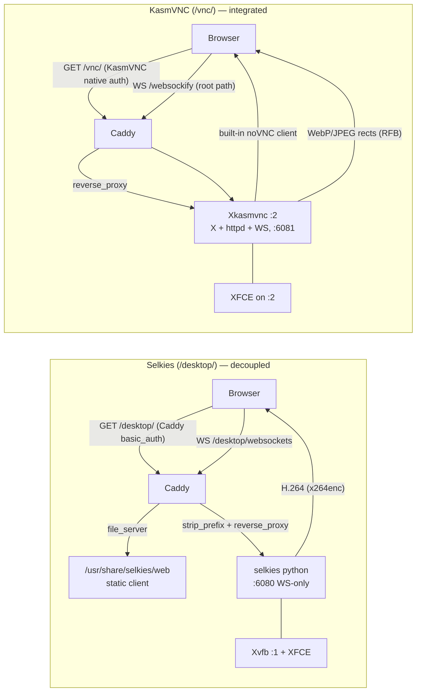

# Architecture

## Monorepo Structure

```
packages/
├── core/       Shared pure logic (types, constants, AAD, reconcile, ReplayWindow)
├── server/     Hono + Bun.serve() sync service (upload, download, doctor, WebSocket)
├── cli/        Container CLI tools (init-vault, unlock-vault, lock-vault, vault-sync, doctor, setup)
└── spa/        Browser file sync SPA (File System Access API + E2E encryption)
```

## Runtime Stack

- **Bun** — TypeScript runtime (replaces Node.js)
- **Hono** — HTTP framework (12,640 req/s)
- **Caddy** — Reverse proxy (code-server + sync-service + dual desktops on single port)
- **Selkies + KasmVNC** — Two parallel browser-accessible remote desktops (on-demand, autostart=false). See "Remote Desktop: Selkies vs KasmVNC" below.
- **Clash/mihomo** — Encrypted egress proxy
- **gocryptfs** — Disk encryption (AES-256, 4KB blocks)
- **supervisord** — Process management
- **Zulu JDK 17** — Java runtime (via mise)

## Security Layers

```
L5: E2E encryption (WebCrypto AES-256-GCM)     ← Sync file transfer
L4: code-server password                        ← Access control
L3: Cloudflare Tunnel (TLS)                     ← Network encryption
L2: gocryptfs (AES-256)                         ← Disk encryption
L1: Clash proxy (VLESS+WS+TLS)                  ← Traffic obfuscation
```

## Data Flow

```
Browser → Cloudflare Tunnel → Caddy(:8080) → code-server(:8082) / sync-service(:8081)
Container egress → Clash(:7890) → Proxy nodes → Internet
Vault sync → git push (via Clash) → GitHub (encrypted ciphertext)
```

## Key Design Decisions

1. Single container (FUSE mount shared across all services)
2. Fail-closed egress (no Clash = no internet)
3. No plaintext on disk (gocryptfs FUSE only in memory)
4. PNG camouflage on sync wire (DLP evasion)
5. Replay protection (ring buffer nonce tracking)
6. LaunchAgent for tunnel (no sudo, auto-start on login)

## Remote Desktop: Selkies vs KasmVNC

Two desktops run in parallel (default `DESKTOP_STACK=both`), each on an
independent X display, WS port, and HOME, behind one Caddy port:

- **Selkies** → `/desktop/` — display `:1`, WS `:6080`, HOME `/workspace/.desktop`
- **KasmVNC** → `/vnc/` — display `:2`, WS `:6081`, HOME `/workspace/.desktop-vnc`

### Request flow



Architectural difference: Selkies decouples X server / encoder / static client
(Xvfb + python + Caddy `file_server`); KasmVNC bundles all three in one
`Xkasmvnc` binary. This drives the auth-model difference below.

### Measured facts (this image, Kali arm64 / Docker Desktop, 2026-06-01)

All numbers below were measured directly in the running container. Both desktops
were **idle** (no client connected) when RSS was sampled.

| Metric | Selkies | KasmVNC | How measured |
|--------|---------|---------|--------------|
| Idle RSS (stream server) | selkies(python) ~67 MB + Xvfb ~110 MB | Xkasmvnc ~122 MB | `ps -o rss` |
| X-server binary | Xvfb 2.1 MB | Xkasmvnc 4.0 MB | `ls -lh` |
| Install footprint | venv 420 MB | .deb files 7.8 MB | `du -sh` / `dpkg -L` |
| Static web client | 5.9 MB | 3.4 MB | `du -sh` |
| Browser decode API | `VideoDecoder` (WebCodecs) | WebAssembly + Canvas2D (`drawImage`/`putImageData`) | grep shipped JS |
| Encoder (configured) | x264enc, 30 fps | WebP/JPEG rects, 30 fps | supervisor conf |
| Auth realm | Caddy `restricted` (shared with code-server) | KasmVNC native `Websockify` | `WWW-Authenticate` header |

Build-layer cost observed during this session's Kali build: the selkies pip/venv
layer dominates (~12 min on the throttled mirror); the KasmVNC `.deb` layer is
comparatively small. Selkies' venv (420 MB) is the single largest desktop cost.

### NOT measured (do not treat as fact)

The following are commonly-cited differences but were **not** benchmarked in this
environment. They are listed only as directions to test if it matters:

- **localhost latency**: on loopback the network RTT is ~0 for both; the
  bottleneck is the encode/decode path, not the link. We did **not** run a
  controlled latency/FPS benchmark, so treat Selkies and KasmVNC as
  **comparable on localhost** until measured. Do not claim one is dramatically
  faster locally.
- **High-RTT / tunnel behavior, bandwidth under motion, CPU under load**: not
  benchmarked here. H.264 (Selkies) vs adaptive WebP rects (KasmVNC) have
  different theoretical trade-offs, but no numbers were collected.

### Qualitative, verifiable differences

These are structural facts (verifiable from config/code), not performance claims:

- **Browser compatibility**: Selkies requires the WebCodecs `VideoDecoder` API
  (Chromium 94+, Safari 16.4+); KasmVNC decodes via WebAssembly + Canvas2D, so it
  works on older browsers lacking WebCodecs.
- **Auth UX**: Selkies shares Caddy's `restricted` realm with code-server (one
  credential cache, no extra prompt). KasmVNC owns its own `Websockify` realm
  (browsers won't replay Caddy creds to the VNC WebSocket), so it prompts once
  more with the same username/password.
- **Features**: KasmVNC's client ships multi-monitor, file upload/download, DLP,
  and a settings panel; Selkies' client is a minimal full-screen stream and adds
  desktop **audio** (pcmflux) which KasmVNC does not.
- **Dependency fragility**: Selkies needs libva ≥2.20 (hence the trixie/Kali
  base requirement); KasmVNC's `.deb` is comparatively self-contained.

### Recommendation

Keep `both` as the default — it avoids betting on one stack up front. Use
`/desktop/` (Selkies) for the audio-capable minimal stream and `/vnc/` (KasmVNC)
when you need its features or an older browser. Single-stack builds
(`DESKTOP_STACK=selkies|kasmvnc`) exist as fallbacks to save image size/build
time if only one is ever used.
